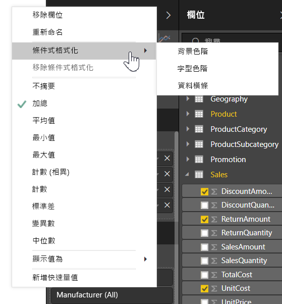
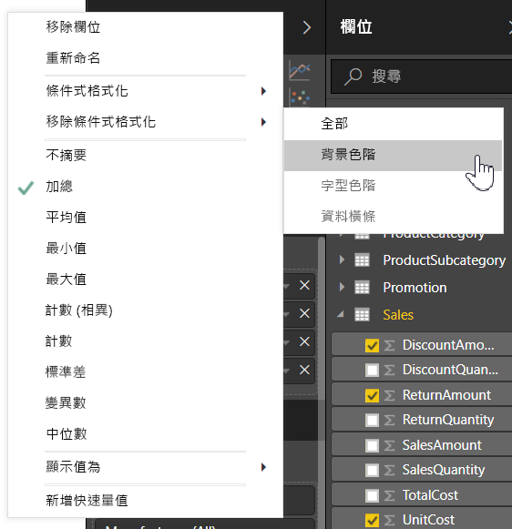
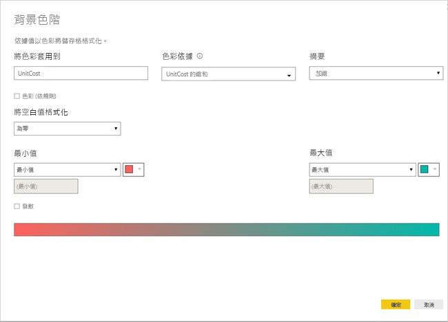
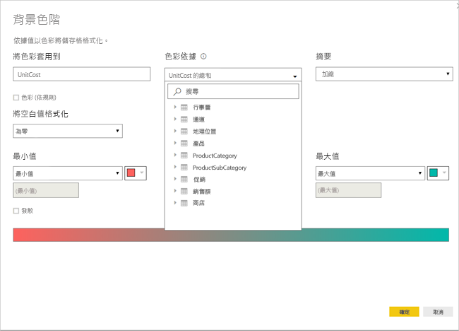
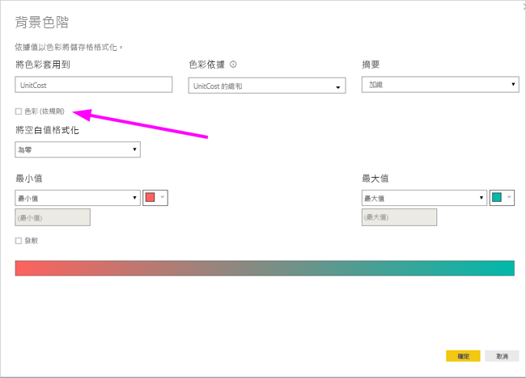
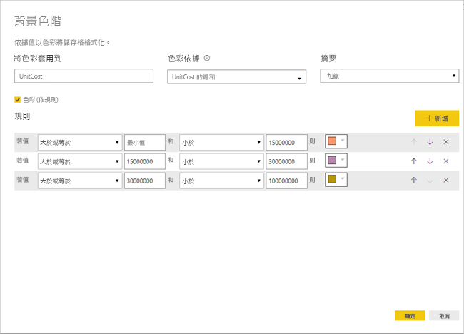
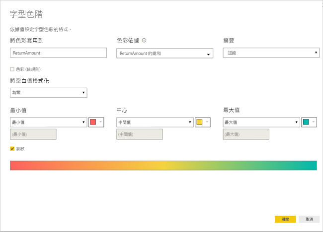
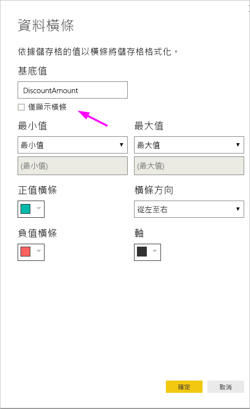

# 設定資料表格式化的條件 
設定資料表格式化的條件時，您可以根據資料格值或根據其他值或欄位 (包括漸層色彩) 來指定自訂資料格色彩。 您也可以使用資料橫條來顯示資料格的值。 

若要存取條件式格式設定，請在 Power BI Desktop [視覺效果] 窗格的 [欄位] 集區，選取您要格式化的 [值] 集區中，值旁邊的向下箭號 (或以滑鼠右鍵按一下欄位)。 您只能管理 [欄位] 集區之 [值] 區域中的欄位條件式格式設定。

下列章節逐一描述這三種條件式格式選項。 一或多個選項可以組合在一個資料表資料行中。

> [!NOTE]
> 套用至資料表時，條件式格式設定會覆寫套用至條件式設定資料格之格式的任何自訂資料表樣式。

若要從視覺效果移除條件式格式設定，只要以滑鼠右鍵再按一次欄位，選取 [移除條件式格式設定]，然後選取要移除的格式設定類型即可。

## 背景色階

選取 [條件式格式設定] 然後選取 [背景色階]，下列對話方塊隨即開啟。

您可以從您的資料模型選取色彩依據的欄位，方法為設定 該欄位的[色彩依據]。 此外，您可以使用**摘要**值指定所選欄位的彙總類型。 在 [將色彩套用到] 欄位中指定要上色的欄位，以便您可以追蹤。您可以將設定格式化的條件套用至文字和日期欄位，只要您選擇數值作為格式設定基礎。

若要針對指定的值範圍使用離散色彩值，請選取 [依規則上色]。 若要使用色彩頻譜，請將 [依規則上色] 保留未核取狀態。 

### 色彩 (依規則)

當您選取 [依規則上色] 時，您可以輸入一或多個值範圍，每個都具有一個設定色彩。  每個值範圍都以「如果值」條件、「和」值條件以及一個色彩開始。

每個範圍中含有值的資料表資料格都會以指定色彩填滿。 下圖有三個規則。

範例資料表現在如下所示：

### 最小到最大色彩

您可以設定 [最小] 和 [最大] 值以及其色彩。 如果您選取 [發散] 方塊，您也可以設定選擇性的「中間」值。

![[發散] 按鈕](media/desktop-conditional-table-formatting/table-formatting-1-diverging.png)

範例資料表現在如下所示：

## 字型色階

選取 [條件式格式設定] 然後選取 [字型色階]，下列對話方塊隨即開啟。 此對話方塊類似於 [背景色階] 對話方塊，但會變更字型色彩，而不是資料格背景色彩。

範例資料表現在如下所示：

## 資料橫條

選取 [條件式格式設定] 然後選取 [資料橫條]，下列對話方塊隨即開啟。 

根據預設，未核取 [只顯示橫條] 選項，因此資料表資料格會顯示橫條與實際值兩者。

如果 [只顯示橫條] 選項已核取，則資料表資料格只會顯示橫條。

