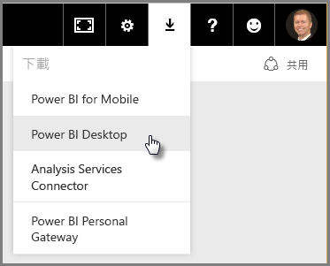
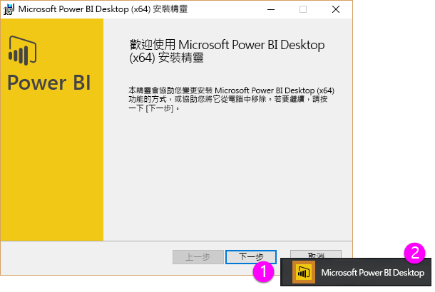
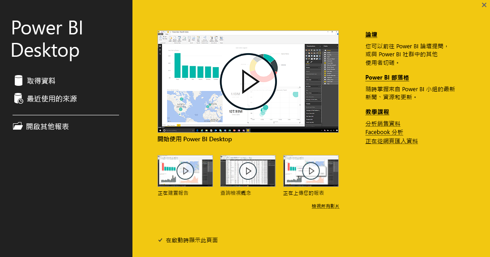
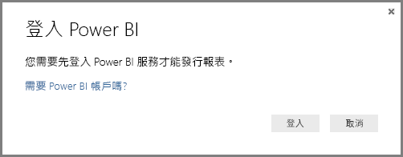

# 開始使用 Power BI Desktop
歡迎使用 **Power BI Desktop 使用者入門指南**。 此 Power BI Desktop 簡短教學課程能讓您熟悉它的運作方式、示範它的功能，以及加速您建置穩固資料模型的能力 — 以及令人讚嘆的報表，增強您的商業智慧工作。 

偏好觀看而不是閱讀嗎？ 歡迎[觀賞我們的使用者入門影片](desktop-videos.md)。 如果您想要跟著影片操作對應的範例資料，可以[下載這個範例 Excel 活頁簿](http://go.microsoft.com/fwlink/?LinkID=521962).

Power BI Desktop 可讓您建立查詢、資料連線和報表的集合，輕鬆地與其他人共用。 Power BI Desktop 整合經過實證的 Microsoft 技術 – 強大的查詢引擎、資料模型化和視覺化，還能與線上 [**Power BI 服務**](https://app.powerbi.com/)順暢地搭配運作.

結合 **Power BI Desktop** (分析師和其他人可在此建立功能強大的資料連線、模型和報表) 和 [**Power BI 服務**](https://preview.powerbi.com/) (Power BI Desktop 報表可在此共用，以便使用者檢視並與其互動)，使新的深入資訊更容易從資料世界建立模型、建置、共用及擴充。

資料分析師會發現 Power BI Desktop 是個功能強大、有彈性且高度可存取的工具，可以連接和塑造資料世界、建置穩固的模型，及製作結構良好的報表。

## 如何使用本指南
您可以使用好幾種方法使用本指南 – 掃描它以取得快速概觀，或閱讀每一節以充分了解 Power BI Desktop 的運作方式。

如果您趕時間，可以在幾分鐘內快速掃視本指南，並且能夠判斷 Power BI Desktop 運作方式及如何使用它。 本指南的大部分內容包含以視覺化方式示範 Power BI Desktop 運作方式的畫面。

若要更深入了解，您也可以閱讀每一節、執行步驟，然後帶著您自己的 Power BI Desktop 檔案，隨時都準備好張貼到 **Power BI** 服務，並與其他人共用。

>[!NOTE]
>另外還有個別且特製化版本的 **Power BI**，稱為 [**Power BI 報表伺服器**](report-server/get-started.md)，這適用於需要其資料和報告來保持內部部署的客戶。 若要與該特定版本搭配使用，另外還有個別且特製化版本的 **Power BI Desktop**，稱為**適用於 Power BI 報表伺服器的 Power BI Desktop**，這只適用於Power BI 版本的報表伺服器。 本文描述標準 **Power BI Desktop**。

## Power BI Desktop 的運作方式
使用 Power BI Desktop，您可以連接到資料  (通常是多個資料來源)、塑造資料  (使用能建立具洞察力、吸引人的資料模型的查詢)，以及使用該模型來建立報表  (其他人可以運用、以其為基礎進行建置並共用)。

步驟都按照您的要求完成之後 – 連接、塑造和報告 – 您可以將該工作儲存成 Power BI Desktop 檔案格式，也是 .pbix 副檔名。 Power BI Desktop 檔案可像其他檔案一樣共用，但最好的 Power BI Desktop 檔案共用方式，是上傳 (共用) 到 [**Power BI 服務**](https://preview.powerbi.com/). 

Power BI Desktop 會集中、簡化並效率化設計與建立商業智慧儲存機制和報告的程序，這些程序在其他情況下可能散亂、不相關且棘手。

準備好要試試？ 讓我們開始吧。

## 安裝並執行 Power BI Desktop
您可以從 **Power BI** 服務下載 Power BI Desktop，方法是選取齒輪  圖示，然後選取 [Power BI Desktop] 。

Power BI Desktop 會安裝為應用程式，並在您的桌面上執行。

當您執行 Power BI Desktop 時，會顯示「歡迎」  畫面。

您可以直接從 [歡迎] 畫面 (從左窗格中的連結) [取得資料]、查看 [最近使用的來源]，或 [開啟其他報表]。 如果關閉該畫面 (選取右上角的 **x**)，會顯示 Power BI Desktop 的 [報表] 檢視。

Power BI Desktop 中有三種檢視：[報表] 檢視、[資料] 檢視和 [關聯性] 檢視。 Power BI Desktop 也包含 [查詢編輯器]，這會在另一個視窗中開啟。 在 [查詢編輯器] 中，您可以建立查詢並轉換資料，然後將調整過的資料模型載入 Power BI Desktop，並建立報表。

下列畫面顯示 Power BI Desktop 左邊的三個檢視圖示：從上到下分別為 **報表**、 **資料**和 **關聯性**。 目前顯示的檢視會以左側的黃色列表示。 在本案例中，目前正在顯示 [報表]  檢視。 您可以選取這三個圖示中的任一個來變更檢視。

安裝 Power BI Desktop 後，您就可以連接至資料、塑造資料，以及建置報表 (通常是依此順序)。 在接下來的章節中，我們會依序介紹每一項。

## 連接到資料
安裝 Power BI Desktop 後，您就可以連接至持續擴展的資料世界。 [查詢] 視窗中有「各式各樣」  的可用資料來源。 下圖顯示如何藉由依序選取 [常用] 功能區 &gt; [取得資料] \> [其他] **來連線至資料**。

 

針對這個快速導覽，我們會連接到幾種不同的 **Web** 資料來源。

想像您即將退休 – 您想要住在有很多陽光、稅制合理且具備良好健康照護的地方 – 或者也許您是資料分析師，您想要該資訊來協助您的客戶。 例如，也許您想要協助太陽眼鏡零售商訂最晴朗區域的目標銷售量。

無論如何，下列 Web 資源具有關於那些主題的相關和詳細資料：

[*http://www.bankrate.com/finance/retirement/best-places-retire-how-state-ranks.aspx*](http://www.bankrate.com/finance/retirement/best-places-retire-how-state-ranks.aspx)

選取 [取得資料] **\> [Web]** 並貼上位址。

 

當您選取 [確定] 時，Power BI Desktop 的 [查詢]  功能就會開始運作。 查詢會連絡 Web 資源，[導覽器]  視窗會傳回它在該網頁找到的資訊。 在本案例中，它找到一個資料表 (資料表 0) 和整體的 Web 文件。 我們對資料表有興趣，因此我們從清單中選取它。 [導覽器]  視窗會顯示預覽。

 

此時我們可以從視窗的底部選取 [編輯]  ，先編輯查詢再載入資料表，或者我們可以載入資料表。

當我們選取 [編輯] 時，查詢編輯器會啟動，並顯示代表資料表的檢視。 此時會顯示 **查詢設定** 窗格 (若未顯示，可依序從功能區選取 **檢視**，然後選取 [顯示] **\> 查詢設定**，以便顯示**查詢設定** 窗格)。 以下是其外觀。

 

如需如何連接至資料的詳細資訊，請參閱[連接至 Power BI Desktop 中的資料](desktop-connect-to-data.md)。

在下一節中，我們會調整資料，使其符合我們的需求。 調整連接資料的程序稱為「塑造」  資料。

## 資料成形及合併
既然我們已經連接到資料來源，我們需要調整資料以符合我們的需求。 有時候調整表示「轉換」  資料，例如重新命名資料行或資料表、將文字變更為數字、移除資料列、將第一列設定為標題列等。

Power BI Desktop 中的查詢編輯器能夠充分利用右鍵功能表，也會在功能區中提供可用的工作。 您可以在 [轉換]  功能區中選取的大多數功能，也可以透過以滑鼠右鍵按一下項目 (例如資料行)，然後從顯示的功能表中進行選擇來加以存取。

## 資料成形
當您在 **查詢編輯器**中塑造資料時，您會隨著 **查詢編輯器** 載入及呈現資料，提供逐步指示來調整資料 ( **查詢編輯器** 會為您執行這項作業)。 原始資料來源不會受到影響，只有這個特定資料檢視會經調整或「經塑造」 。

**查詢編輯器**會記錄您指定的步驟 (例如重新命名資料表、轉換資料類型或刪除資料行)，而且每次這個查詢連接到資料來源，都會執行這些步驟，因此資料一律會以您指定的方式來塑造。 每當您使用 Power BI Desktop 的查詢時，或任何人使用您的共用查詢，例如 **Power BI** 服務上的查詢，都會進行這個程序。 系統會循序擷取 [查詢設定]  窗格之 [套用的步驟] 下的所有步驟。

下圖顯示已塑造查詢的 [查詢設定]  窗格，我們將於接下來幾個段落中逐一說明每個步驟。

 

讓我們回到我們的退休資料，我們藉由連接到 Web 資料來源來找到這資料，並塑造資料以符合我們的需求。

特此告知入門者，大部分的評分是以整數帶入 [查詢編輯器] ，但並非全部都是 (有一個資料行會包含文字和數字，因此不會自動轉換)。 我們需要資料為數字。 沒問題，只要以滑鼠右鍵按一下資料行標頭，然後選取 [變更類型] **\> [整數]**，即可變更資料類型。 如果我們需要選擇多個資料行，可以先選取資料行，然後按住 **SHIFT**、選取其他相鄰的資料行，然後以滑鼠右鍵按一下資料行標頭，即可變更所有選取的資料行。 您也可以使用 **CTRL** 來選取非相鄰的資料行。

 

您也可以使用 [轉換]  功能區，將那些資料行從文字變更 (或「轉換」  ) 成標頭。 以下是 [轉換]  功能區，並且有箭頭指向 [資料類型]  按鈕，這個按鈕可讓您將目前的資料類型轉換成其他資料類型。

 

請注意，在 [查詢設定] 中，[套用的步驟] 會反映已做的變更。 如果我想要移除成形程序中的任何步驟，我只需選取該步驟，接著選取步驟左邊的 **X**。

 

我們需要再做一些變更，讓查詢位於我們想要的位置：

* *移除第一個資料行* – 我們不需要它，它只包含指出「看看您那一州的退休評等」的重複資料列，這是 Web 資料表的成品

<!-- -->

* *修正一些錯誤* – 在網頁上，一個資料行有混合數字的文字 (某些州繫結在一個類別中)。 那在該網站上很好，但並不適合我們的資料分析。 (在此案例中) 錯誤很容易修正，並且示範 [查詢編輯器] 及其 [套用的步驟] 一些很棒的功能

<!-- -->

* *變更資料表名稱* – 「資料表 0」  不是有用的描述元，但變更它很簡單

每個步驟於**[在 Power BI Desktop 中成形及合併資料](desktop-shape-and-combine-data.md)** 中都有示範。 歡迎參閱該頁面，或繼續閱讀這份文件，了解您接下來要做什麼。 下一節會在套用上述變更之後繼續。

## 合併資料
有關各州的那份資料很有趣，而且適用於建立額外的分析工作和查詢。 但是有一個問題：大多數資料使用兩個字母的縮寫州名代碼，而不是該州的完整名稱。 我們需要某種方式來建立州名及其縮寫的關聯。

我們很幸運：有另一個公用的資料來源可執行該項工作，但還需要進行相當多的塑造，才能予以連接到我們的退休資料表。 以下是州名縮寫的 Web 資源：

<http://en.wikipedia.org/wiki/List_of_U.S._state_abbreviations>

從 [查詢編輯器] 中的 [常用] 功能區，我們選取 [取得資料] **\> [Web]** 並輸入位址，然後選取 [確定]，[導覽器] 視窗便會顯示在該網頁上找到的資訊。

 

我們選取 [資料表 [編輯]]，因為其中包含我們要的資料，但仍需要進行相當多的成形，以便削減資料表的資料。 每個步驟於**[在 Power BI Desktop 中成形及合併資料](desktop-shape-and-combine-data.md)** 中也有示範。 總結那些步驟，以下是我們做的事：

我們選取 [編輯] ，然後：

* *移除前兩個資料列* – 其為建立網頁資料表時的產物，而我們不需要這兩個資料列。

<!-- -->

* *移除底部 26 個資料列* – 這些全部是地區名稱，我們不需要將其包含在內。

<!-- -->
* *篩選掉華盛頓特區* – 退休統計資料的資料表不包含華盛頓特區，因此我們從清單中將其排除。

<!-- -->

* *移除一些不必要的資料行* – 我們只需要將州對應到正式的雙字母縮寫，就可以移除其他資料行。

<!-- -->

* *使用第一個資料列作為標頭* - 由於我們移除了前三個資料列，因此目前的頂端列是我們要的標頭。

    >[!NOTE]
    >現在便是指出**查詢編輯器**中套用的步驟的「順序」很重要的時機，而且該順序可能會影響資料的成形方式。 另外，也必須考慮一個步驟對另一個後續的步驟可能會有什麼影響；如果您從 [套用的步驟] 移除一個步驟，後續的步驟可能就不會和原本預期的行為一樣，這便是受到查詢步驟順序的影響。

* *重新命名資料行和資料表本身* – 一般會有幾種方式可以重新命名資料行，您可以選擇您偏好的方式。

*StateCodes* 資料表成形之後，我們可以將這兩個資料表或查詢合併成一個。由於現在的資料表是我們對資料套用查詢的結果，所以通常稱為*查詢*.

有兩個主要方式可合併查詢 – 「合併」  和「附加」 。

當您有一或多個資料行要加入另一個查詢時，您可「合併」  查詢。 當您有其他資料列要加入現有的查詢時，您可「附加」  查詢。

在本例中，我們想要合併查詢。 首先，我們選取想讓其他查詢合併「進去」  的查詢，然後從功能區上的 [主資料夾]  索引標籤選取 [合併查詢]  。

 

[合併]  視窗隨即出現，提示我們選取哪一個資料表要合併到選取的資料表，然後選取要用於合併的相符資料行。 從 *RetirementStats* 資料表 (查詢) 選取 *State* ，然後選取 *StateCodes* 查詢 (在本案例中很容易，因為只有一個其他查詢 – 當您連接到許多資料來源時，會有許多查詢可從中選擇)。 當我們選取正確的相符資料行 – 來自 *RetirementStats* 的 *State* ，和來自 *StateCodes* 的 *State Name* – [合併]  視窗外觀如下所示，且 [確定]  按鈕已啟用。

 

在查詢的結尾會建立 **NewColumn** ，它是與現有查詢合併的資料表 (查詢) 內容。 來自合併查詢的所有資料行會壓縮成 **NewColumn**，但您可以選擇 [展開]  資料表，並包含您要的任何資料行。 若要展開合併的資料表，並選取要包含哪些資料行，請選取展開圖示 ()。 [展開]  視窗隨即出現。

 

在本例中，我們只想要 *State Code* 資料行，因此我們只選取該資料行，然後選取 [確定] 。 清除 [使用原始資料行名稱做為前置詞]  核取方塊，因為我們不需要也不想要它；如果我們保留選取它，則合併的資料行將名為 *NewColumn.State Code* (原始資料行名稱，或 *NewColumn* ，然後一個點，再來是帶入查詢的資料行名稱)。

>[!NOTE]
>想嘗試如何帶入 *NewColumn* 資料表嗎？ 您可以試驗一下，如果您不喜歡結果，只需要從 [查詢設定]  窗格中的 [套用的步驟]  清單刪除該步驟；您的查詢便會回到套用 [展開]  步驟之前的狀態。 就像是個自由重做的機會，您可以不限次數地任意執行，直到展開程序看起來是您要的方式為止。

我們現在有合併兩個資料來源的單一查詢 (資料表)，其中每個資料來源都已經過塑造以符合我們的需求。 此查詢可以做為許多其他相關資料連線的基礎 – 例如任何州的住房成本統計資料、人口統計資料或工作機會。

如需每種成形及合併資料步驟的更完整描述，請參閱[在 Power BI Desktop 中成形及合併資料](desktop-shape-and-combine-data.md).

現在我們有足夠的資料來建立一些相關報表，全都在 Power BI Desktop 內。 由於這是一項里程碑，讓我們儲存這個 Power BI Desktop 檔案 – 我們稱它為「開始使用 Power BI Desktop」 。 若要在 [查詢編輯器] 套用變更，並載入 Power BI Desktop，請從 [常用] 功能區選取 [關閉並套用]。

## 建置報表
載入資料表之後可以進行其他變更，且您可以重新載入模型來套用所做的任何變更。 但是目前這樣就夠了。 在 Power BI Desktop [報表]  檢視中，您可以開始建立報表。

[報表]  檢視有五個主要區域：

1. 功能區，顯示與報表和視覺效果相關聯的常見工作
2. [報表]  檢視或畫布，在這裡會建立和排列視覺效果
3. 底部的 [頁面]  索引標籤區域，可讓您選取或加入報表頁面
4. [視覺效果]  窗格，您可以在這裡變更視覺效果、自訂色彩或座標軸、套用篩選、拖曳欄位等等
5. [欄位]  窗格，您可以在這裡將查詢項目和篩選拖曳至 [報表]  檢視，或拖曳至 [視覺效果]  窗格的 [篩選]  區域
   
   

[視覺效果]  和 [欄位]  窗格可以摺疊，方法是選取邊緣上的小箭號，在 [報表]  檢視中提供更多的空間，以建置酷炫的視覺效果。 修改視覺效果時，您也會看到向上或向下的箭號，這分別表示您可以展開或摺疊該區段。

 

若要建立視覺效果，只需要將欄位從 [欄位]  清單拖曳至 [報表]  檢視。 在本案例中，讓我們來拖曳 *RetirementStats* 的 *State* 欄位，看看結果如何。

 

看看它...Power BI Desktop 會自動建立地圖式視覺效果，因為可辨識 *State* 欄位包含地理位置資料。

請注意，在 [視覺效果]  窗格中，我可以選取不同類型的視覺效果，而且在那些圖示下方的區域中，我可以將欄位拖曳到不同區域以套用圖例，或是修改視覺效果。

 

讓我們來往前快轉一下，看看 [報表] 檢視在加入一些視覺效果和一些新報表頁面之後的外觀。 如需報表的詳細資訊，請參閱 [Power BI Desktop 中的報表檢視](desktop-report-view.md)。

第一個報表頁面提供的資料檢視方塊是根據「整體排名」 。 當我們選取其中一個視覺效果時，[欄位及篩選]  窗格會顯示選取的欄位，以及視覺效果的結構 (哪些欄位套用至 [共用軸] 、[資料行值] 和 [行值] )。

 

此報表中有六個 **頁面** ，每個會將我們的資料中的特定項目視覺化。

1. 第一頁，如上所示，顯示根據「整體排名」的所有州 。
2. 第二頁著重在根據「整體排名」 的前十個州。
3. 第三個頁面上，居住成本 (及相關聯的資料) 最佳的 10 個州會加上視覺效果。
4. 第四頁的焦點是天氣，篩選為 15 個最晴朗的州。
5. 在第五個的頁面上，會針對前 15 個州將社區福利繪製圖表並視覺化。
6. 最後，也會視覺化犯罪統計資料，顯示最佳 (和最差) 的十個州。

以下是著重在居住成本的報表頁面外觀。

 

您可以建立各種相關報表和視覺效果。

## 分享您的成果
既然我們已經有相當完整的 Power BI Desktop 報表，我們可以在 **Power BI** 服務與他人分享。 有幾種方式可以在 Power BI Desktop 分享您的成果。 您可以發行至 **Power BI** 服務、直接從 Power BI 服務上傳 .pbix 檔案，或是儲存 .pbix 檔案，然後就像任何其他檔案一樣地傳送它。

首先，我們來看一下直接從 Power BI Desktop 發行至 **Power BI** 服務。 從 [常用]  功能區選取 [發行] 。

將提示您登入 Power BI。

當您已登入且發行程序已完成時，會看到下列對話方塊。

當您登入 Power BI 時，您會在服務的 [儀表板] 、[報表] 和 [資料集]  區段看到您剛載入的 Power BI Desktop 檔案。

另一種分享成果的方式是從 **Power BI** 服務內載入它。 下列連結會在瀏覽器顯示 **Power BI** 服務：

`https://app.powerbi.com`

選取 [取得資料]  會開始載入 Power BI Desktop 報表的程序。

 

[取得資料]  頁面隨即出現，您可以從中選取要從何處取得資料。 在本案例中，我們從 [檔案]  方塊選取 [取得]  。

[檔案]  檢視隨即出現。 在本案例中，我們選取 [本機檔案] 。

當您選取檔案時，Power BI 會將檔案上傳。

一旦檔案已上傳，您就可以在 Power BI 服務左窗格中的 [報表]  選取檔案。

**Power BI** 服務會顯示報表的第一頁。 在頁面的底部，您可以選取任何索引標籤，以顯示該報表的頁面。

 

您可以在 **Power BI** 服務中變更報表，方法是從報表畫布上方選取 [編輯報表]  。

若要儲存報表，請從服務選取 [檔案] **\> [另存新檔]**。 您可以在 **Power BI** 服務中，從您的報表建立各種有趣的視覺效果；您可以將報表釘選到 *儀表板* 。 若要了解 **Power BI** 服務中的儀表板**[，請參閱](service-dashboards-design-tips.md)設計絕佳儀表板的秘訣**.

 

儲存之後，選取主頁面上的 [共用]  圖示。

 

從這裡，您可以傳送電子郵件給同事，和他們共用儀表板。

 

如需有關建立、共用及修改儀表板的詳細資訊，請參閱[共用儀表板](service-share-dashboards.md)。

您可以使用 Power BI Desktop 和 Power BI 服務來製作與資料相關的顯目混搭與視覺效果。 如需詳細資訊，請查看下一節。

## 後續步驟
您可以使用 Power BI Desktop 執行各種作業。 如需有關其功能的詳細資訊，請參閱下列資源：

* [Power BI Desktop 的查詢概觀](desktop-query-overview.md)
* [Power BI Desktop 中的資料來源](desktop-data-sources.md)
* [連接至 Power BI Desktop 中的資料](desktop-connect-to-data.md)
* [使用 Power BI Desktop 合併資料並使其成形](desktop-shape-and-combine-data.md)
* [Power BI Desktop 中的常見查詢工作](desktop-common-query-tasks.md)   

