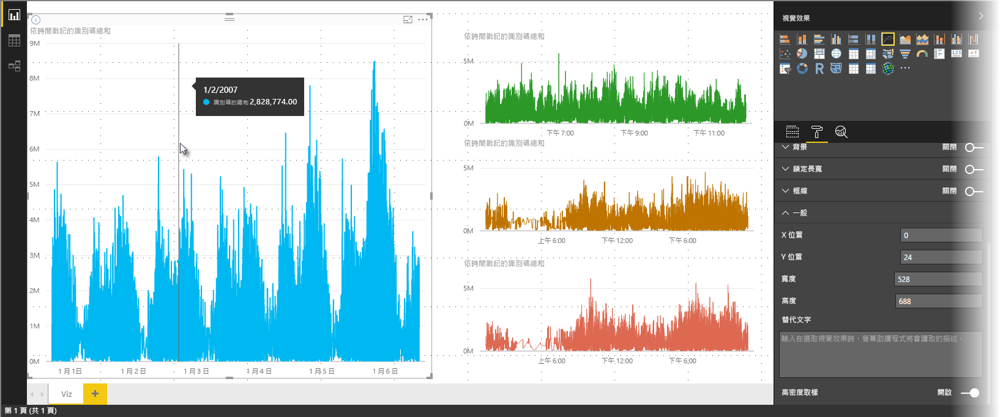
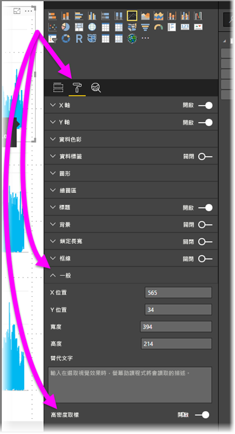

# Power BI 中的高密度線路取樣
從 **Power BI Desktop** 的 2017 年 6 月版和「Power BI 服務」的更新開始，有新的取樣演算法可以改善對高密度資料進行取樣的視覺效果。 例如，您可以利用零售商店的銷售結果來建立折線圖，而每間商店每年都會有一萬張以上的銷售收據。 這類銷售資訊的折線圖會對每間商店的資料進行取樣 (選取以有意義的方式轉譯該資料，來說明銷售隨著時間的變化)，並建立多數列的折線圖，進而代表基礎資料。 這是視覺化高密度資料的常見做法，此外，Power BI Desktop 已改善對高密度資料的取樣，本文會進行詳細說明。

> [!NOTE]
> 本文中所述的「高密度線路取樣」演算法套用至且適用於 **Power BI Desktop** 和 **Power BI 服務**。
> 
> 

## 高密度線路取樣運作方式
先前，**Power BI** 已透過決定性方式選取完整基礎資料範圍中的範例資料點集合。 例如，針對跨一個日曆年度之視覺效果的高密度資料，視覺效果中可能會顯示 350 個範例資料點，並會選取每個資料點，確保視覺效果中已呈現完整資料範圍 (基礎資料的整體數列)。 為了協助您了解如何發生這種情況，假設我們已繪製一年期間的股價，並選取 365 個資料點來建立折線圖視覺效果 (即一天一個資料點)。

在此情況下，該股價每天都有許多值。 當然，每天都有最高值和最低值，但這些可能發生在股票市場開市當天的任何時間。 針對高密度線路取樣，如果基礎資料樣本是在每天的早上 10:30 和中午 12:00 取得，則會取得基礎資料的代表性快照 (早上 10:30 和中午 12:00 的價格)，但可能不會擷取代表性資料點的實際最高和最低股價 (當天)。 在該情況和其他情況下，取樣代表基礎資料，但不一定會擷取重要點，在此情況下是每日最高和最低股價。

根據定義，會針對高密度資料進行取樣，讓可相當快速建立的視覺效果回應互動性 (視覺效果上有太多資料點可能會導致動彈不得，而且可能會影響趨勢可見性）。 取樣的資料量提供最佳視覺效果經驗，並且可以建立取樣演算法。 在 Power BI Desktop 中，此演算法已經過改良，可提供回應、轉譯和清楚保留每個時間配量中重要點的最佳組合。

## 新線路取樣演算法的運作方式
高密度線路取樣的新演算法適用於含連續 X 軸的折線圖和區域圖視覺效果。

針對高密度視覺效果，**Power BI** 會以聰明的方式將資料切割為高解析區塊，然後選擇重要點來代表每個區塊。 該切割高解析資料程序已經過特別調整，確保無法以視覺方式區分產生的圖表與轉譯所有基礎資料點，但更為快速且更具互動性。

### 高密度線路視覺效果的最小值和最大值
針對任何指定的視覺效果，視覺效果限制如下：

* **3,500** 是視覺效果上所「顯示」的最大資料點數目，而不論基礎資料點或數列數目為何。 因此，如果您有 10 個各具有 350 個資料點的數列，則視覺效果已達其最大整體資料點限制。 如果您有一個數列，則新演算法認為它是最佳基礎資料取樣時，最多可能有 3,500 個資料點。
* 任何視覺效果最多都有「60 個數列」。 如果您的數列超過 60 個，請分割資料，並建立多個各具有 60 (含) 個以下數列的視覺效果。 最好使用**交叉分析篩選器**，只顯示資料的各區段 (僅特定數列)。 例如，如果您在圖例中顯示所有子類別，則可以在相同報表頁面上使用交叉分析篩選器，依整體類別進行篩選。

這些參數確保 Power BI Desktop 中的視覺效果會非常快速地轉譯，並且回應與使用者的互動，而且不會讓轉譯視覺效果的電腦上造成過度運算負荷。

### 評估高密度線路視覺效果的代表性資料點
基礎資料點數目超過視覺效果中可表示的資料點 (超過 3,500) 時，會開始稱為「量化」的程序，這會將基礎資料分割為稱為「量化」的群組，然後反覆地調整這些量化。

此演算法會建立最多量化，以建立視覺效果的最大細微性。 在每個量化內，此演算法會尋找最小和最大資料值，確保可以擷取重要值和重大值 (例如，極端值)，並將其顯示在視覺效果中。 根據量化結果以及 Power BI 的後續資料評估，判斷視覺效果 X 軸的最小解析，確保視覺效果的最大細微性。

如前所述，每個數列的最小細微性是 350 個點，而最大值為 3,500。

每個量化都是由兩個資料點表示，而它們會成為量化在視覺效果中的代表性資料點。 資料點就是該量化的最高值和最低值，而且透過選取最高值和最低值，量化程序可確保擷取任何重要最高值或重大最低值，並將其轉譯在視覺效果中。

如果這聽起來需要進行許多分析來確保偶而擷取到極端值，並將其正確地顯示在視覺效果中，那就沒錯，而且這是新演算法和量化程序背後的確切原因。

## 工具提示和高密度線路取樣
請務必注意，此量化程序會擷取指定量化中的最小值和最大值，並將其顯示在視覺效果中，而且可能會影響當您將滑鼠游標停留在資料點上方時，工具提示顯示資料的方式。 若要解釋如何及為何發生這種情況，請重新瀏覽本文稍早的股價範例。

假設您要根據股價建立視覺效果，而且要比較兩個不同股票，這兩個股票都是使用「高密度取樣」。 每個數列的基礎資料都有大量資料點 (您可能會擷取當天每秒的股價)。 高密度線路取樣演算法會個別執行每個數列的量化。

現在，假設第一支股票的價格在 12:02 上彈，然後在十秒之後快速恢復，這就是重要資料點。 量化該股票時，12:02 的最高值會是該量化的代表性資料點。

但針對第二支股票，12:02 不是包含該時間之量化中的最高值也不是最低值，但可能會在三分鐘後發生包含 12:02 之量化的最高值和最低值。 在該情況下，如果建立折線圖，並將滑鼠游標停留在 12:02 上方，則會在第一支股票的工具提示中看到值 (因為它在 12:02 跳動，並將該值選取為該量化的最高資料點)，但在第二支股票 12:02 時的工具提示中看「不」到任何值。 這是因為第二支股票不是包含 12:02 之量化的最高值，也不是最低值。 因此第二支股票在 12:02 沒有可顯示的資料，所以不會顯示任何工具提示資料。

工具提示很常發生這種情況。 所指定量化的最高值和最低值可能未與平均縮放的 X 軸值點完全相符；因此，工具提示不會顯示該值。  

## 如何開啟高密度線路取樣
根據預設，會**開啟**新演算法。 若要變更此設定，請移至 [格式] 窗格的 [一般] 卡片，您會在底端看到稱為 [高密度取樣] 的切換滑桿。 若要將它關閉，請滑動到 [關閉]。

## 考量與限制
高密度線路取樣的新演算法是 Power BI 的一項重要改善，但在使用高密度值和資料時，您必須知道下列幾點考量。

* 如果使用游標對齊代表性資料，則因為細微性提高和量化程序，所以**工具提示**只可能會顯示值。 如需詳細資訊，請參閱本文稍早的＜工具提示＞節。
* 整體資料來源的大小太大時，新演算法會消除數列 (圖例項目)，以容納資料匯入最大值條件約束。
  
  * 在此情況下，新演算法會依字母順序排序圖例數列，並依字母順序往下顯示圖例項目清單，直到達到資料匯入最大值，而且不會匯入其他數列。
* 基礎資料集超過 60 個數列 (如前所述的最大數列數目) 時，新演算法會依字母順序排序數列，並清除超過第 60 個依字母順序排序之數列的數列。
* 如果資料中的值不是 *numeric* 或 *date/time* 類型，Power BI 將不會使用新的演算法，並將還原為先前的 (「非高密度取樣」) 演算法。
* 新演算法不支援 [顯示沒有資料的項目] 設定。
* 使用 SQL Server Analysis Services (2016 (含) 更早版本) 中代管之模型的即時連線時，不支援新演算法。 在 **Power BI** 或 Azure Analysis Services 所代管的模型中支援它。

## 後續步驟
如需了解散佈圖中的高密度取樣資訊，請參閱下列文章。

* [Power BI 散佈圖中的高密度取樣](desktop-high-density-scatter-charts.md)

