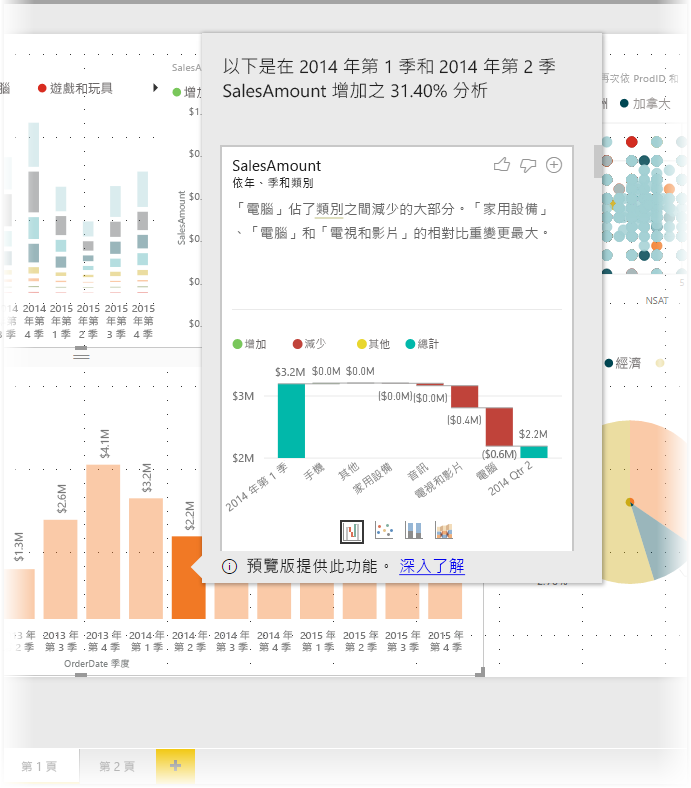
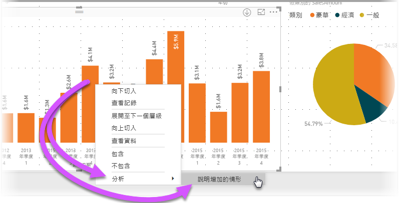
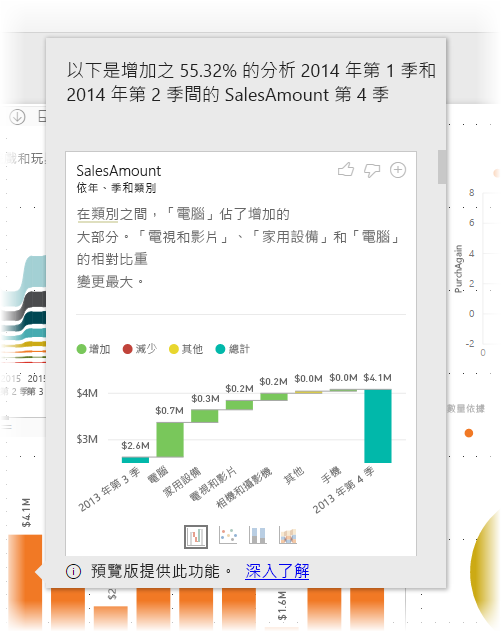
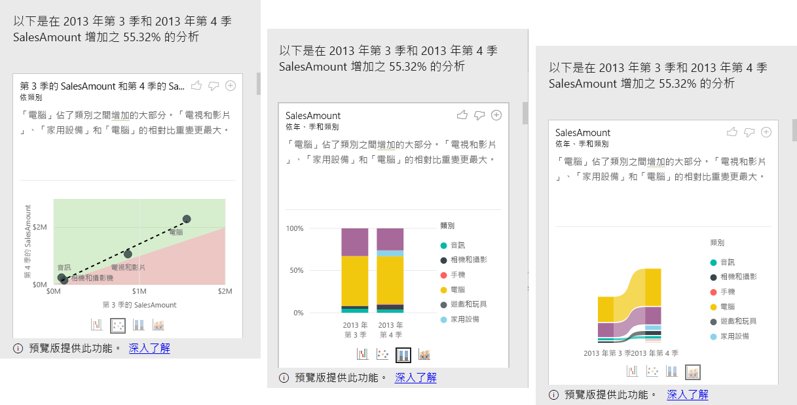

# 使用 Power BI Desktop (預覽) 中的深入解析
您可以要求 **Power BI Desktop** 說明圖表中的增減情況，並取得快速、自動化、具洞察力的資料分析。 只要以滑鼠右鍵按一下資料點，然後選取 [分析] > [說明減少的情形] (如果之前的橫條圖較低的話，則為增加情形)，即會以便於使用的視窗形式將深入解析傳遞給您。

這項深入解析的功能與內容相關，並會以正前方的資料點為依據，例如之前的橫條圖或資料行。

> [!NOTE]
> 這項功能目前處於預覽狀態，並可能有所變更。 自 2017 年 9 月起的 **Power BI Desktop** 版本開始，深入解析功能即預設為啟用 (您不需要勾選 [預覽] 方塊即可啟用)。
> 
> 

## 使用深入解析
若要使用深入解析，只要以滑鼠右鍵按一下橫條圖或線條視覺效果中的任何資料點，然後選取 [分析] > [說明增加的情形] (或 [說明減少的情形]，因為所有深入解析都是以先前的資料點變更為依據)。

**Power BI Desktop** 即會對這項資料執行機器學習演算法，並於視窗中填入視覺效果與描述，以說明哪些類別對增加或減少情況的影響最大。 深入解析預設會有「瀑布圖」視覺效果，如下圖所示。

選取瀑布圖視覺效果底部的小圖示，即可選擇要讓深入解析顯示散佈圖、堆疊直條圖，或功能區圖表。

頁面頂端有「喜歡」和「不喜歡」圖示，可讓您提供視覺效果和功能的意見反應。

值得注意的是，視覺效果頂端的 **+** 按鈕可讓您將選取的視覺效果新增至報表，就像您手動建立視覺效果一樣。 然後，您可以設定新增視覺效果的格式或進行調整，方法即如您在報表上對任何其他視覺效果的操作。 在 **Power BI Desktop** 中編輯報表時，您只能新增選取的深入解析視覺效果。

當報表在閱讀模式或編輯模式中時，您都可以使用深入解析，讓分析資料與建立可輕鬆新增至報表之視覺效果的作業更加多元。

## 考量與限制
因為深入解析是根據前一個資料點的變更來進行解析，所以選取視覺效果中的第一個資料點時，就無法使用此功能。 

下列清單是目前「深入解析」不支援的案例集合：

* TopN 篩選
* 包含/排除篩選
* 量值篩選
* 非加總量值和彙總
* 顯示值為
* 篩選量值 (這是我們用於深入解析散佈圖的新功能)
* X 軸上的類別資料行 (除非它定義純量的依資料行排序作業)。 如果使用階層，則在使用中階層內的每個資料行皆必須符合此條件
* 非數字量值

此外，深入解析目前不支援下列模型類型和資料來源：

* DirectQuery
* Live connect
* 內部部署的 Reporting Services
* 內嵌

## 後續步驟
如需 **Power BI Desktop** 的詳細資訊，以及如何開始使用，請參閱下列文章。

* [Power BI Desktop 是什麼？](desktop-what-is-desktop.md)
* [Power BI Desktop 的查詢概觀](desktop-query-overview.md)
* [Power BI Desktop 中的資料來源](desktop-data-sources.md)
* [連接至 Power BI Desktop 中的資料](desktop-connect-to-data.md)
* [使用 Power BI Desktop 合併資料並使其成形](desktop-shape-and-combine-data.md)
* [Power BI Desktop 中的常見查詢工作](desktop-common-query-tasks.md)   

