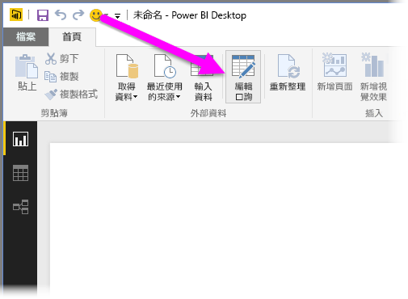
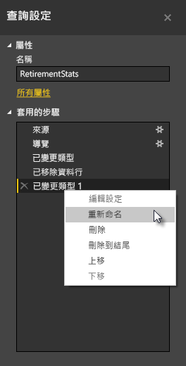

# Power BI Desktop 中的查詢概觀
透過 **Power BI Desktop**，您可以連線到資料世界、建立具吸引力的基礎報表，並與他人分享您的成果。其他使用者可接著以您的成果作為建置基礎，擴展自己的商務智慧成果。

Power BI Desktop 包含三種檢視：

* **報表** 檢視 - 您可以在此利用所建立的查詢，建立多頁具吸引力的視覺效果，並依您想要顯示的方式進行排列，以與他人共用
* **資料** 檢視 - 以資料模型格式檢視報表中的資料，您可以在此加入量值、建立新的資料行及管理關聯性
* **關聯性** 檢視 - 以圖形表示資料模型中已建立的關聯性，並視需要進行管理或修改。

藉由選取 Power BI Desktop 左側的三個圖示之一，即可存取這些檢視。 在下圖中，會選取 [報表檢視]，並以圖示旁的黃色寬線表示。  

Power BI Desktop 也隨附 [查詢編輯器] ，您可以從中連接到一或多個資料來源、依您的需求成形和轉換資料，再將該模型載入 Power BI Desktop。

本文概述 [查詢編輯器] 中的資料工作。 您當然還需要深入了解，因此在本文結尾，您將找到有關支援的資料類型、連接到資料、資料成形、建立關聯性及如何開始使用的詳細指引連結。

但首先，讓我們來認識 [查詢編輯器] 。

## 查詢編輯器
若要移至 [查詢編輯器]，請從 Power BI Desktop 的 [常用] 索引標籤選取 [編輯查詢]。  

如果未連接資料，[查詢編輯器] 看起來就像是準備填入資料的空白窗格。  

載入查詢之後，[查詢編輯器] 檢視會變得更有趣。 如果我們連接到下列 Web 資料來源，[查詢編輯器] 會載入該資料的相關資訊，您可以接著開始將此資料成形。

[*http://www.bankrate.com/finance/retirement/best-places-retire-how-state-ranks.aspx*](http://www.bankrate.com/finance/retirement/best-places-retire-how-state-ranks.aspx)

以下是建立資料連線之後所顯示的 [查詢編輯器]：

1. 在功能區中，現在有許多按鈕可以與查詢中的資料互動。
2. 在左窗格中，會列出查詢以供選取、檢視及成形。
3. 在中央窗格中，會顯示所選查詢的資料以供成形
4. [查詢設定] 視窗隨即顯示，列出查詢的屬性和套用的步驟  
   
   

我們將在下列各節中分別討論這四個區域：功能區、查詢窗格、資料檢視和 [查詢設定] 窗格。

## 查詢功能區
[查詢編輯器] 中的功能區是由四個索引標籤組成：[常用]、[轉換]、[加入資料行] 和 [檢視]。

[常用] 索引標籤包含常見的查詢工作，包括任何查詢的第一個步驟，也就是 [取得資料]。 下圖顯示 [常用] 功能區。  

若要連接到資料並開始查詢建立程序，請選取 [取得資料]  按鈕。 此時會出現一個功能表，提供最常見的資料來源。  

如需可用資料來源的詳細資訊，請參閱＜資料來源＞ 。 如需連接到資料的相關資訊，包括範例和步驟，請參閱＜連接到資料＞ 。

[轉換]  索引標籤可存取常見的資料轉換工作，例如加入或移除資料行、變更資料類型、分割資料行，以及其他資料驅動型工作。 下圖顯示 [轉換]  索引標籤。  

如需轉換資料的詳細資訊，包括範例，請參閱＜結合及成形資料＞ 。

[加入資料行]  索引標籤提供與加入資料行、格式化資料行資料及加入自訂資料行相關聯的其他工作。 下圖顯示 [加入資料行]  索引標籤。  

功能區上的 [檢視]  索引標籤可用來切換是否顯示特定窗格或視窗。 它也可用來顯示 [進階編輯器]。 下圖顯示 [檢視]  索引標籤。  

請注意，您也可以在中央窗格中，以滑鼠右鍵按一下資料行或其他資料，來執行功能區所提供的許多工作。

## 左窗格
左窗格顯示使用中的查詢數目及查詢名稱。 當您從左窗格選取查詢時，其資料會顯示在中央窗格中，您可以在此將資料成形及轉換，以符合您的需求。 下圖顯示內含多項查詢的左窗格。  

## 中央 (資料) 窗格
在中央窗格或 [資料] 窗格中，會顯示所選查詢的資料。 這是完成 [查詢] 檢視中大部分工作的位置。

在下圖中，會顯示先前建立的 Web 資料連接，並選取 [整體分數]  資料行，當以滑鼠右鍵按一下其標頭時，會顯示可用的功能表項目。 請注意，許多快顯功能表項目與功能區索引標籤中的按鈕相同。  

當您選取快顯功能表項目 (或功能區按鈕) 時，[查詢] 會將步驟套用至資料，並將資料儲存為查詢本身的一部分。 如下一節所述，這些步驟會循序記錄到 [查詢設定]  窗格中。  

## 查詢設定窗格
[查詢設定]  窗格是顯示與查詢相關聯之所有步驟的位置。 例如，在下圖中，[查詢設定]  窗格的 [套用的步驟]  區段會反映剛才已變更 [整體分數]  資料行類型的真實情況。

當額外的成形步驟套用至查詢時，便會從 [套用的步驟]  區段中擷取這些步驟。

請務必了解基礎資料「不會」  變更；相反地，[查詢編輯器] 會調整並成形其資料檢視，並根據 [查詢編輯器] 中已成形及修改的資料檢視，進行與基礎資料的任何互動。

在 [查詢設定]  窗格中，您可以視需要重新命名步驟、刪除步驟或重新排序步驟。 若要執行這項操作，請以滑鼠右鍵按一下 [套用的步驟]  區段中的步驟，然後從出現的功能表中進行選擇。 所有查詢步驟會依其在 [套用的步驟] 窗格中出現的順序來執行。

## 進階編輯器
如果您想要查看 [查詢編輯器] 透過每個步驟所建立的程式碼，或想要建立您自己的成形程式碼，您可以使用 [進階編輯器] 。 若要啟動 [進階編輯器]，請從功能區選取 [檢視]  ，然後選取 [進階編輯器] 。 此時會出現一個視窗，並顯示現有的查詢程式碼。  

您可以在 [進階編輯器]  視窗中直接編輯程式碼。 若要關閉視窗，請選取 [完成]  或 [取消]  按鈕。  

## 儲存您的工作
如果您的查詢符合需求，您可以讓 [查詢編輯器] 將資料模型的變更套用至 Power BI Desktop，再關閉 [查詢編輯器]。 若要執行這項操作，請從 [查詢編輯器] 的 [檔案] 功能表選取 [關閉並套用]。  

進行時，Power BI Desktop 會提供一個顯示其狀態的對話方塊。  

一旦您的查詢符合需求，或者如果您只想要確定已儲存工作，Power BI Desktop 都會將您的工作儲存為 .pbix 檔案格式。

若要儲存您的工作，請選取 **檔案 \>儲存**(或 **[檔案]\> [另存新檔]**)，如下圖所示。  

## 後續步驟
您可以使用 Power BI Desktop 執行各種作業。 如需有關其功能的詳細資訊，請參閱下列資源：

* [Power BI Desktop 是什麼？](desktop-what-is-desktop.md)
* [Power BI Desktop 中的資料來源](desktop-data-sources.md)
* [連接至 Power BI Desktop 中的資料](desktop-connect-to-data.md)
* [使用 Power BI Desktop 合併資料並使其成形](desktop-shape-and-combine-data.md)
* [Power BI Desktop 中的常見查詢工作](desktop-common-query-tasks.md)   

