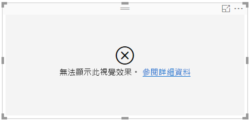

# 使用 R 建立 Power BI 視覺效果
有了 **Power BI Desktop**，您可以使用 **R** 將資料視覺化。

## 安裝 R
**Power BI Desktop** 不會包含、部署或安裝 **R** 引擎。 若要在 **Power BI Desktop** 執行 R 指令碼，您必須在本機電腦上另外安裝 **R**。 您可以從許多位置免費下載並安裝 **R**，包括 [Revolution Open 下載頁面](https://mran.revolutionanalytics.com/download/)以及 [CRAN 儲存機制](https://cran.r-project.org/bin/windows/base/)。 **Power BI Desktop** 目前版本的 R 指令碼支援安裝路徑中的 Unicode 字元和空格 (空白字元)。

## 啟用 R 視覺效果
若要啟用 R 視覺效果，請選取 [檔案] > [選項及設定] > [選項]，然後在隨即顯示的 [選項] 頁面中，確認已在 [選項] 視窗的 [R 指令碼] 區段中指定本機 R 安裝，如下圖所示。 在下圖中，R 的本機安裝路徑為 **C:\Program Files\R\R-3.2.0**，而在文字方塊中會明確提供該路徑。 請確認顯示的路徑正確的反映您希望 **Power BI Desktop** 使用的本機 R 安裝。
   
   

指定 R 安裝後，您就可以開始建立 R 視覺效果。

## 在 Power BI Desktop 中建立 R 視覺效果
1. 在 [視覺效果] 窗格中選取 **R 視覺效果**圖示 (如下圖所示) 以加入 R 視覺效果。
   
   

   當您將 R 視覺效果新增至報表時，**Power BI Desktop** 會執行下列動作：
   
   - 報表畫布上會出現預留位置 R 視覺影像。
   
   - **R 指令碼編輯器**會隨即在中央窗格的底部顯示。
   
   

2. 接下來，將您想要在 R 指令碼中使用的欄位新增到 [欄位] 的 [值] 區段中，就如同任何其他 **Power BI Desktop** 視覺效果一般。 
    
    只有加入到 [欄位] 的欄位才可提供您的 R 指令碼使用。 您在 **Power BI Desktop R 指令碼編輯器**中使用 R 指令碼時，也可以新增欄位，或從 [欄位] 移除不需要的欄位。 **Power BI Desktop** 會自動偵測您已新增或移除哪些欄位。
   
   > [!NOTE]
   > R 視覺效果的預設彙總類型為「不摘要」。
   > 
   > 
   
3. 現在您可以使用選取的資料來建立繪圖。 

    在您選取欄位時， **R 指令碼編輯器** 會根據您在 [編輯器] 窗格上方灰色區段中所選取的項目，產生支援的 R 指令碼繫結程式碼。 在您選取或移除額外的欄位時，R 指令碼編輯器中的程式碼會隨之自動產生或受到移除。
   
   在下圖所示的範例中，已選取三個欄位：hp、gear 以及 drat。 由於選取了這些項目，R 指令碼編輯器會產生下列繫結程式碼：
   
   * 建立稱為 **資料集** 的資料框架
     * 該框架由使用者所選取的不同欄位所組成
   * 預設彙總為「不摘要」 
   * 類似於資料表視覺效果，欄位經過分組，且重複的資料列只會出現一次
   
   
   
   > [!TIP]
   > 在某些情況下，您可能不想自動進行分組，或您希望所有的資料列都會顯示，包括重複項目在內。 在此情況下，您可以將索引欄位加入資料集中，如此所有的資料列都將視為唯一，且不會進行分組。
   > 
   > 
   
   產生的資料框架稱為**資料集**，且您可以根據所選資料行的各自名稱來加以存取。 例如，在 R 指令碼中撰寫 *dataset$gear* 即可存取 gear 欄位。 針對使用空格或特殊字元的欄位，使用單引號加以括住。

4. 由於資料框架會根據您選取的欄位自動產生，因此您可以撰寫 R 指令碼，進而繪製到 R 預設裝置。 指令碼完成後，請從 \[R 指令碼編輯器]  標題列選取 \[執行]  \(\[執行] 位於標題列右側)。
   
    選取 [執行] 後，**Power BI Desktop** 會識別繪製內容並將其呈現在畫布上。 由於此程序會在本機的 R 安裝上執行，因此請確定已安裝必要的套件。
   
   當下列任一種狀況發生時，**Power BI Desktop** 會重新繪製視覺效果：
   
   * 當您從 [R 指令碼編輯器] 標題列選取 [執行] 時
   * 每當因資料重新整理、篩選或反白顯示而發生資料變更時

    下圖顯示相互關聯繪製程式碼的範例，它繪製不同類型汽車屬性之間的關聯性。

    

5. 若要取得更大的視覺效果檢視，您可以將 **R 指令碼編輯器**最小化。 當然，就如同 **Power BI Desktop** 中的其他視覺效果，您可以在環圈圖視覺效果 (上方範例影像右側的圓形視覺效果) 中只選取跑車，藉此交叉篩選相互關聯繪製內容。

    

6. 您也可以修改 R 指令碼以自訂視覺效果，並透過將參數加入繪製命令中，進而利用 R 的強大功能。

    原始的繪製命令如下：

    corrplot(M, method = "color",  tl.cex=0.6, tl.srt = 45, tl.col = "black")

    在 R 指令碼中進行一些變更後，新的命令如下：

    corrplot(M, method = "circle", tl.cex=0.6, tl.srt = 45, tl.col = "black", type= "upper", order="hclust")

    如此一來，R 視覺效果現在可繪製圓形且只會將上半部列入考量，並重新排序叢集相互關聯屬性的矩陣，如下圖所示。

    

    當執行 R 指令碼而產生錯誤時，R 視覺效果不會進行繪製，且畫布上會顯示錯誤訊息。 如需有關錯誤的詳細資訊，請從畫布上的 R 視覺效果錯誤選取 **查看詳細資料** 。

    

    > **R 指令碼的安全性︰**R 視覺效果是從 R 指令碼建立，其中的程式碼可能具有安全性或隱私權風險。 初次嘗試檢視 R 視覺效果或與其互動時，使用者會看到安全性警告訊息。 請在信任作者與來源，或已檢閱並了解 R 指令碼之後，才啟用 R 視覺效果。
    > 
    > 

## 已知的限制
**Power BI Desktop** 中的 R 視覺效果有一些限制：

* 資料大小限制 – R 視覺效果用於繪製的資料限制為 150,000 個資料列。 如果選取超過 150,000 個資料列，則只會使用前 150,000 個資料列，而且影像上會顯示訊息。
* 計算時間限制 – 如果 R 視覺效果計算超過五分鐘，執行時間會逾時並導致錯誤。
* 關聯性 – 如同其他 Power BI Desktop 視覺效果，如果選取來自不同資料表的資料欄位，而其之間沒有定義關聯性，便會發生錯誤。
* R 視覺效果會在資料更新、篩選及反白顯示時進行重新整理。 不過，影像本身不是互動式，且不得為交叉篩選的來源。
* R 視覺效果會回應反白顯示的其他視覺效果，但您不能點選 R 視覺效果中的項目，無法交叉篩選其他項目。
* 只有繪製到 R 預設顯示裝置的繪圖才會在畫布上正確顯示。 避免明確地使用不同的 R 顯示裝置。
* 在此版本中，32 位元版本的 Power BI Desktop 不會自動識別 RRO 安裝，因此您必須在 [選項及設定] > [選項] > [R 指令碼] 手動提供 R 安裝目錄的路徑。

## 後續步驟
請看看下列有關 Power BI 中 R 的其他資訊。

* [在 Power BI Desktop 中執行 R 指令碼](desktop-r-scripts.md)
* [在 Power BI 使用外部 R IDE](desktop-r-ide.md)

