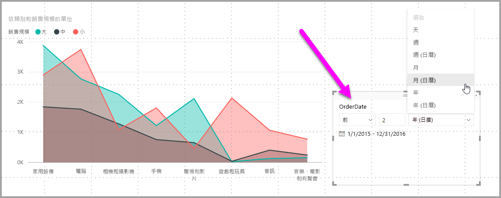
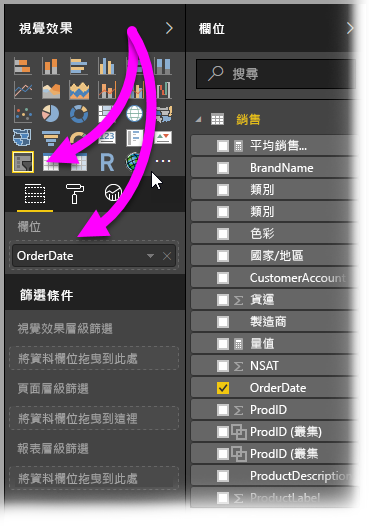
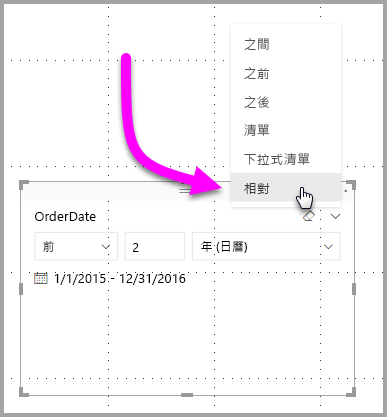
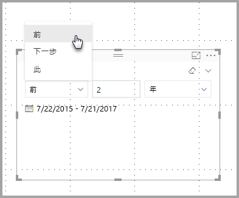
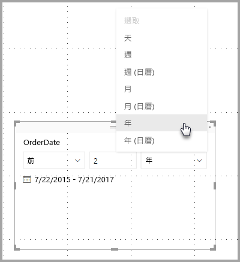
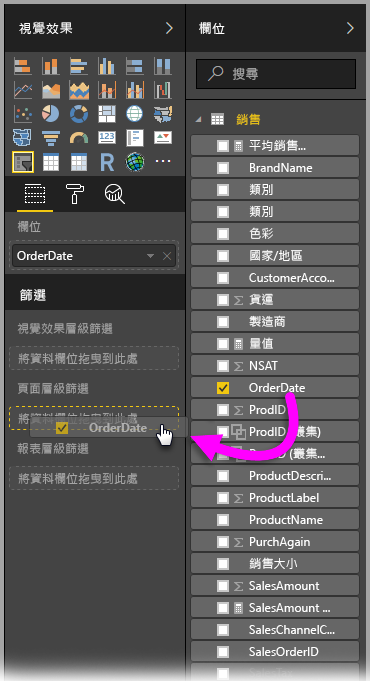
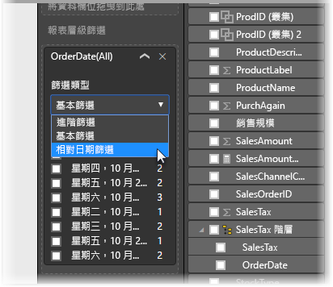
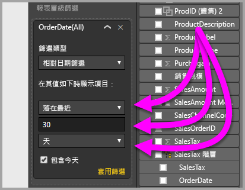

# 在 Power BI Desktop 中使用相對日期交叉分析篩選器與篩選條件
利用**相對日期交叉分析篩選器**或**相對日期篩選條件**，可以將時間篩選條件套用到資料模型中的任何日期資料行。 舉例來說，您可以使用**相對日期交叉分析篩選器**，只顯示過去三十天 (或月、日曆月份等) 內產生的銷售資料。 當您重新整理資料時，相對時段會自動套用適當的相對日期限制式。

## 使用相對日期範圍交叉分析篩選器
您可以使用相對日期交叉分析篩選器，就如同使用其他交叉分析篩選器一般。 只要建立報表的 [交叉分析篩選器] 視覺效果，然後選取一個日期值作為 [欄位] 值即可。 在下圖中，選取了 [OrderDate] 欄位。

選取**相對日期交叉分析篩選器**右上角的插入號，即會出現功能表。

針對相對日期交叉分析篩選器，請選取 [相對]。

接著便可以選取設定。 在*相對日期交叉分析篩選器* 的第一個下拉式功能表中，您有下列選項可以選取：

* 前
* 下一步
* 此

這些選取項目顯示於下圖。

*相對日期交叉分析篩選器* 中的之後 (中間那一項) 設定可讓您鍵入數字，以定義相對日期範圍。

第三個設定可讓您選取日期度量，您有下列選項可以選取：

* 天
* 週
* 週 (日曆)
* 月
* 月 (日曆)
* 年
* 年 (日曆)

這些選取項目顯示於下圖。

若您從該清單選取 [月]，並在中間的設定中輸入 2。 就會發生下列情形：如果今天是 7 月 20 日，受交叉分析篩選器限制的視覺效果中，包含的資料會顯示前兩格月，自 5 月 20 日至 7 月 20 日 (今天日期) 的資料。

相對來說，若您選取 [月 (日曆)]，受限制的視覺效果會顯示自 5 月 1 日至 6 月 30 日 (之後兩個完整的日曆月份) 的資料。

## 使用相對日期範圍篩選條件
您也可以為報表頁面或整個報表建立相對日期範圍篩選條件。 若要這樣做，只要如下圖所示，將日期欄位拖曳至 [欄位] 窗格中的 [頁面層級篩選] 或 [報表層級篩選] 區域。

完成後，您可以用類似自訂**相對日期交叉分析篩選器**的方式修改相對日期範圍。 從 [篩選條件類型] 下拉式功能表選取 [相對日期篩選]。

選取 [相對日期篩選] 後，您會看見三個要修改的區段，包括一個置中的數字方塊，就像交叉分析篩選器一樣。

以上就是在報表中使用這些相對日期限制式的步驟。

## 限制與考量
**相對日期範圍交叉分析篩選器**及篩選條件目前適用下列限制與考量。

* **Power BI** 中的資料模型不包含時區資訊。 模型可以儲存時間，但無法指出所在時區。
* 交叉分析篩選器及篩選條件一律以 UTC 時間為依據，所以如果您在報表中設定篩選條件，再將其傳送給不同時區中的同事，您與同事都會看到一樣的資料。 不過，若您不在 UTC 時區內，可能會看見時間位移在預期之外的資料。
* 使用**查詢編輯器**可以將在當地時區中擷取的資料轉換為 UTC。

