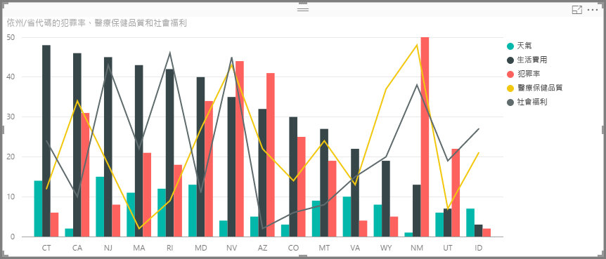
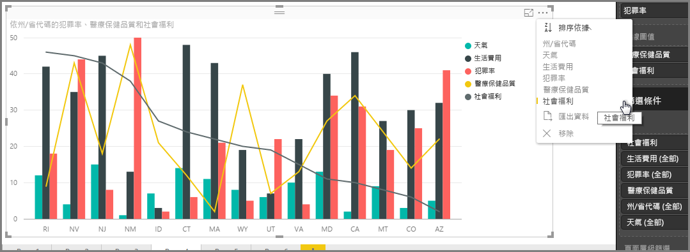
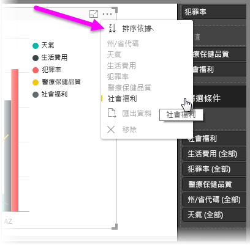
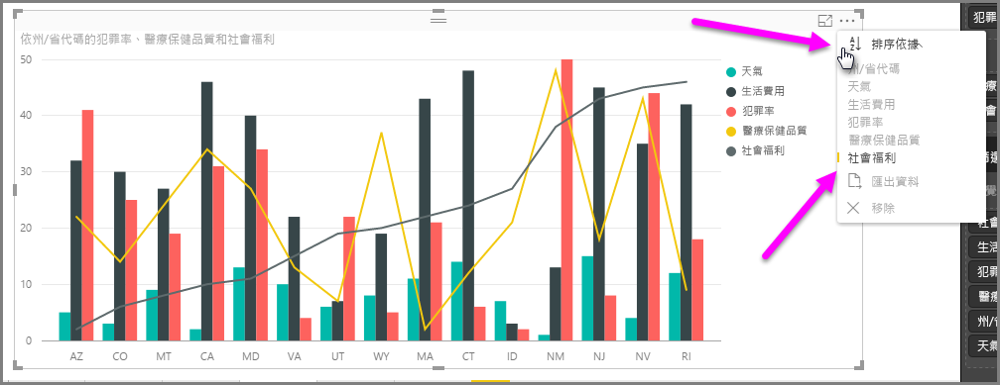
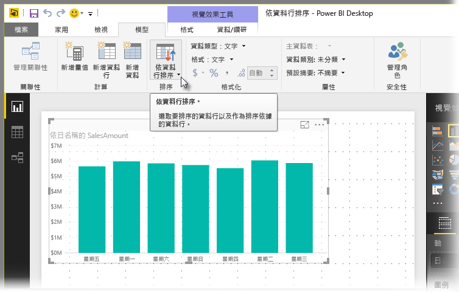
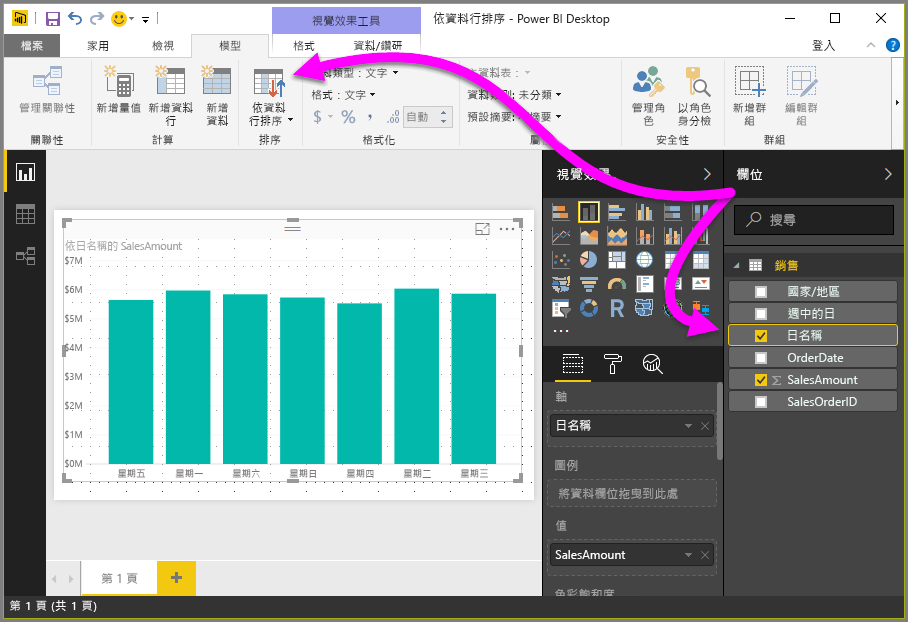
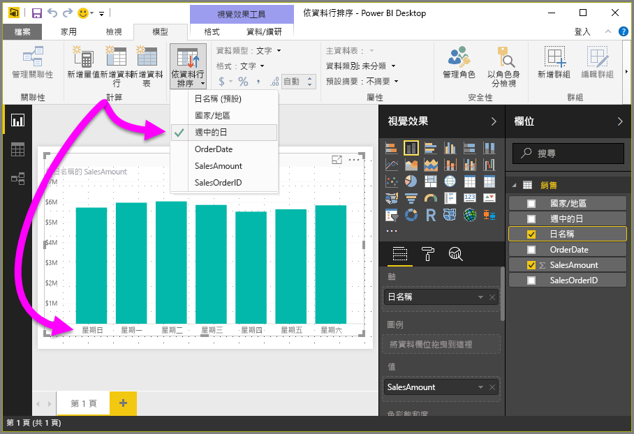
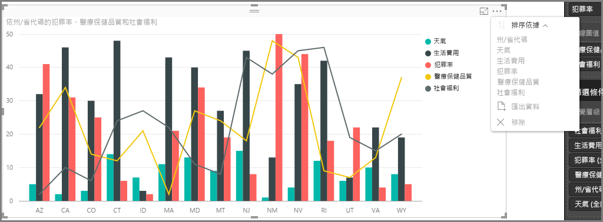

# Power BI Desktop 中的依資料行排序
在 **Power BI Desktop** 和 **Power BI 服務**中，您可以依不同資料欄位進行排序來變更視覺效果外觀。 變更視覺效果的排序方式，即可反白顯示您想要傳達的資訊，並確定視覺效果反映出任何您想要傳達的趨勢 (或強調)。

無論您是使用數值資料 (例如銷售數據) 或文字資料 (如州名稱)，都可以任何方式排序視覺效果，變成您要的樣子。  **Power BI** 提供更多的排序彈性，以及可供您使用的快速功能表。 在任何視覺效果上，選取省略符號功能表 (...)，並選取 [排序依據]，然後選取要作為排序依據的欄位，如下圖所示。

## 深入探討和範例
讓我們深入探討範例，並查看它在 **Power BI Desktop** 中的運作方式。

下列視覺效果列出有關天氣的前 15 個州 (晴天數從第 1 名排到第 50 名，第 1 名的晴天數最多)。 以下是尚未進行任何排序的視覺效果。

視覺效果目前是以 [生活花費] 排序，這可在將遞減的長條顏色與圖例比對後得知，但還有更好的方法可以判斷目前的排序資料行：[排序依據] 對話方塊，這可從視覺效果右上角的省略符號功能表 (...) 前往。 當我們選取省略符號時，可以看到下列項目︰

選取省略符號時，可以注意幾個功能表中出現的項目︰

* [生活花費] 旁邊的黃色列，以及粗體顯示的 [生活花費]
* **排序依據**文字旁邊的小圖示，顯示 **Z/A** (Z 在 A 上方) 和向下箭號。

我們將在接下來兩節中分別探討以上項目。

## 選取要用來排序的資料行
在 [排序依據] 功能表中，您會注意到 [生活花費] 旁邊有黃色列，這表示視覺效果正在使用 [生活花費] 資料行來排序視覺效果。 使用其他資料行排序很簡單 – 只要選取省略符號，顯示 [排序依據] 功能表後選取其他資料行即可。 就是這麼簡單。

下圖中，我們選取 [社區幸福感] 作為我們排序所用的資料行。 該資料行剛好是視覺效果中的其中一條線，而非長條。 在我們選取 **社區幸福感** 後，就會變成以下這個樣子.

請注意視覺效果的變化。 在視覺效果所包含的各州中，數值現在是從 [社區幸福感] 值最高的州 (此例中為 RI，即羅德島州)，排到數值最低的 AZ (即亞歷桑那州)。 請記住，整體圖表仍然只包含晴天數最多的 15 個州，我們只是利用視覺效果內的其他資料行進行排序。

但是，如果我們要遞增排序，而不要遞減排序，那該怎麼做？ 下節會說明方法其實相當簡單。

## 選取排序順序 – 最小到最大、最大到最小
當我們深入觀察前一張圖的 [排序依據] 功能表時，可以看到 [排序依據] 旁顯示 **Z/A** (Z 在 A 的上方) 圖示。 讓我們一起來看看：

當顯示 **Z/A** 時，表示視覺效果是依從最大值到最小值的順序來排序所選的資料行。 想要更改嗎？ 沒問題，只要點選或按一下 **Z/A** 圖示，它就會將排序順序改為 **A/Z** ，並從最小到最大值排序視覺效果 (根據所選的資料行)。

以下我們使用相同的視覺效果，但這次是先點選 [排序依據] 功能表中的 **Z/A** 圖示來變更順序。 請注意，AZ (亞利桑那州) 現在為第一個列出的州，而 RI (羅德島州) 則是最後一個州，和之前的排序相反。

您可以使用視覺效果內的任何資料行進行排序。我們可輕鬆選取 [天氣] 作為用來排序的資料行，然後從 [排序依據] 功能表中選取 **Z/A**，即可優先顯示晴天數最多的州 (最高值 - 在此資料模型中，天氣等於晴天數)，同時仍保留視覺效果中的其他資料行，無論其是否剛好適用於該州。 以下就來看看具有這些設定的視覺效果。

## 使用 [依資料行排序] 按鈕排序
還有另一個方法來排序資料，就是使用 [模型] 功能區中的 [依資料行排序] 按鈕。

這個排序方法會要求您從 [欄位] 窗格選取資料行，然後選取 [依資料行排序] 按鈕來選擇如何 (根據哪一個資料行) 排序視覺效果。 您必須從 [欄位] 窗格選取想要排序的資料行 (欄位)，以啟用 [依資料行排序] 按鈕，否則按鈕處於非使用中。

讓我們來看看一個常見的範例︰您有來自每週每一天的資料，而且您想要根據時間順序排序。 下列步驟將顯示做法。

1. 首先，請注意，當已選取視覺效果，但沒有在 [欄位] 窗格中選取任何資料行，則 [依資料行排序] 按鈕無法使用 (灰色)。
   
   
2. 當我們選取要用來排序的資料行時，在 [欄位] 窗格中，[依資料行排序] 按鈕會變成使用中。
   
   
3. 接下來，選取視覺效果之後，我們可以選取 [週中的日]，而不是預設值 (「星期幾名稱」)，視覺效果會以我們想要的順序排序︰依週中的日。
   
   

這樣就大功告成了！ 請記住，您必須在 [欄位] 窗格中選取資料行，[依資料行排序] 按鈕才會變成使用中。

## 回到預設資料行以進行排序
您可以隨心所欲排序任何資料行，但偶爾會想回到預設的排序資料行。 沒問題。 針對已選取排序資料行的視覺效果 (如前所述，已選取之排序資料行的 [排序依據] 功能表旁會有一個黃色列)，只要開啟 [排序依據] 功能表並再次選取該資料行，視覺效果就會回到預設的排序資料行。

例如，以下是我們先前的圖表︰

當我們返回功能表並再次選取 [天氣] 時，視覺效果預設會依 [狀態碼] 以字母順序排序，如下圖所示。

有如此多種排序視覺效果的選項，建立所需的圖表或影像真的很簡單。

