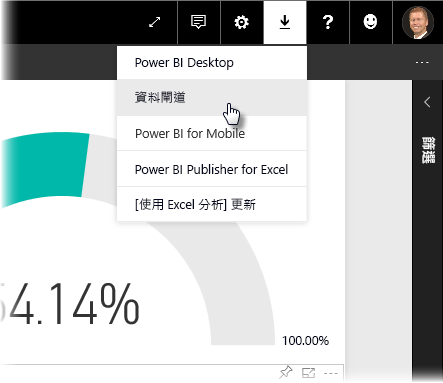
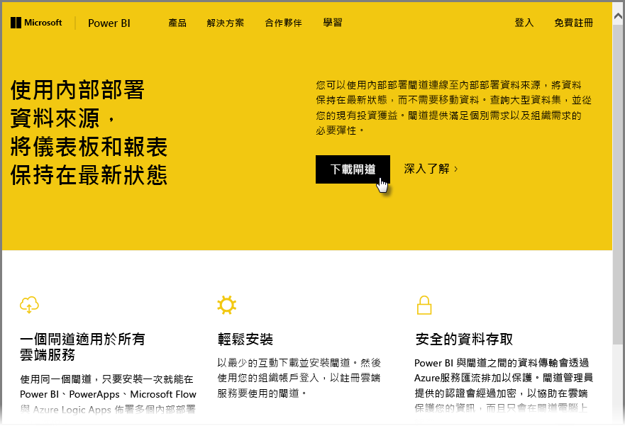
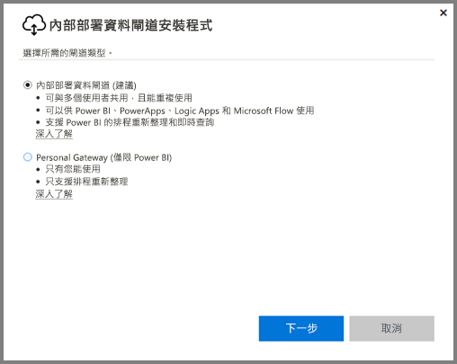
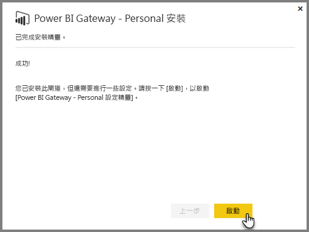
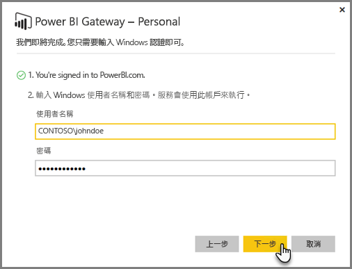
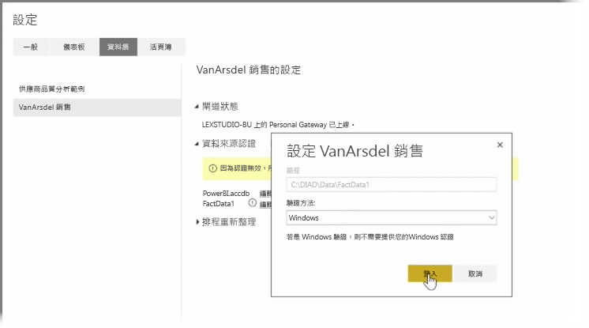
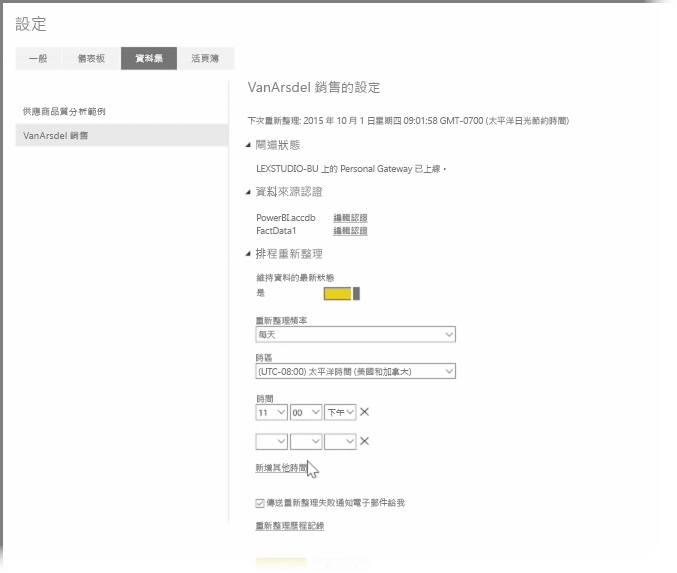
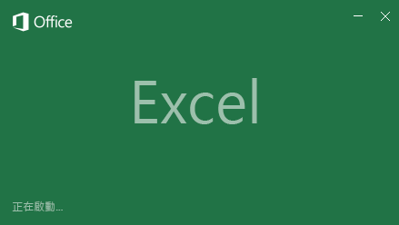

在之前的主題中，我們已經討論過如何使用 Power BI 連接到資料來源，以及如何手動重新整理 Power BI 服務上的資料集。 不過，每次變更資料時都要手動重新整理項目實在不太方便，因此您可以使用 Power BI 來設定重新整理排程，以連線到您的資料來源並自動將它們發佈至 Power BI 服務。 這麼做也可讓您進行服務與任何內部部署資料來源的連線 (包括 Excel 檔案、Access 資料庫、SQL 資料庫等)。

**資料閘道**是一種可讓您將內部部署資料來源連線到 Power BI 服務的系統。 它是一種在電腦上執行的小型應用程式，其會按照預先安排的排程連接到您的資料、收集任何更新，並將其推送到 Power BI 服務。 **Personal Gateway** 是**資料閘道**的一個版本，不需任何系統管理員設定即可使用。

>[!NOTE]
>執行 Power BI Personal Gateway 的電腦「必須」開機並連線到網際網路，**Personal Gateway** 才能正常運作。
> 

若要設定您的**個人閘道**，請先登入 Power BI 服務。 選取畫面右上角的**下載**圖示，然後從功能表選取 [資料閘道]。

接著，您會前往一個網頁，請選取其中的 [Power BI Gateway - Personal]，如下所示。

完成下載之後，請執行應用程式，並完成安裝精靈。

系統會提示您，啟動組態精靈來設定您的閘道。

系統會要求您先登入 Power BI 服務帳戶，再登入電腦的 Windows 帳戶，因為閘道服務在您的帳戶下執行。

返回 Power BI 服務。 選取您想要重新整理之資料集旁的省略符號 (三個點) 功能表，然後選取 [排程更新]。 這會開啟 [重新整理設定] 頁面。 Power BI 會偵測到您已安裝 **Personal Gateway**，並讓您知道其狀態。

選取每個適用資料來源旁邊的 [編輯認證]，然後設定驗證。

最後，設定 [排程更新] 下方的選項以啟動自動更新，並設定執行的頻率。

這樣就大功告成了！ 排程時間到達時，Power BI 會使用您提供的認證與執行 **Personal Gateway** 的電腦連線，以連接這些資料來源，再根據您的排程更新報表和資料集。 下次您前往 Power BI 時，最近重新整理排程的資料即會反映在這些儀表板、報表和資料集中。

## 後續步驟
**恭喜您！** 您已完成 Power BI **導引式學習**課程的＜探索資料＞一節。 Power BI 服務提供許多有趣的方式，可讓您探索資料、共用深入資訊，並與視覺效果互動。 此外，它完全可以透過瀏覽器存取，因此您可以隨時隨地進行連線。

**Excel** 也是 Power BI 其中一個功能強大的搭配軟體。 Power BI 是專為搭配 Excel 使用所量身設計，因此，活頁簿可以在 Power BI 中輕鬆與順暢地運作。

有多輕鬆？ 在下一節＜Power BI 與 Excel＞中，您就可以了解。

下一節見！

