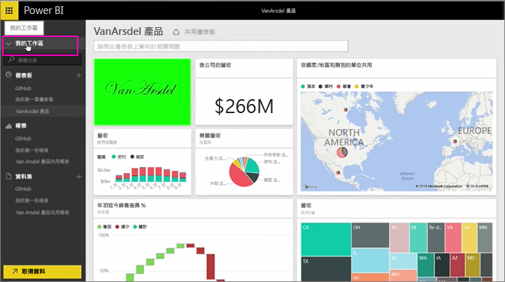
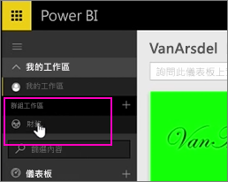
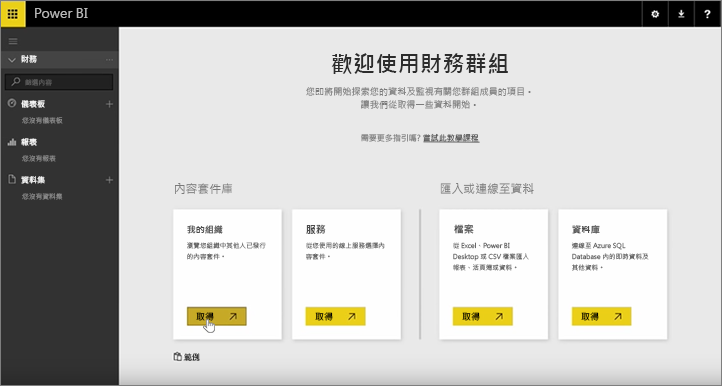
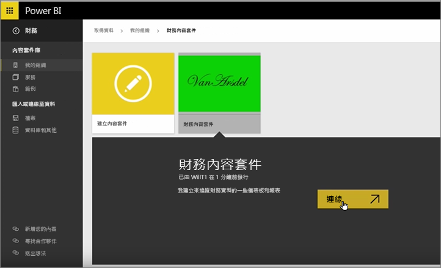
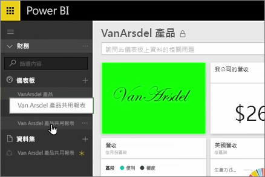
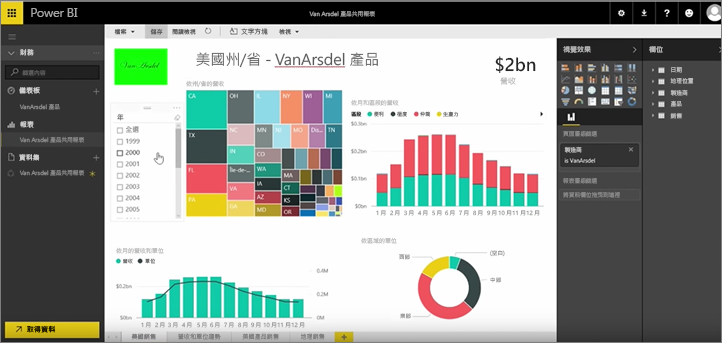

在先前課程中，我們已建立內容套件及群組。 在本課程中，我們要為群組中的每個人建立內容套件的執行個體。

我從 [我的工作區] 開始...

...然後切換回我在先前的課程中所建立的 Finance 群組。

群組尚未擁有任何儀表板、報表及資料集。 我將要使用我所建立的內容套件。 我從我的組織瀏覽內容套件，而非從協力廠商服務進行瀏覽。

我找到我在一分鐘前建立的內容套件。 於是我了解為何好的標題、描述和影像如此重要，因為這樣可以吸引大家的注意。 我連接至此內容套件。

Power BI 匯入內容套件中的儀表板、報表和資料集。

當我選取資料集時，Power BI 會詢問我是否要將內容套件個人化。

我要建立一份內容套件的複本，讓我可以進行變更，並能將其從內容套件的已發行版本中斷連線。 如果內容套件的建立者對已發行版本進行變更，我將不會自動收到這些更新。

但我仍能隨意編輯儀表板、報表甚至是資料集。

因此內容套件能讓您輕鬆地重複使用由貴組織中其他人所建立的內容。

前往下一個課程：[在 Power BI 中建立內容套件](6-4-update-content-pack.md)。

