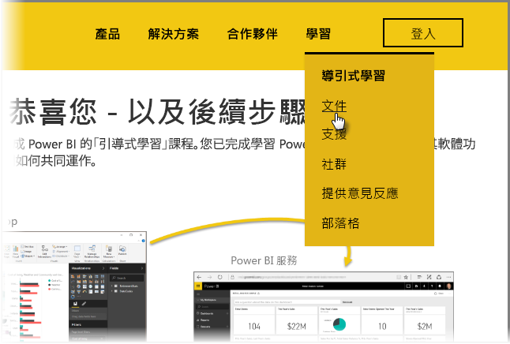

大功告成！ **恭喜您！** 您已完成 Power BI「引導式學習」課程。 您已完成學習 Power BI 的基本項目、瀏覽其軟體功能和項目，以及了解它們如何共同運作。

這是本課程的最後一節 (也是最後一個主題，除非您想要學習 DAX)，因此如果您已依照順序瀏覽所有這些章節，請花點時間鼓勵自己。 表現良好！ 您現在已十分熟悉這些「重要概念」：

* 何謂 [Power BI](0-0-what-is-power-bi.md)
* Power BI 的[建置組塊](0-0b-building-blocks-power-bi.md)
* [取得](1-2-connect-to-data-sources-in-power-bi-desktop.md)資料並加以[模型化](2-1-intro-modeling-data.md)
* [視覺效果](3-1-intro-visualizations.md)
* 在 Power BI 服務中[探索資料](4-0-intro-power-bi-service.md)
* 搭配使用 [Excel 和 Power BI](5-1-intro-excel-data.md)
* 並[發佈和共用](6-0-intro-content-packs-groups.md)您的工作

現在您腦中已具備這些大量的知識，您已準備好學以致用！ 您可透過以下連結進行下載或使瀏覽器連接到 Power BI 服務：

* 您可以隨時[取得最新的 Power BI Desktop](https://powerbi.microsoft.com/desktop)
* 前往 [Power BI 服務](https://powerbi.microsoft.com/)相當容易
* 只需點選幾下，即可取得 [Power BI 行動應用程式](https://powerbi.microsoft.com/mobile/)

同時還有其他說明及參考內容可用。 只要前往此頁面頂端，並選取 [學習] > [文件] 即可查看更詳盡的 Power BI 參考內容。

希望您喜歡這場「Power BI 引導式學習」體驗導覽。 祝您一切順利，並預祝您的 Power BI 視覺效果永遠為沈浸式且吸引人。

## 給 DAX 使用者的額外一節
還要更多？ 有興趣使用 **DAX (資料分析運算式)** 在 Power BI 中建立、篩選，或使用自訂的資料行和資料表嗎？ 有額外的一節是針對傾向於使用 Power BI 進行程式碼工作的人員，該節名為 **DAX 簡介**。 如果您有興趣，本節使用與本導引式學習其餘部分相同的友善方法，請看看。

