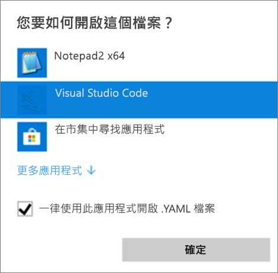
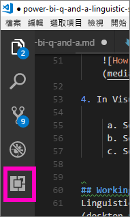
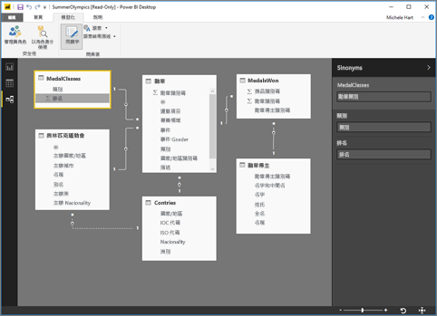

# <a name="language-modeling-and-the-linguistic-schema"></a>語言模型和語言結構描述 
使用一般片語和自然語言來詢問資料問題的功能十分強大。 如果您的資料能夠回答，就更厲害了，而 Power BI 的問與答就有這樣的能耐。 Power BI 問與答在您提出問題時，會盡力正確回答。 

但如果想要得到更好的問與答互動，有幾種方式可以用來改善答案：其中一種是編輯語言結構描述。 

一切從您的企業資料開始。  資料模型愈完善，使用者獲得高品質的解答就愈容易。 改善模型的一種方法是新增語言結構描述，來定義和分類資料集中資料表和資料列名稱之間的術語和關聯性。 Power BI Desktop 可讓您管理語言結構描述。 

## <a name="what-is-a-linguistic-schema"></a>什麼是語言結構描述
語言結構描述描述了問與答對於資料集內的物件，應該要理解的字詞和片語，包括與該資料集相關的詞性、同義字和片語。 當您匯入或連線到資料集時，Power BI 會根據資料集的結構建立語言結構描述。 當您向問與答提問時，這項功能就會尋找資料中的相符部份和關聯性，以找出問題的用意。 例如，尋找名詞、動詞、形容詞、片語和其他元素。 另外還會尋找關聯性，例如哪些資料行是動詞的受詞。 

您可能很熟悉詞性 (如果沒有，請參閱下文)，但對您而言，片語可能是一個新詞。  片語就是您談論 (或表達) 事物之間關聯性的方式。 例如，要描述客戶和產品之間的關聯性，您可以說「客戶購買產品」。 若要描述客戶和年齡之間的關聯性，您可以說「年齡表示客戶的年紀多大」。 或描述客戶與電話號碼之間的關聯性，您可以直接說「客戶有電話號碼」。

這些片語有各種不同的形式與長度。 有些直接與資料模型中的關聯性相對應。 有些會讓資料行與其存在的資料表產生關聯。 還有一些會讓複雜關聯性中的多個資料表和資料行產生關聯。 在所有情況下，片語都會用日常的字詞來描述事物的關聯性。

語言結構描述以 YAML 格式儲存。 此格式與非常熱門的 JSON 格式有關，但提供更有彈性也更容易閱讀的語法。 語言結構描述可以在 Power BI Desktop 中編輯、匯出及匯入。

## <a name="prerequisites"></a>先決條件
- 如果您尚未閱讀關於[改進問與答資料模型](desktop-qna-in-reports.md)的文章，建議您先閱讀該文章。 該文包含了許多用於設計和改進資料模型的秘訣，以及有關新增同義字的重要章節。  

- 問與答有兩個方面。  第一個方面是準備工作，或稱「建立模型」。  第二個方面是提出問題和瀏覽資料，或稱「取用」。 在某些公司，稱為「製造資料模型者」或「IT 系統管理員」的員工，會負責組合資料集、建立資料模型並將資料集發佈至 Power BI。  而第二組員工則是在線上「取用」資料的人。  在其他公司，這些角色可能合併在一起。 

    本主題適合製造資料模型者。 也就是處理資料集並將其最佳化，以提供最佳問與答結果的人員。 

- [範例 .yaml 及 .pbix 檔案](https://go.microsoft.com/fwlink/?linkid=871858)    
- YAML 檔案的編輯器，建議使用 [Visual Studio Code](https://code.visualstudio.com/)


### <a name="set-up-an-editor-for-yaml-files"></a>安裝編輯器以處理 YAML 檔案
建議使用 Visual Studio Code 來編輯語言結構描述 YAML 檔案。 Visual Studio Code 包含對 YAML 檔案現成可用的支援，而且可擴充以專門驗證 Power BI 語言結構描述格式。
1. 安裝 [Visual Studio Code](https://code.visualstudio.com/)。    

2. 選取您稍早儲存的範例語言結構描述：[YAML 檔案](https://go.microsoft.com/fwlink/?linkid=871858) (SummerOlympics.lsdl.yaml)。    
4. 選取 [Visual Studio Code] 並勾選 [一律使用此應用程式開啟 .yaml 檔案]。

    

4. 在 Visual Studio Code 中，安裝 YAML Support by Red Hat 延伸模組。    
    a. 選取 [延伸模組] 索引標籤 (左邊最後一個) 或按 CTRL+SHIFT+X。    
        
    b. 搜尋 "yaml" 並在清單中選取 **YAML Support by Red Hat**。    
    c. 選取 [安裝] > [重新載入]。


## <a name="working-with-linguistic-schemas"></a>使用語言結構描述
語言結構描述可以在 Power BI Desktop 的[關聯性檢視](desktop-relationship-view.md)中編輯、匯出及匯入。 編輯語言結構描述的其中一種方式是[在 [同義字] 窗格中新增同義字](desktop-qna-in-reports.md)。 這不會開啟 YAML 檔案。




 編輯語言結構描述的另一種方式是匯出並直接編輯 YAML 檔案。  在編輯語言結構描述 YAML 檔案時，可以將資料表中的資料行標記為不同的文法元素，以及定義同事可能用來提問的字詞。 例如，您指定幾個資料行是動詞的主詞和受詞，然後在模型中新增同事可以用來指稱資料表、資料行和量值的替代詞。 


在編輯語言結構描述之前，您必須從 Desktop 加以開啟 (匯出)。 當您將 YAML 檔案存回相同位置時，會視為匯入。  但是，您也可以改為匯入其他 YAML 檔案。  例如，如果您有類似的資料集，而且您已經投入了大量時間來新增詞性、識別關聯性、建立片語和建立同義字。 

問與答會使用這些資訊以及您建立的增強功能，以提供更好的答案、自動完成和問題摘要。


## <a name="edit-a-linguistic-schema"></a>編輯語言結構描述
當您第一次從 Desktop 匯出語言結構描述時，檔案中大部分或所有內容將會由問與答引擎自動產生。 這些產生的實體、字詞 (同義字)、關聯性和片語，會標上「狀態：已產生」標籤，而且包含在檔案中的主要用途為提供資訊，但對於您自己的變更而言是個有助益的起點。 

> [!NOTE]
> 本教學課程中包含的範例 YAML 檔案不包含「狀態：已產生」或「狀態：已刪除」標籤，因為該檔案是專門為本教學課程而準備的。 若要查看這些標籤，請在 [關聯性檢視] 中打開未編輯的 .pbix 文件並匯出語言結構描述。


當您將語言結構描述檔案匯回 Power BI Desktop 時，標記為「狀態：已產生」的任何內容都會忽略 (並在之後重新產生)，因此如果您想變更某些產生的內容，請務必刪除相對應的「狀態：已產生」標籤。 同樣地，如果您想刪除某些產生的內容，則需要將「狀態：已產生」標籤變更為「狀態：已刪除」，這樣在匯入語言結構描述檔案時才不會重新產生。

1. 在 Power BI Desktop 中的關聯性檢視中打開資料集。 
2. 選取 [模型] 索引標籤，然後選擇 [匯出語言結構描述]。
3. 選取 Visual Code (或其他編輯器)。
4. 編輯並儲存 YAML 檔案。
5. 從 Desktop 選取關聯性檢視 > [模型] 索引標籤 > [語言結構描述] > [匯入語言結構描述]。
6. 瀏覽到您儲存編輯後 YAML 檔案的位置，並加以選取。 成功訊息會讓您知道語言結構描述 YAML 檔案已成功匯入。

    

### <a name="add-phrasings-to-the-linguistic-schema"></a>將片語新增到語言結構描述
片語就是您談論 (或表達) 事物之間關聯性的方式。 例如，要描述客戶和產品之間的關聯性，您可以說「客戶購買產品」。 若要描述客戶和年齡之間的關聯性，您可以說「年齡表示客戶的年紀多大」。 或描述運動員與獎牌之間的關聯性，您可以直接說「運動員贏得獎牌」。

這些片語有各種不同的形式與長度。 有些直接與語意模型中的關聯性相對應。 有些會讓資料行與其存在的資料表產生關聯。 還有一些會讓複雜關聯性中的多個資料表和資料行產生關聯。 在所有情況下，片語都會用日常的字詞來描述事物的關聯性。

## <a name="where-do-phrasings-come-from"></a>片語從哪裡來？
許多簡單的片語會根據模型結構和一些基於資料行名稱的猜測，自動新增至語言結構描述。 例如：
- 大多數資料行以類似「產品有描述」這樣的簡單片語，與所在的資料表產生關聯。
- 模型關聯性會產生關聯性兩端的預設片語，如「訂單有產品」和「產品有訂單」。
- 某些關聯性模型可以根據資料行名稱獲得更複雜的預設片語，如「訂單運送到城市」。

但是，使用者談論事物的方式，有很多是問與答猜測不到的。 針對這些方式，您可以手動新增片語。


## <a name="why-should-i-add-phrasings"></a>為什麼要新增片語？
新增片語的第一個原因是定義新字詞。 例如，如果您希望能夠要求「列出年紀最大的客戶」，您必須先教導問與答「年紀最大」的意思。 您可以透過新增「年齡表示客戶的年紀多大」這樣的片語達到這個目的。

新增片語的第二個原因是解決模稜兩可的情況。 當字詞有兩個以上的意義時，基本的關鍵字搜尋就難以發揮效用。 比方說，「飛往芝加哥的航班」的意思完全不同於「飛離芝加哥的航班」，但問與答不會知道您是指哪一種意思，除非您新增「航班來自出發城市」和「航班飛往目的地城市」片語。 同樣地，只有當您新增「客戶向員工購買汽車」和「員工出售汽車給客戶」這些片語時，問與答才會理解「John 出售給 Mary 的汽車」和「John 向 Mary 購買的汽車」之間的區別。

新增片語的最後一個原因是改進重述。 相較於問與答對您重複「顯示客戶及他們的產品」，如果改為「顯示客戶及他們購買的產品」或「顯示客戶及他們檢閱的產品」會更加清楚，這取決於問與答如何理解這個問題。 新增自訂片語可讓重述更為明確，也避免模稜兩可。


## <a name="what-kinds-of-phrasings-are-there"></a>片語有哪些類型？
若要了解不同類型的片語，您需要先記住幾個非常基本的文法術語：
- 「名詞」是人、地點或物品。 
    - 範例：汽車、青少年、Mary、通量電容器
- 「動詞」是一個動作或狀態。 
    - 範例：孵化、爆裂、狼吞虎嚥、噴射
- 「形容詞」是修飾名詞的描述性文字。 
    - 範例：強大的、魔法的、金色的、遭竊的
- 「介系詞」會用在名詞之前，以與前一個名詞、動詞或形容詞產生關聯 
    - 範例：的、對於、接近、來自
-  「屬性」是某個事物的特性或特徵。
-  「名稱」是一個或一組單字，可以得知或指稱某個人、動物、地點或事物。   


## <a name="attribute-phrasings"></a>屬性片語
屬性片語是問與答的主力，會在某個事物是另一個事物的屬性時使用。 當細微、詳細的片語尚未定義時，屬性片語很簡單、直接，並且可執行大部分的繁重工作。 屬性片語使用基本動詞「有」(「產品有類別」和「主辦國有主辦城市」) 來描述，並且自動允許使用介系詞 “of” 和 “for” (“categories of products”「產品類別」、“orders for products” 「產品訂單」) 和所有格 (“John’s orders”「John 的訂單」) 來提出問題。 屬性片語用於如下問題：
- 哪些客戶有訂單？
- 按國家遞增列出主辦城市
- 顯示具有 chai 的訂單
- 列出具有訂單的客戶
- 各個產品的類別為何？
- 計算 Robert King 的訂單數    

根據資料表、資料行的內含項目和模型關聯性，模型中所需的絕大多數屬性片語會自動產生，因此您通常不需要自行建立。
以下為屬性片語在語言結構描述中的範例：

```json
product_has_category:
  Binding: {Table: Products}
  Phrasings:
  - Attribute: {Subject: product, Object: product.category}
```
 
## <a name="name-phrasings"></a>名稱片語
如果資料模型中的資料表含有具名物件 (如運動員名稱和客戶名稱)，名稱片語會很有幫助。 例如，「產品名稱是產品的名稱」片語對於能夠在問題中使用產品名稱至關重要。 名稱片語也可讓「名為」做為動詞 (例如「列出名為 John Smith 的客戶」)，當與其他片語結合使用時，最重要的是允許使用名稱值來參考特定的資料表資料列。 例如，「購買了 chai 的客戶」，問與答可以指出 “chai” 值指的是產品資料表中的整個資料列，而不僅僅是產品名稱資料行中的值。 名稱片語用於如下問題：    
- 哪些員工名為 Robert King
- 誰名為 Ernst Handel
- Fernand De Montigny 的運動項目
- 名為 Mary 的運動員人數
- Robert King 買了什麼？

假設您在模型中為名稱資料行使用了合理的命名慣例 (例如"Name" 或 "ProductName" 而非 "PrdNm")，模型中所需的絕大多數名稱片語會自動產生，因此您通常不需要自行建立。

以下為名稱片語在語言結構描述中的範例：

```json
employee_has_name:
  Binding: {Table: Employees}
  Phrasings:
  - Name:
      Subject: employee
      Name: employee.name
```

 
## <a name="adjective-phrasings"></a>形容詞片語
形容詞片語定義用於描述模型中事物的新形容詞。 例如，「滿意的客戶就是那些評級 > 6 的客戶」，需要提問諸如「列出 Des Moines 中滿意的客戶」這樣的問題。 有數種形式的形容詞片語，用於不同的情況。

「簡單形容詞片語」根據條件來定義新的形容詞，例如「已停產的產品是狀態 = D 的產品」。 簡單形容詞片語用於如下問題：
- 哪些產品已停產？
- 列出已停產的產品
- 列出金牌得主
- 缺貨的產品

簡單形容詞片語在語言結構描述 product_is_discontinued 中的範例：

```json
Binding: {Table: Products}
  Conditions:
  - Target: product.discontinued
    Operator: Equals
    Value: true
  Phrasings:
  - Adjective:
      Subject: product
      Adjectives: [discontinued]
```

「度量形容詞片語」根據表示形容詞適用範圍的數值來定義新形容詞，例如「長度表示河流有多長」、「小國家地區的土地面積小」。 度量形容詞片語用於如下問題：
- 列出長河
- 哪些河是最長的？
- 列出在籃球比賽中獲得金牌的最小國家/地區
- 格蘭河有多長？

度量形容詞片語在語言結構描述 river_has_length 中的範例：

 ```json
Binding: {Table: Rivers}
  Phrasings:
  - Adjective:
      Subject: river
      Adjectives: [long]
      Antonyms: [short]
      Measurement: river.length
```

「動態形容詞片語」會根據模型中資料行的值定義一組新形容詞，例如「顏色描述產品」和「活動有活動性別」。 動態形容詞片語用於如下問題：
- 列出紅色的產品
- 哪些產品是綠色的？
- 顯示女性滑冰活動
- 計算進行中的問題數

動態形容詞片語在語言結構描述 product_has_color 中的範例：
```json
Binding: {Table: Products}
  Phrasings:
  - DynamicAdjective:
      Subject: product
      Adjective: product.color
```

 
## <a name="noun-phrasings"></a>名詞片語
名詞片語會定義描述模型中一組事物的新名詞。 通常包含幾種模型專屬的度量或條件。 例如，對於奧運的模型，我們需要新增片語來區分出獎牌得主之中的冠軍、水上運動中的球類運動、團隊與個人競賽、運動員的年齡類別 (青少年、成年人、老年人) 等等。對於電影資料庫，我們需要新增名詞片語來表示「不賣座電影為淨利 < 0 的電影」，以便我們提出諸如「按年份計算不賣座電影數」這樣的問題。 有數種形式的名詞片語，用於不同的情況。

「簡單名詞片語」會根據條件定義新名詞，例如「約聘人員是全職工作時間 = false 的員工」和「冠軍是獎牌數 > 5 的運動員」。 簡單名詞片語用於如下問題：

- 哪些員工是約聘人員？
- 計算在波特蘭的約聘人員數
- 2016 年有多少冠軍

簡單名詞片語在語言結構描述 employee_is_contractor 中的範例：

```json
Binding: {Table: Employees}
  Conditions:
  - Target: employee.full_time
    Operator: Equals
    Value: false
  Phrasings:
  - Noun:
      Subject: employee
      Nouns: [contractor]
```

「動態名詞片語」根據模型中資料行的值定義一組新名詞，例如「職務會定義一組員工」。 動態名詞片語用於如下問題：

- 列出在芝加哥的出納員
- 哪些員工是咖啡館服務生？
- 列出 1992 年的裁判

動態名詞片語在語言結構描述 employee_has_job 中的範例：

 ```json
Binding: {Table: Employees}
  Phrasings:
  - DynamicNoun:
      Subject: employee
      Noun: employee.job
```

## <a name="preposition-phrasings"></a>介系詞片語
介系詞片語用來描述模型中的事物如何與介系詞相關。 例如，「城市在國家之中」片語可以提高對諸如「統計華盛頓州的城市」等問題的理解。 當資料行識別為地理實體時，會自動建立一些介系詞片語。 介系詞片語用於如下問題：

- 計算紐約的客戶數
- 列出關於語言學的書籍
- John Galt 在哪個城市？
- 有幾本書是 Stephen Pinker 撰寫的？
 
介系詞片語在語言結構描述 customers_are_in_cities 中的範例：

 ```json
Binding: {Table: Customers}
  Phrasings:
  - Preposition:
      Subject: customer
      Prepositions: [in]
      Object: customer.city
```

 
## <a name="verb-phrasings"></a>動詞片語
動詞片語用來描述模型中的事物如何與動詞相關。 例如，「客戶購買產品」片語提升了對「誰買了乳酪？」等問題的理解。 以及「John 買了什麼？」 動詞片語是所有片語類型中最有彈性的，往往涉及兩件以上的事物，例如「員工賣產品給客戶」。 動詞片語用於如下問題：

- 誰賣了什麼給誰？
- 哪位員工賣了 chai 給 John？
- Mary 賣了 chai 給多少客戶？
- 列出 Mary 賣給 John 的產品。
- 波士頓員工將哪些已停產的產品賣給了芝加哥客戶？

動詞片語也可以包含介系詞片語而增加靈活性，例如「運動員在比賽中贏得獎牌」或「客戶得到產品退款」。 包含介系詞片語的動詞片語用於如下問題：

- 多少運動員贏得了 Visa 錦標賽冠軍？
- 哪些客戶得到了乳酪的退款？
- Danell Leyva 在哪場比賽中獲得銅牌？

當資料行識別為包含動詞和介系詞時，會自動建立一些動詞片語。

動詞片語在語言結構描述 customers_buy_products_from_salespeople 中的範例：

```json
Binding: {Table: Orders}
  Phrasings:
  - Verb:
      Subject: customer
      Verbs: [buy, purchase]
      Object: product
      PrepositionalPhrases:
      - Prepositions: [from]
        Object: salesperson
```

## <a name="relationships-with-multiple-phrasings"></a>多種片語的關聯性
通常，單一關聯性可以用多種方式來描述。 在此情況下，單一關聯性可以有一種以上的片語。 資料表實體和資料行實體之間的關聯性通常具有屬性片語和另一種片語。 例如，在客戶和客戶名稱之間的關聯性中，您同時要有屬性片語 (例如「客戶有名稱」) 和名稱片語 (例如「客戶名稱是客戶的名稱」)，才能問這兩種類型的問題。

有兩種片語的關聯性在語言結構描述 customer_has_name 中的範例：

  ```json
Binding: {Table: Customers}
  Phrasings:
    - Attribute: {Subject: customer, Object: customer.name}
    - Name:
        Subject: customer
        Object: customer.name
```

另一個例子是將替代片語「員工賣給客戶產品」新增至「客戶向員工購買產品」關聯性。 請注意，您不需要新增「員工賣產品**給客戶**」或「產品**由員工**賣給客戶」等變體，因為問與答會自動推斷主詞和間接受詞的「由」和「給」變體。

## <a name="considerations-and-troubleshooting"></a>考量與疑難排解
如果您對不符合語言結構描述格式的 .lsdl.yaml 檔案進行變更，您會看到類似這樣的驗證波浪線指出問題： 

    


有其他問題嗎？ [試試 Power BI 社群](http://community.powerbi.com/)
