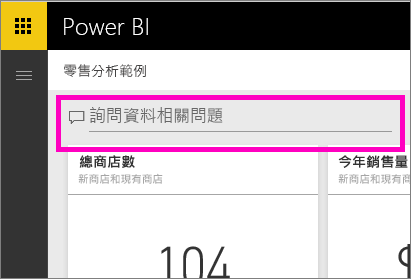
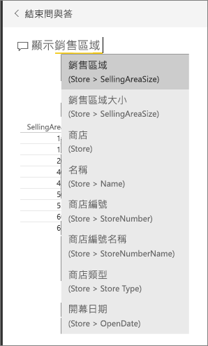
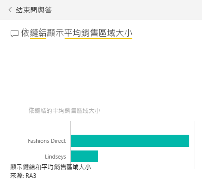
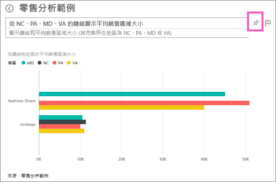
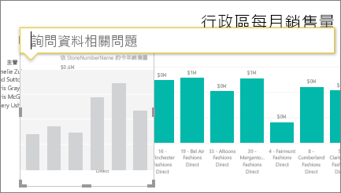
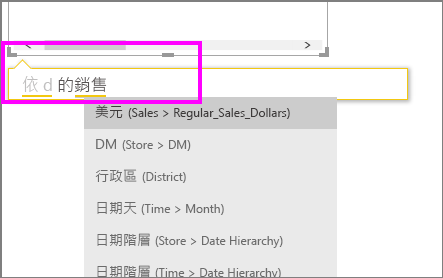
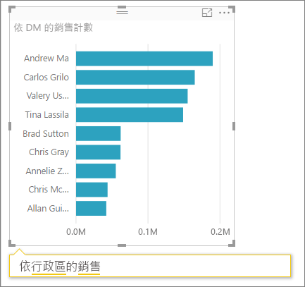
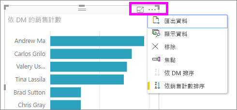

# 教學課程：如何使用問與答來建立視覺效果及建置報表
[問與答概觀](power-bi-q-and-a.md)簡介了 Power BI 問與答，並區分「取用者」(與他們共用了儀表板和報表) 和「建立者」(擁有基礎的報表和資料集)。 本教學課程的第一個部分，設計的對象主要是針對使用 Power BI 服務來取用儀表板的人。 第二個部分的設計則是針對使用 Power BI 服務或 Power BI Desktop 建立報表的人。 [問與答和 Power BI 行動版](mobile-apps-ios-qna.md)和[問與答與 Power BI Embedded](developer/qanda.md) 包含於個別的文章中。

問與答易於互動，甚至充滿樂趣，而且，一個問題多半會帶來更多其他問題，原因在於視覺效果會顯示可探索的有趣路徑。 觀看 Amanda 示範使用問與答來建立視覺效果、深入探討這些視覺效果，以及將其釘選至儀表板。

<iframe width="560" height="315" src="https://www.youtube.com/embed/qMf7OLJfCz8?list=PL1N57mwBHtN0JFoKSR0n-tBkUJHeMP2cP" frameborder="0" allowfullscreen></iframe>

## 第 1 部分：在 Power BI 服務 (app.powerbi.com) 的儀表板中使用問與答
儀表板包含從一或多個資料集釘選的磚，因此您可以詢問有關任何這些資料集所包含之任何資料的問題。 若要查看哪些報表和資料集已用來建立儀表板，請從功能表列選取 [檢視相關項目]。

問與答問題方塊位於儀表板的左上角，這也是您用自然語言輸入問題的地方。 問與答辨識您輸入的文字，然後找出哪裡 (哪個資料集) 可尋找解答。 問與答也可以用自動完成、重新描述，和其他文字及視覺輔助工具，協助您建立問題。

您問題的答案會顯示為互動式的視覺效果，而且每當您修改問題時便會更新。

1. 請開啟儀表板並將游標放在問題方塊中。 即使您還沒開始輸入，問與答也會顯示包含建議的新畫面，以協助您提出問題。 您會在[基礎資料集](service-get-data.md)裡看到資料表名稱，甚至可能會看到列出完整問題，若資料集擁有者已建立[精選問題](service-q-and-a-create-featured-questions.md)的。

   

   您一律可以選擇這些問題的其中一個做為起點，並繼續精簡問題，藉此尋找您要的特定解答。 或者，使用資料表名稱來幫助您撰寫新的問題。

2. 從資料集選項中選取，或開始輸入您自己的問題並從下拉式清單建議中選取。

   

3. 當您輸入問題時，問與答會挑選最佳的[視覺效果](power-bi-visualization-types-for-reports-and-q-and-a.md)來顯示您的答案；而當您修改這個問題時，視覺效果就會動態改變。

   

4. 當您輸入問題時，Power BI 會使用在儀表板上有磚的任何資料集尋找最佳解答。  如果所有的圖格都來自 *datasetA* ，則您的答案將來自 *datasetA* 。  如果有磚來自 *datasetA* 和 *datasetB* ，則問與答就會搜尋這 2 個資料集的最佳回應。

   > [!TIP]
   > 所以要小心，如果只有一個磚來自 *datasetA* ，而您從儀表板中移除了，問與答將不再有權存取 *datasetA* 。
   >
   >
5. 如果您很滿意結果，請[將視覺效果釘選到儀表板](service-dashboard-pin-tile-from-q-and-a.md)，方法是選取在右上角的釘選圖示。 如果儀表板已與您共用或為應用程式的一部分，您就無法釘選。

   

##    第 2 部分：在 Power BI 服務或 Power BI Desktop 中的報表使用問與答

使用問與答瀏覽您的資料集，以及將視覺效果新增至報表和儀表板。 報表是以單一資料集為基礎，且可能是完全空白或包含充滿視覺效果的頁面。 但是，只因為報表是空的並不表示沒有任何資料讓您探索 -- 資料集連結到報表，且正在等候您瀏覽並建立視覺效果。  若要查看使用哪個資料集來建立報表，請在 Power BI 服務的閱讀檢視中開啟報表，然後從功能表列選取 [檢視相關項目]。

若要在報表中使用問與答，您必須具有報表與基礎資料集的編輯權限。 在[問與答概觀](power-bi-q-and-a.md)主題中，我們將這稱為「建立者」案例。 因此，如果相反地您是在「取用」與您共用的報表，則將無法使用問與答。

1. 在編輯檢視中開啟報表 (Power BI 服務) 或在報表檢視中開啟報表 (Power BI Desktop)，然後從功能表列選取 [詢問問題]。

    **Desktop**    
    

    **服務**    
    

2. 問與答問題方塊會顯示在報表畫布上。 下列範例中，問題方塊顯示在另一個視覺效果之上。 這是正常的，但[將空白頁面新增至報表](power-bi-report-add-page.md)然後才提問，可能會是比較好的做法。

    

3. 請將游標放在 [問題] 方塊中。 當您輸入時，問與答會顯示可協助您形成問題的建議。

   

4. 當您輸入問題時，問與答會挑選最佳的[視覺效果](power-bi-visualization-types-for-reports-and-q-and-a.md)來顯示您的答案；而當您修改這個問題時，視覺效果就會動態改變。

   

5. 當您有喜歡的視覺效果時，請選取 ENTER。 若要儲存報表的視覺效果，請選取 [檔案] > [儲存]。

6. 與新的視覺效果互動。 您建立視覺效果的方式並不重要 -- 可以使用相同的所有互動性、格式和功能。

  

  如果您在 Power BI 服務中建立視覺效果，您甚至可以[將它釘選至儀表板](service-dashboard-pin-tile-from-q-and-a.md)。

## 告訴問與答要使用的視覺效果。
在使用問與答的時候，您不只可以要求要說明資料，也可以告訴 Power BI 要如何顯示答案。 只需在問題結尾加上「為<visualization type>」。  例如「依工廠顯示庫存量為地圖」和「顯示總庫存為卡片」。  請自己試試看吧。

##  考量與疑難排解
- 如果您已使用即時連線或閘道連線到資料集，必須[針對該資料集啟用](service-q-and-a-direct-query.md)問與答。

- 您已開啟報表且沒有看到問與答的選項。 如果您使用 Power BI 服務，請務必在編輯檢視中開啟報表。 如果您無法開啟編輯檢視，則表示您沒有該報表的編輯權限，且將無法使用該特定報表的問與答。

## 後續步驟
回到 [Power BI 中的問與答](power-bi-q-and-a.md)   
[教學課程：使用問與答與零售分析範例](power-bi-visualization-introduction-to-q-and-a.md)   
[在問與答中詢問問題的祕訣](service-q-and-a-tips.md)   
[準備適用於問與答的活頁簿](service-prepare-data-for-q-and-a.md)  
[準備適用於問與答的內部部署資料集](service-q-and-a-direct-query.md)
[將磚從問與答釘選到儀表板](service-dashboard-pin-tile-from-q-and-a.md)
