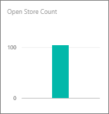
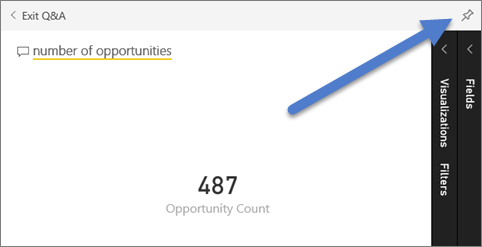
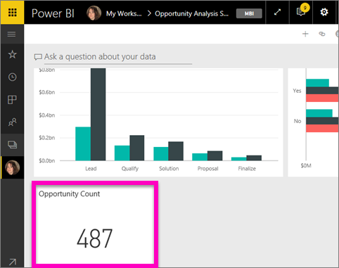

# 卡片視覺效果
有時您在 Power BI 儀表板或報告中追蹤的最重要項目是一個單一數字，例如總銷售額、歷年的市佔率，或總商機。 這類型的視覺效果稱為「卡片」。 幾乎所有的原生 Power BI 視覺效果，都可以使用報告編輯器或 [問與答] 來建立卡片。

## 使用報告編輯器建立卡片
這些指示使用零售分析範例。 若要跟著做，請針對 Power BI 服務 (app.powerbi.com) 或 Power BI Desktop [下載範例](sample-datasets.md)。   

1. 從[空白報告頁面](power-bi-report-add-page.md)開始，選取 [商店] \> [開啟商店計數] 欄位。 如果您使用 Power BI 服務，您必須在[編輯檢視](service-interact-with-a-report-in-editing-view.md)中開啟報告。

    Power BI 會以一個數字建立直條圖。

   
2. 在 [視覺效果] 窗格中選取卡片圖示。

   
6. 將滑鼠暫留在卡片上，然後選取釘選圖示 ，以將視覺效果新增至儀表板。

   
7. 將磚釘選至現有的儀表板或新的儀表板上。

   * 現有儀表板：從下拉式清單中選取儀表板的名稱。
   * 新儀表板：輸入新儀表板的名稱。
8. 選取 [釘選] 。

   靠近右上角的成功訊息讓您知道，視覺效果已當成磚加入儀表板。

   
9. 選取 [移至儀表板]。 您可以在這裡[編輯和移動](service-dashboard-edit-tile.md)釘選的視覺效果。

## 從問與答問題方塊建立卡片
[問與答] 問題方塊是製作卡片的最簡單方式。 從儀表板或報告可在 Power BI 服務 (app.powerbi.com) 中使用 [問與答] 問題方塊。 下列步驟說明如何從 Power BI 服務儀表板建立卡片。 如果您想要在 Power BI Desktop 中使用 [問與答] 建立卡片，請針對 Desktop 報告的 [問與答] 預覽[遵循這些指示](https://powerbi.microsoft.com/en-us/blog/power-bi-desktop-december-feature-summary/#QandA)。

1. 建立[儀表板](service-dashboards.md)和[取得資料](service-get-data.md)。 此範例使用[商機分析範例](sample-opportunity-analysis.md)。

1. 在儀表板頂端的問題方塊中，開始輸入您想要知道的資料相關問題。 

   

>**提示**：從 Power BI 服務報告的[編輯檢視](service-reading-view-and-editing-view.md)中，選取頂端功能表列中的 [詢問問題]。 從 Power BI Desktop 報告，尋找報告中的某個開放空間，然後按兩下以開啟問題方塊。

3. 例如，在問題方塊中輸入「商機次數」。

   

   問題方塊可透過建議與重新陳述來協助您，而且最後會顯示總數。  
4. 選取右上角的釘選圖示 ，將卡片新增至儀表板。

   
5. 將卡片當作圖格，釘選至現有儀表板或新的儀表板。

   * 現有儀表板：從下拉式清單中選取儀表板的名稱。 您只能選擇具有目前工作區的儀表板。
   * 新的儀表板︰輸入新儀表板的名稱，它就會新增至目前工作區。
6. 選取 [釘選] 。

   靠近右上角的成功訊息讓您知道，視覺效果已當作圖格新增至儀表板。  

   
7. 選取 [移至儀表板] 以查看新磚。 於該處，您可以在儀表板上[重新命名、調整大小、加入超連結和重新置放磚等等](service-dashboard-edit-tile.md)。

   

## 考量與疑難排解
- 如果完全看不到問題方塊，請連絡系統或租用戶系統管理員。    
- 如果您使用 Desktop 且按兩下報告中的空白處並未開啟 [問與答]，您可能需要啟用它。  選取 [檔案] > [選項及設定] > [選項] > [預覽功能] > [問與答]，然後重新啟動 Desktop。

## 格式化卡片
您有變更標籤、文字、色彩等等的許多選項。 學習的最佳方法是建立卡片，然後探索 [格式化] 窗格。 以下是幾個可用的格式化選項。 

1. 從選取畫刷圖示開始，以開啟 [格式化] 窗格。 

    
2. 展開 [資料標籤] 並變更色彩、大小和字型家族。 如果您有數千個存放區，則可以使用 [顯示單位] 以千為單位顯示存放區數目，並控制小數位數。 例如，125.8K 而不是 125,832.00。

3.  展開 [類別目錄標籤] 並變更色彩和大小。

    

4. 展開 [背景] 並移動滑桿至 [開啟]。  現在您可以變更背景色彩和透明度。

    

5. 繼續探索格式化選項，直到您的卡片完全符合您的喜好。 

    

## 後續步驟
[Power BI 的儀表板磚](service-dashboard-tiles.md)

[Power BI 中的儀表板](service-dashboards.md)

[Power BI - 基本概念](service-basic-concepts.md)

有其他問題嗎？ [試試 Power BI 社群](http://community.powerbi.com/)
