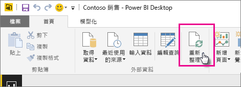
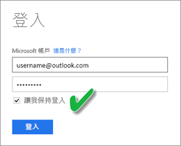

# 重新整理 OneDrive 或 SharePoint Online 上儲存的資料集
將檔案從 OneDrive 或 SharePoint Online 匯入至 Power BI 服務，是確定您在 **Power BI Desktop**中所做的工作與 Power BI 服務保持同步的好方法。

## 將 Power BI Desktop 檔案儲存在 OneDrive 或 SharePoint Online 的優點
將 **Power BI Desktop** 檔案儲存在 OneDrive 或 SharePoint Online 時，任何已載入檔案模型的資料都會匯入至資料集，而且任何您已在該檔案中建立的報表都會載入至 Power BI 服務中的**報表**。 如果您變更放在 OneDrive 或 SharePoint Online 上的檔案，例如新增量值、變更資料行名稱或編輯視覺效果，則在儲存檔案之後，通常也會在大約一小時內於 Power BI 服務中更新這些變更。

您可以選取 [主資料夾] 功能區的 [重新整理]，直接在 Power BI Desktop 手動執行一次性的重新整理。 當您在這裡選取 [重新整理] 時，就會使用原始資料來源的更新資料重新整理*檔案*模型中的資料。 這類的重新整理，完全位於 Power BI Desktop 應用程式本身，不同於 Power BI 中的手動或排程重新整理，所以請務必了解此差異。

當您從 OneDrive 或 SharePoint Online 匯入 Power BI Desktop 檔案時，模型的其他相關資訊會載入 Power BI 中的資料集內。 在 Power BI 服務 (而非 Power BI Desktop) 中，因為 Power BI 服務中的報表是以該資料集為基礎，所以您會想要重新整理該資料集的資料。 因為資料來源位於外部，所以您可以使用 [立即重新整理] 手動重新整理資料集，或您可以使用 [排程重新整理] 設定重新整理排程。

當您重新整理資料集時，Power BI 不會連接到 OneDrive 或 SharePoint Online 上的檔案來查詢更新資料。 它會使用在資料集的資訊，直接連接到資料來源，以查詢更新資料，然後載入資料集。 此資料集內重新整理的資料不會同步回到 OneDrive 或 SharePoint Online 上的檔案。

## 支援的項目有哪些？
在 Power BI 中，從 Power BI Desktop 檔案建立的資料集支援 [立即重新整理] 和 [排程重新整理]，這些檔案是從本機磁碟匯入，本機磁碟使用 [取得資料]/查詢編輯器連接下列任何資料來源並載入資料︰

### Power BI Gateway - Personal
* Power BI Desktop 的 [取得資料] 和查詢編輯器都會顯示所有的線上資料來源。
* Power BI Desktop 的 [取得資料] 和查詢編輯器都會顯示所有的內部部署資料來源，但 Hadoop 檔案 (HDFS) 與 Microsoft Exchange 除外。

<!-- Refresh Data sources-->
[!INCLUDE [refresh-datasources](./includes/refresh-datasources.md)]

> [!NOTE]
> 必須安裝並執行閘道器，才能讓 Power BI 連接至內部部署資料來源並重新整理資料集。
> 
> 

## OneDrive 或商務用 OneDrive。 有何不同？
如果您有個人 OneDrive 和商務用 OneDrive，建議您保留任何您想要匯入至商務用 OneDrive 中 Power BI 的檔案。 原因如下：您可能使用兩個不同的帳戶來登入它們。

因為您用來登入 Power BI 的帳戶通常與用來登入商務用 OneDrive 的帳戶相同，所以通常可以無縫連接到 Power BI 中的商務用 OneDrive。 但如果使用個人 OneDrive，您很可能要以不同的 [Microsoft 帳戶](http://www.microsoft.com/account/default.aspx)登入。

當您使用 Microsoft 帳戶登入時，請確定選取 [讓我保持登入]。 Power BI 之後可將您在 Power BI Desktop 檔案中進行的任何更新與在 Power BI 中的資料集同步處理  
    

如果您變更無法與 Power BI 中資料集或報表同步處理之 OneDrive 上的檔案 (因為您的 Microsoft 帳戶認證可能已更改)，您將必須連接到您的檔案，並從您的個人 OneDrive 將它再上傳一次。

## 我要如何排程重新整理？
當您設定重新整理排程時，Power BI 會直接連接到資料來源，方法是使用資料集內的連接資訊和認證來查詢更新資料，然後將更新資料載入資料集。 此外，也會更新任何在 Power BI 服務中該資料集上的報表和儀表板視覺效果。

如需如何設定排程重新整理的詳細資訊，請參閱[設定排程重新整理](refresh-scheduled-refresh.md)。

## 發生錯誤時
如果發生錯誤，問題通常起因於 Power BI 無法登入資料來源，或資料集連接至內部部署資料來源時，閘道器離線。 請確認 Power BI 可以登入資料來源。 如果您用以登入資料來源的密碼已變更，或 Power BI 從資料來源登出，請務必嘗試在 [資料來源認證] 中再次登入您的資料來源。

如果您正在變更放在 OneDrive 上的 Power BI Desktop 檔案並加以儲存，而這些變更未一小時左右之內反映在 Power BI 內，有可能是因為 Power BI 無法連接到您的 OneDrive。 請嘗試再次連接到位於 OneDrive 的檔案。 如果系統提示您登入，請確定您已選取 [讓我保持登入]。 因為 Power BI 無法連接到您的 OneDrive 來同步處理檔案，所以您將需要再次匯入您的檔案。

請務必核取 [傳送重新整理失敗通知電子郵件給我]  。 您會想要立刻知道排定的重新整理是否失敗。

## 疑難排解
有時候重新整理資料可能不會如預期執行。 這通常是閘道連線問題之故。 請參閱閘道疑難排解文章，以取得工具和已知的問題。

[為內部部署資料閘道進行疑難排解](service-gateway-onprem-tshoot.md)

[對 Power BI Gateway - Personal 進行疑難排解](service-admin-troubleshooting-power-bi-personal-gateway.md)

有其他問題嗎？ [嘗試在 Power BI 社群提問](http://community.powerbi.com/)

