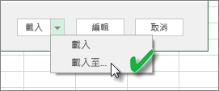
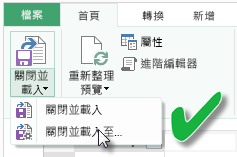
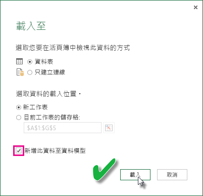

# 重新整理建立自本機磁碟上 Excel 活頁簿的資料集
## 支援的項目有哪些？
在 Power BI 中，從 Excel 活頁簿建立的資料集支援 [立即重新整理] 和 [排程重新整理]，這些檔案是從本機磁碟匯入，本機磁碟使用 Power Query (Excel 2016 中的 [取得和轉換資料]) 或 Power Pivot 連接下列任何資料來源並將資料載入 Excel 資料模型︰  

### Power BI Gateway - Personal
* Power Query 中顯示的所有線上資料來源。
* Power Query 中顯示的所有內部部署資料來源，但 Hadoop 檔案 (HDFS) 與 Microsoft Exchange 除外。
* Power Pivot 中顯示的所有線上資料來源。\*
* Power Pivot 中顯示的所有內部部署資料來源，但 Hadoop 檔案 (HDFS) 與 Microsoft Exchange 除外。

<!-- Refresh Data sources-->
[!INCLUDE [refresh-datasources](./includes/refresh-datasources.md)]

> **注意：**  
> 
> * 必須安裝並執行閘道器，才能讓 Power BI 連接至內部部署資料來源並重新整理資料集。
> * 使用 Excel 2013 時，請確定您已更新為最新版本的 Power Query。
> * 不支援重新整理從本機磁碟機匯入的 Excel 活頁簿 (其中資料只存在於工作表或連結的資料表)。 如果活頁簿資料已儲存並從 OneDrive 匯入，就可支援重新整理。 如需深入了解，請參閱[重新整理建立自 OneDrive 或 SharePoint Online 上 Excel 活頁簿的資料集](refresh-excel-file-onedrive.md)。
> * 當您重新整理從本機磁碟機匯入之 Excel 活頁簿中建立的資料集時，只會重新整理來自資料來源的查詢資料。 如果您變更 Excel 或 Power Pivot 中的資料模型結構；例如，建立新的量值或變更資料行的名稱，則這些變更將不會複製到資料集。 如果您進行這類變更，您就必須重新上傳或重新發行活頁簿。 如果您預期對活頁簿結構進行一般變更，而且您想該變更反映在 Power BI 中的資料集，而不必重新上傳，請考慮將您的活頁簿放在 OneDrive 上。 Power BI 會自動重新整理儲存在 OneDrive 並從中匯入的活頁簿之結構和工作表資料。
> 
> 

## 如何確定資料已載入 Excel 資料模型？
當您使用 Power Query (Excel 2016 中的 [取得和轉換資料]) 來連接到資料來源時，您有幾個載入資料位置的選項。 若要確定您將資料載入資料模型，您就必須在 [載入]  對話方塊中選取 [新增這項資料到資料模型]  選項。

> [!NOTE]
> 這裡的圖片顯示的是 Excel 2016。
> 
> 

在 [導覽] 中，按一下 [載入至...]。  
    

或者，如果您在 [導覽] 中按一下 [編輯]  ，您就會開啟 [查詢編輯器]。 其中您可以按一下 [關閉並載入至...]。  
    

接著請確定在 [載入至] 中已選取 [將此資料加入資料模型] 。  
    

### 如果在 Power Pivot 中使用 [取得外部資料]？
沒問題。 每當您使用 Power Pivot 連接和查詢來自內部部署或線上資料來源的資料時，資料就會自動載入至資料模型。

## 我要如何排程重新整理？
當您設定重新整理排程時，Power BI 會直接連接到資料來源，方法是使用資料集內的連接資訊和認證來查詢更新資料，然後將更新資料載入資料集。 此外，也會更新任何在 Power BI 服務中該資料集上的報表和儀表板視覺效果。

如需如何設定排程重新整理的詳細資訊，請參閱[設定排程重新整理](refresh-scheduled-refresh.md)。

## 發生錯誤時
如果發生錯誤，問題通常起因於 Power BI 無法登入資料來源，或資料集連接至內部部署資料來源時，閘道器離線。 請確認 Power BI 可以登入資料來源。 如果您用以登入資料來源的密碼已變更，或 Power BI 從資料來源登出，請務必嘗試在 [資料來源認證] 中再次登入您的資料來源。

請務必核取 [傳送重新整理失敗通知電子郵件給我] 。 您會想要立刻知道排定的重新整理是否失敗。

>[!IMPORTANT]
>不支援重新整理連接至 Power Pivot 並從中查詢的 OData 摘要。 當使用 OData 摘要作為資料來源時，請使用 Power Query。

## 疑難排解
有時候重新整理資料可能不會如預期執行。 這通常是閘道連線問題之故。 請參閱閘道疑難排解文章，以取得工具和已知的問題。

[為內部部署資料閘道進行疑難排解](service-gateway-onprem-tshoot.md)

[對 Power BI Gateway - Personal 進行疑難排解](service-admin-troubleshooting-power-bi-personal-gateway.md)

## 後續步驟
有其他問題嗎？ [試試 Power BI 社群](http://community.powerbi.com/)

