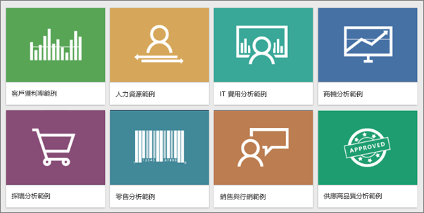
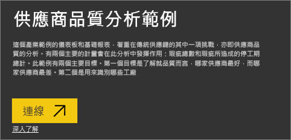
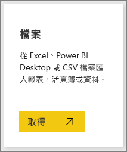
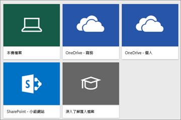
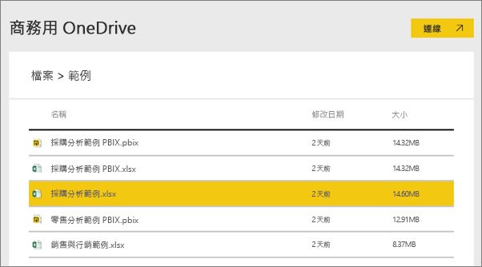
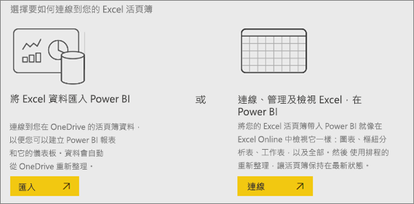
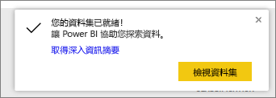
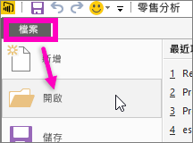

# 哪種範例資料可搭配 Power BI 使用？
您是否剛接觸 Power BI 並想要試用，但沒有任何資料；  或您可能有資料集，但因為 (還) 不了解 Power BI 的運作方式，而擔心可能會不小心損害資料集？

不必煩惱！ obviEnce ([www.obvience.com](http://www.obvience.com/)) 和 Microsoft 建立了範例供您使用，直到您更熟悉 Power BI 為止。  資料經匿名處理，並代表了不同產業：財務、HR、銷售等。 在您閱讀線上文件的同時，會發現教學課程與範例使用這些相同範例，這表示您將能夠跟著進行。      

   

這些範例均以數種格式提供：內容套件、個別 Excel 活頁簿及 .pbix 檔案。 如果您不了解這些是什麼，或如何開始使用，也不必擔心。 我們會在本文稍後詳加說明。 我們為各個範例建立了「導覽」，這種文章會說明範例背後的案例，並帶您瀏覽不同案例。 也許會有一個案例回答您經理的問題、另一個則會談討競爭力解析，或建立報表及儀表板以供共用、或說明業務轉換。   

但在開始之前，請先閱讀這些使用範例的法律規範。 當您完成時，我們會向您介紹範例及示範使用方式。   

## Power BI 範例 Excel 活頁簿的使用方式方針
請先閱讀本資訊再使用 Power BI 範例。

©2015 Microsoft Corporation. 著作權所有，並保留一切權利。 文件和活頁簿皆以「現況」提供。 活頁簿中呈現的資訊和檢視，包括 URL 及其他網際網路網站參考資料，可能會變更，恕不另行通知。 貴用戶須自行承擔使用風險。 部分範例僅供示範，均屬虛構， 亦沒有任何預定或推斷的實際關聯。 針對此處提供的資訊，Microsoft 不做任何明示或默許的擔保。

活頁簿不會提供您任何 Microsoft 產品的任何智慧財產權法定權利。 您可以複製並使用此活頁簿以供內部參考之用。

活頁簿和相關的資料是由 obviEnce 提供。 [www.obvience.com](http://www.obvience.com)

ObviEnce 是一家 ISV 和 Microsoft Business Intelligence 的智慧財產權 (IP) 提供機構。 ObviEnce 與 Microsoft 密切合作以開發最佳作法，亦建立開始與部署 Microsoft Business Intelligence 解決方案的概念領導地位。

活頁簿和資料皆為 obviEnce LLC 的財產，並僅供以業界範例資料示範 Power BI 功能的目的而共享。

任何活頁簿及/或資料 (包括每個活頁簿包含之資訊工作表) 的使用皆必須包含上述歸屬聲明。 活頁簿和任何視覺效果亦必須提供下列著作權聲明：obviEnce ©。

按一下下方任一連結下載 Excel 活頁簿檔案或 .pbix 檔案，即表示您同意上述條款。

## 可用的範例
有八個範例供您使用。  每個各代表一種不同產業。

### 客戶獲利率範例
[瀏覽客戶獲利率範例](sample-customer-profitability.md)

這個產業範例會分析財務長對其主管、產品和客戶的關鍵計量。 您可以調查哪些因素會影響公司的獲利率。

### 人力資源範例  
[瀏覽 HR 範例](sample-human-resources.md)

這個產業範例藉由分析新進員工、現有員工和離職員工，著眼於公司的招聘策略。  透過瀏覽資料，您可以找到自願離職的傾向與招聘策略的趨勢。

### IT 費用分析範例 
[瀏覽 IT 支出分析範例](sample-it-spend.md)

在這個產業範例中，我們分析公司 IT 部門的規劃成本與實際成本。 這項比較可幫助我們了解公司的年度計畫是否得當，並可針對大大偏離計畫的領域進行調查。 此範例中的公司，會經歷一年一度的計畫週期，然後按季產出新的「最新估計」(LE) 來協助分析 IT 支出於會計年度的變化。

### 商機分析範例  
[瀏覽商機分析範例](sample-opportunity-analysis.md)

這個產業範例會探討軟體公司的銷售通路。 業務經理依地區、交易大小和通路追蹤商機和營收，藉此監控他們的直接與合作夥伴銷售通路。

### 採購分析範例  
[瀏覽採購分析範例](sample-procurement.md)

這個產業範例會分析財務長對其主管、產品和客戶的關鍵計量。 您可以調查哪些因素會影響公司的獲利率。

### 零售分析範例  
[瀏覽零售分析範例](sample-retail-analysis.md)

這個產業範例會分析在多個門市和區域售出之品項的零售資料。 計量會比較今年與去年在以下領域的表現：銷售、單位、毛利率和變異數，以及新門市分析。

### 銷售與行銷範例  
[瀏覽銷售與行銷範例](sample-sales-and-marketing.md)

這個產業範例會分析製造公司 VanArsdel Ltd。它可讓行銷長觀察產業與 VanArsdel 的市場占有率。  透過瀏覽範例，您可以找到這家公司的市場佔有率、生產量、銷售和情緒指數。

### 供應商品質範例  
[瀏覽供應商品質範例](sample-supplier-quality.md)

這個產業範例著重在傳統供應鏈的其中一項挑戰：供應商品質的分析。 有兩個主要的計量會在此分析中發揮作用：缺失總數和缺失所造成的停工期總計。 這個範例有兩個主要目標：找出品質最佳與最差的供應商，以及找出哪家工廠表現最好，能找到缺點並加以移除，將停工期降到最低。

您現在知道可用的內容了。 接下來該了解如何取得這些範例。  

## 如何取得範例
如上方所述，範例以數種格式提供：內容套件、Excel 活頁簿及 .pbix 檔案。 我們會從內容套件開始，說明這些格式的使用方式。

## 以內容套件形式提供的 Power BI 範例
內容套件是唯一可以從 Power BI 中取得的範例格式；您不需要離開 Power BI 就能找到。 內容套件基本上是某人建立的一或多個儀表板、資料集和報表組合，可以搭配 Power BI 服務使用。 人們會建立內容套件，與同事共用。 每個 Power BI 範例內容套件都包含一個資料集、報表和儀表板。  內容套件不適用於 Power BI Desktop。 如果您想深入了解內容套件，請參閱 [Power BI 中的內容套件簡介](service-organizational-content-pack-introduction.md)。

### 在 Power BI 服務中取得及開啟範例內容套件
1. 開啟 Power BI 服務 (app.powerbi.com) 並登入。
2. 在左下角選取 [取得資料]。

    
3. 在顯示的 [取得資料] 頁面上，選取 [範例]。

   
4. 選取其中一個範例以開啟該範例的描述。 接著選擇 [連線]。  

   
5. Power BI 會匯入內容套件，並將新的儀表板、報表及資料集新增到您目前的工作區。 新的內容會以黃色星號標示。 使用範例讓 Power BI 進行測試回合。  

   

現在您有了資料，可以開始進行。  使用範例內容套件試試幾個教學課程，或直接開啟 Power BI 服務及探索。

## 以 Excel 檔案形式提供的 Power BI 範例
每個範例內容套件也都能以 Excel 活頁簿形式提供。 這些 Excel 活頁簿經過設計，可與 Power BI 服務搭配使用。  

1. 請使用下方連結個別下載檔案，或[下載所有範例檔案的 ZIP 檔案](http://go.microsoft.com/fwlink/?LinkId=535020)。 如果您是進階使用者，可能必須下載 Excel 活頁簿以探索或編輯資料模型。

   * [零售分析範例](http://go.microsoft.com/fwlink/?LinkId=529778)
   * [供應商品質分析範例](http://go.microsoft.com/fwlink/?LinkId=529779)
   * [人力資源範例](http://go.microsoft.com/fwlink/?LinkId=529780)
   * [客戶獲利率範例](http://go.microsoft.com/fwlink/?LinkId=529781)
   * [商機追蹤範例](http://go.microsoft.com/fwlink/?LinkId=529782)
   * [IT 費用分析範例](http://go.microsoft.com/fwlink/?LinkId=529783)
   * [採購分析範例](http://go.microsoft.com/fwlink/?LinkId=529784)
   * [銷售與行銷範例](http://go.microsoft.com/fwlink/?LinkId=529785)
2. 儲存下載的檔案。 檔案的儲存位置會有差異。

   *   **本機** - 如果您將檔案從 Power BI 儲存到電腦上的本機磁碟或組織中的其他位置，可以將檔案匯入 Power BI 中。 您的檔案實際上會保留在本機磁碟，因此不是真的將整個檔案匯入 Power BI。 真正發生的情況是在 Power BI 網站中建立新的資料集，並將資料和資料模型 (在某些情況下) 載入資料集。 如果您的檔案有任何報表，這些報表會顯示在 Power BI 網站的 [報表] 下。
   * **OneDrive - 商務** - 如果您有商務用 OneDrive，並使用與用來登入 Power BI 相同的帳戶進行登入，這樣做可以有效地讓 Excel、Power BI 中的工作或 .CSV 檔案，與 Power BI 中的資料集、報表和儀表板保持同步。 由於 Power BI 和 OneDrive 都在雲端，因此 Power BI 每隔約一小時就會連接到您在 OneDrive 上的檔案。 如果發現任何變更，便會自動更新 Power BI 中的資料集、報表和儀表板。
   *  **OneDrive - 個人** - 如果您將檔案儲存到自己的 OneDrive 帳戶，則可以利用與商務用 OneDrive 相同的許多優點。 最大的差異是當您第一次連接到檔案時 (使用 [取得資料] > [檔案] > [OneDrive - 個人])，需要使用 Microsoft 帳戶登入 OneDrive，這通常與用來登入 Power BI 的帳戶不同。 當您使用 Microsoft 帳戶登入 OneDrive 時，請務必選取 [讓我保持登入] 選項。 如此一來，Power BI 每隔約一小時就會連接到您的檔案，以確保您在 Power BI 中的資料集保持同步。
   *  **SharePoint 小組網站** - 將 Power BI 檔案儲存到 SharePoint - 小組網站與儲存到商務用 OneDrive 大致相同。 最大的差異是從 Power BI 連接到檔案的方式。 您可以指定 URL 或連接到根資料夾。
3. 開啟 Power BI 服務 (app.powerbi.com) 並登入。

   > [!TIP]
   > 這時候，您可能必須建立新儀表板，並以您打算匯入的檔案為其命名。  否則，當您匯入 Excel 資料集時，Power BI 不會建立以範例命名的新儀表板，而會將磚新增到您目前開啟的儀表板。 選取該磚會帶您前往資料集的報表。 因為您之後可以隨時建立新的儀表板，所以這並不是大問題，但從新的儀表板開始進行，能讓您省下一或兩個步驟。
   >
   >
4. 在左下角選取 [取得資料]。

    
5. 在顯示的 [取得資料] 頁面上，選取 [檔案] > [取得]。

     
6. 瀏覽到您下載及儲存範例的位置。

   
7. 選取檔案，在這個案例中是儲存在商務用 OneDrive 的 **Procurement Analysis Sample.xlsx**，然後選擇 [連線]。

   
8. 選擇要匯入資料，還是要將活頁簿帶入 Power BI 以查看其在 Excel Online 中的實際呈現方式。

    
9. 如果您選取 [匯入]，Power BI 會匯入範例活頁簿，並將其新增為新資料集，名為 **Procurement Analysis Sample**。  如果活頁簿有任何 Power View 工作表、資料表或範圍，或有資料模型，Power BI 也會建立報表 (名稱相同)。 如果您尚未開啟任何儀表板，Powrer BI 會建立新的儀表板。 (如果您在按一下 [取得資料] 時開啟了儀表板，將會在該儀表板上看到新的空白磚。  按一下該磚，您就會前往剛新增的資料集之報表)。 新的內容會依範例命名，並以黃色星號標示。
10. 當 [您的資料集已就緒!] 畫面出現時，請選取 [檢視資料集] 或 [取得深入資訊摘要]，也可以直接使用 Power BI 左邊瀏覽列找出並開啟相關報表或儀表板。  

     

### (選擇性) 從 Excel 本身檢視 Excel 範例
想了解 Excel 活頁簿中的資料如何轉換為 Power BI 資料集和報表嗎？ ***在 Excel 中***開啟 Excel 範例，瀏覽工作表就會得到一些答案。

* 第一次在 Excel 中開啟範例活頁簿時，您可能會看到兩個警告。 第一個警告說明活頁簿是在受保護的檢視狀態中。 選取 [啟用編輯] 。 第二個警告可能指出活頁簿具有外部資料連線。 選取 [啟用內容] 。
* 每個活頁簿都包含數個工作表。 因為這些 Excel 範例至少都有一個具視覺效果的 Power View 工作表，所以當您將 Excel 檔案匯入 Power BI 中時，會得到一個資料集**和**一個報表。

   您可能需要[啟用 Power View 增益集](https://support.office.com/article/Create-a-Power-View-sheet-in-Excel-2013-B23D768D-7586-47FE-97BD-89B80967A405#__toc328591957)。
* 實際資料會位在何處？ Power Pivot 資料模型中。 若要查看資料，請在 [PowerPivot]  索引標籤中選取 [管理資料模型] 。

    沒看到 [PowerPivot] 索引標籤？ [啟用 Power Pivot 增益集](https://support.office.com/article/Start-Power-Pivot-in-Microsoft-Excel-2013-add-in-A891A66D-36E3-43FC-81E8-FC4798F39EA8)。
* [資訊] 索引標籤提供建立此範例之 obviEnce 公司的相關資訊。

## 以 .pbix 檔案形式提供的 Power BI 範例
每個範例內容套件也都能以 Power BI .pbix 檔案形式提供。 .pbix 檔案的設計目的是搭配 Power BI Desktop 使用。  

1. 使用下方連結個別下載檔案。

   * [零售分析範例](http://download.microsoft.com/download/9/6/D/96DDC2FF-2568-491D-AAFA-AFDD6F763AE3/Retail Analysis Sample PBIX.pbix)
   * [供應商品質分析範例](http://download.microsoft.com/download/8/C/6/8C661638-C102-4C04-992E-9EA56A5D319B/Supplier-Quality-Analysis-Sample-PBIX.pbix)
   * [人力資源範例](http://download.microsoft.com/download/6/9/5/69503155-05A5-483E-829A-F7B5F3DD5D27/Human Resources Sample PBIX.pbix)
   * [客戶獲利率範例](http://download.microsoft.com/download/6/A/9/6A93FD6E-CBA5-40BD-B42E-4DCAE8CDD059/Customer Profitability Sample PBIX.pbix)
   * [商機追蹤範例](http://download.microsoft.com/download/9/1/5/915ABCFA-7125-4D85-A7BD-05645BD95BD8/Opportunity Analysis Sample PBIX.pbix)
   * [IT 費用分析範例](http://download.microsoft.com/download/E/9/8/E98CEB6D-CEBB-41CF-BA2B-1A1D61B27D87/IT Spend Analysis Sample PBIX.pbix)
   * [採購分析範例](http://download.microsoft.com/download/D/5/3/D5390069-F723-413B-8D27-5888500516EB/Procurement Analysis Sample PBIX.pbix)
   * [銷售與行銷範例](http://download.microsoft.com/download/9/7/6/9767913A-29DB-40CF-8944-9AC2BC940C53/Sales and Marketing Sample PBIX.pbix)
2. 儲存下載的檔案。
3. 從 Desktop 選取 [檔案] > [開啟]，然後瀏覽到您儲存範例 .pbix 的位置。

   
4. 選取 .pbix 檔案在 Desktop 中加以開啟。

## 後續步驟
[Power BI 基本概念](service-basic-concepts.md)

[教學課程：連線到 Power BI 範例](sample-tutorial-connect-to-the-samples.md)

[Power BI 的資料來源](service-get-data.md)

有其他問題嗎？ [試試 Power BI 社群](http://community.powerbi.com/)
