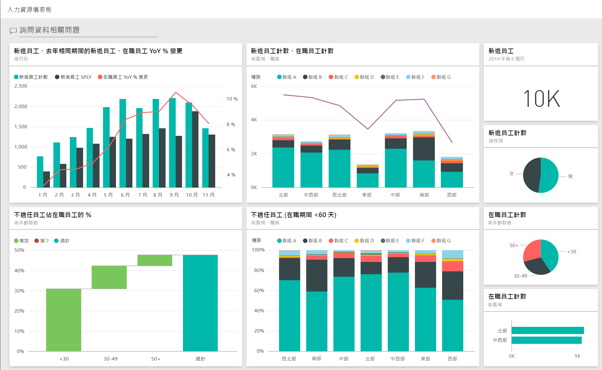
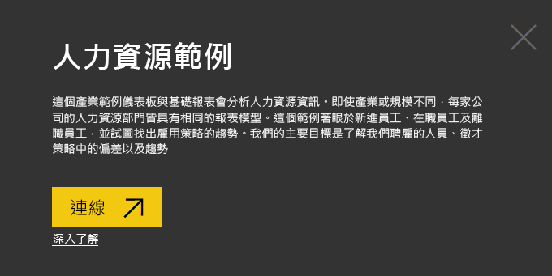
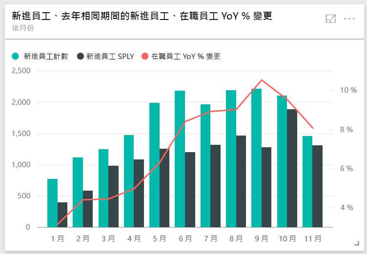
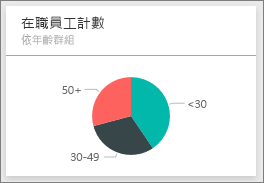
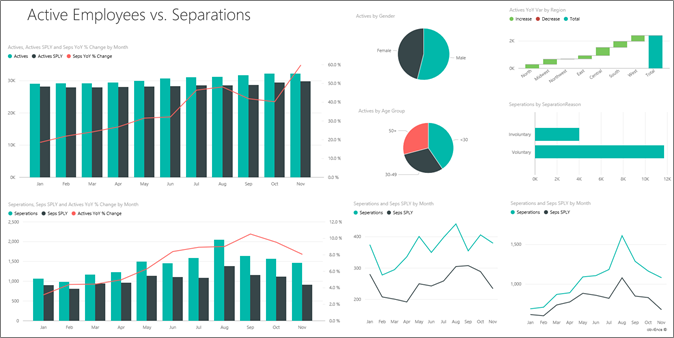
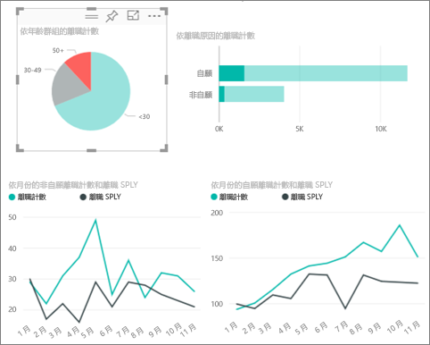
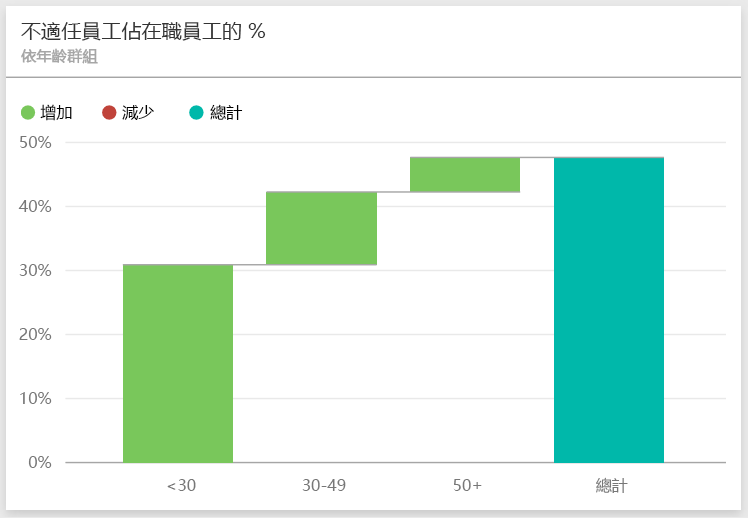
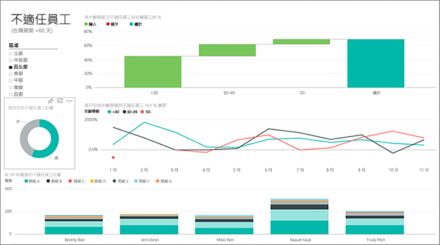
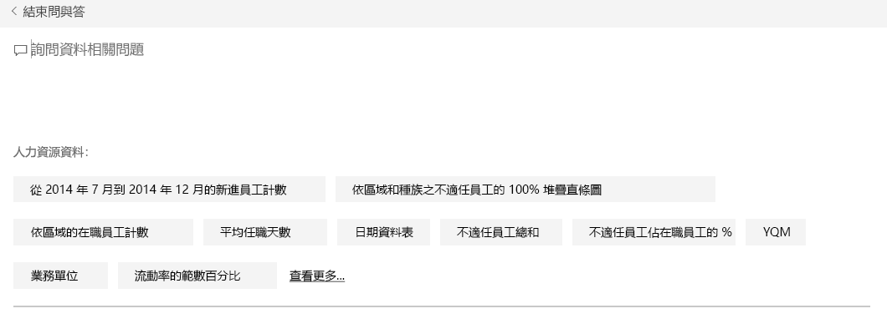
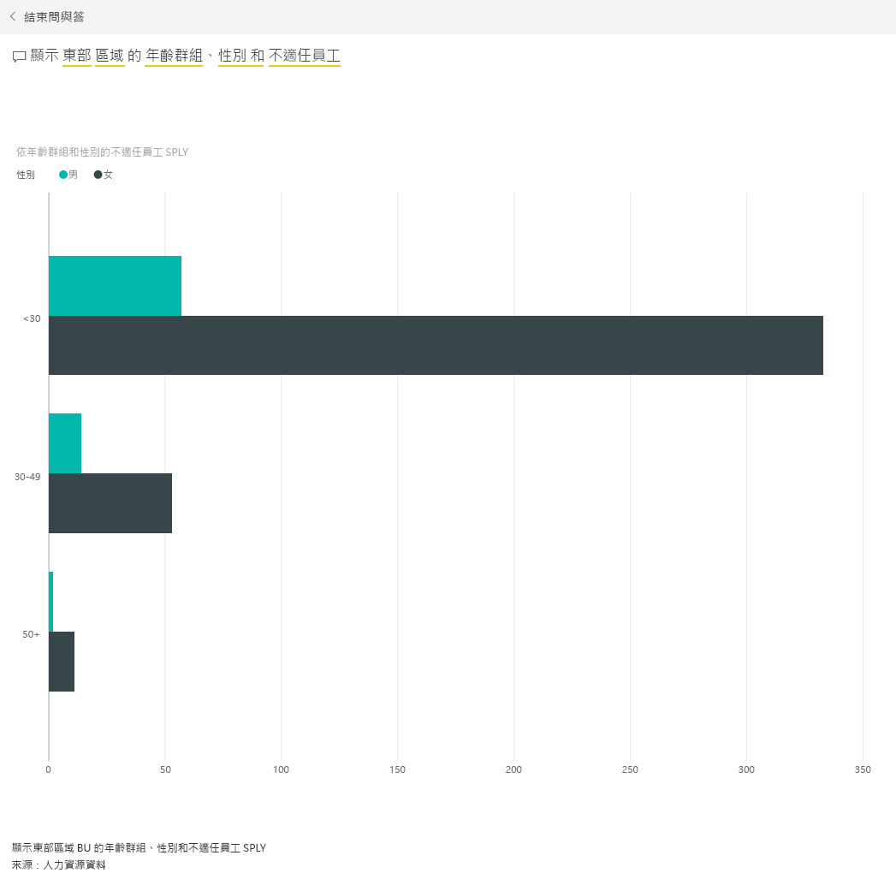

# Power BI 的人力資源範例：導覽

## 人力資源範例概觀
即使產業或規模不同，每家公司的人力資源部門皆具有相同的報表模型。 這個範例著眼於新進員工、在職員工及離職員工，並試圖找出雇用策略的趨勢。 我們的主要的目標是希望了解：

* 雇用的人員
* 徵才策略中的偏差
* 自願離職中的趨勢

此範例是系列中的一部分，該系列說明您可如何使用 Power BI 的商業導向資料、報表及儀表板。 此為來自 obviEnce 的匿名真實資料 ([www.obvience.com)](http://www.obvience.com/)。 資料會以數種格式提供：內容套件/應用程式、Excel 活頁簿，或 .pbix Power BI Desktop 檔案。 若要深入了解，請參閱[範例資料集](sample-datasets.md)。

## 先決條件

 您必須先將範例下載為[內容套件](https://docs.microsoft.com/power-bi/sample-human-resources#get-the-content-pack-for-this-sample)、[pbix 檔案](http://download.microsoft.com/download/6/9/5/69503155-05A5-483E-829A-F7B5F3DD5D27/Human%20Resources%20Sample%20PBIX.pbix)或 [Excel 活頁簿](http://go.microsoft.com/fwlink/?LinkId=529780)，才能使用範例。

### 取得此範例的內容套件

1. 開啟 Power BI 服務 (app.powerbi.com) 並登入。
2. 在左下角選取 [取得資料]。
   
    
3. 在顯示的 [取得資料] 頁面上，選取 [範例]。
   
   
4. 選取 [人力資源範例]，然後選擇 [連線]。  
   
   
5. Power BI 會匯入內容套件，並將新的儀表板、報表及資料集新增到您目前的工作區。 新的內容會以黃色星號標示。 
   
   
  
### 取得此範例的 .pbix 檔案

或者，您可以下載此範例為 .pbix 檔案，其設計目的是要用於 Power BI Desktop。 

 * [人力資源範例 PBIX](http://download.microsoft.com/download/6/9/5/69503155-05A5-483E-829A-F7B5F3DD5D27/Human%20Resources%20Sample%20PBIX.pbix)

### 取得此範例的 Excel 活頁簿
您也可以[只下載此範例的資料集 (Excel 活頁簿)](http://go.microsoft.com/fwlink/?LinkId=529780)。 活頁簿包含的 Power View 工作表可供您檢視及修改。 若要查看未經處理的資料，請選取 [Power Pivot] > [管理]。

## 新進員工
首先，我們來探索新進員工。

1. 在您的工作區中，選取 [儀表板] 索引標籤，然後開啟 [人力資源] 儀表板。
2. 在儀表板上，選取 [依月份的新進員工、去年相同期間的新進員工、在職員工 YoY % 變更] 磚。  
     

   人力資源範例報表會開啟 [ **新進員工** ] 頁面。  

   

請注意下列項目：

* **新進員工、新進員工 SPLY 和依月份在職員工 YoY % 變更**組合圖表顯示，比起去年，我們今年每個月份都雇用更多員工，有幾個月更是大幅成長。
* 在 [ **依地區和民族的新進員工和在職員工**] 組合圖中，可以注意到我們在 **東部** 地區雇用的員工變少了。
* [ **依年齡群組的新進員工 YoY Var** ] 瀑布圖顯示我們雇用的主要是年輕員工。 這可能是因為這些工作主要是兼職性質。
* [ **依性別的新進員工** ] 圓形圖顯示性別分配相當平均。

您是否可以找到更多深入資訊；例如，哪個地區性別分配不均？ 選取圖表中不同的年齡群組和性別，以探索年齡、性別、地區和民族群組之間的關聯性。

從上方導覽列選取儀表板名稱，以返回儀表板。

## 目前在職員工和離職員工的比較
讓我們來探索目前在職員工和不再於公司任職的員工資料。

在儀表板中，選取 [ **依年齡群組的在職員工** ] 圖格。  

人力資源範例報表會開啟 [**在職員工和離職員工比較**] 頁面。  

**感興趣的項目**：

* 組合圖左側顯示在職員工和離職員工的每年變更。 由於快速雇用，我們今年有更多在職員工，但離職員工也比去年多。
* 相較於其他月份，8 月的離職員工較多。 選取不同的年齡群組、性別或地區，以查看是否可以找到任何極端值。
* 透過圓形圖可發現，我們的在職員工和離職員工的性別和年齡群組分配很平均。 選取不同年齡群組，以查看不同年齡的性別分配。 在每個年齡群組中，我們的性別分配是否平均？

## 離職原因
讓我們使用編輯檢視來查看報表。 選取左上角的 [ **編輯報表** ]。

將圓形圖變更為顯示離職員工資料而不是在職員工。

1. 選取 [ **依年齡群組的在職員工** ] 圓形圖。
2. 在 [欄位] 中選取 [員工] 旁邊的箭頭，展開 [員工] 資料表。 清除 [在職員工] 旁的核取方塊，移除該欄位。
3. 選取 [員工] 資料表中 [ **離職員工** ] 旁的核取方塊，將它加入欄位區中的 [ **值** ] 方塊。
4. 返回報表畫布，選取 [依離職原因的離職人員] 橫條圖中的 [自願] 列。 這會在圖表中以其他視覺效果反白顯示自願離職的員工。
5. 按一下 [依年齡群組的離職員工] 圓形圖的 50 + 配量。

   查看右下角的 [離職原因] 折線圖。 此圖會篩選顯示自願離職的部分。  
   

   注意到 50+ 年齡群組的趨勢了嗎？ 在下半年期間，較多 50 歲以上的員工自願離職。 這是需要以更多詳細資料進一步調查的領域。
6. 您可以針對 [ **依性別的在職員工** ] 圓形圖遵循相同步驟，將它變更為離職員工，而不是在職員工。 查看依性別顯示的自願離職資料，看看是否能發現任何其他深入資訊。
7. 按一下頂端導覽列的 **Power BI** 返回儀表板。 您可以將所做的變更儲存至報表或不儲存。

## 不當員工
最後要探索的部分是不當員工。 不當員工定義為沒有在職超過 60 天以上的員工。 我們雇用速度很快。 但是否有雇用良好的人才？

1. 選取 [ **依年齡群組的不當員工 %** ] 儀表板圖格。 報表會開啟到第 3 頁的 [不當員工]。

     
2. 選取左側 [地區] 交叉分析篩選器的 [西北] 核取方塊，並在 [依性別的不當員工] 環圈圖中選擇 [男性] 的配量。  查看 [不當員工] 頁面上的其他圖表。 不當員工中的男性比女性多，且群組 A 中有很多不當員工。
     
3. 查看 [ **依性別的不當員工** ] 環圈圖，並點選 [ **地區** ] 交叉分析篩選器，可發現東部是女性不當員工多於男性不當員工的唯一地區。  
4. 從上方導覽列選取儀表板名稱，以返回儀表板。

## 在問與答方塊中提問
[問與答的問題方塊](power-bi-tutorial-q-and-a.md)是您使用自然語言來輸入問題的地方。 問與答辨識您輸入的文字，然後找出在哪個資料集裡可以找到解答。

1. 按一下問與答的問題方塊。 在開始輸入之前，請注意問與答方塊的一些建議：

   
2. 您可挑選其中一個建議，或另外輸入：**顯示東部地區的年齡群組、性別和不當員工**。  

   

   請注意，大部分的女性不當員工都在 30 歲以下。

這是安全的作業環境。 您一律可以選擇不儲存變更。 如果儲存了變更，您也可以隨時移至 [ **取得資料** ]，重新複製此範例。

## 下一步：連接到您的資料
我們希望本教學已示範 Power BI 儀表板、問與答和報表如何讓您深入了解人力資源的資料。 現在換您登場 — 連接到您自己的資料。 您可以透過 Power BI 連接到各式各樣的資料來源。 深入了解[開始使用 Power BI](service-get-started.md).  
