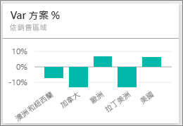
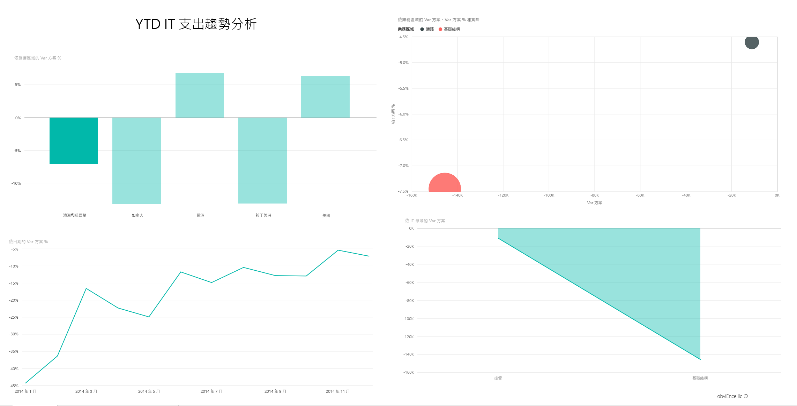
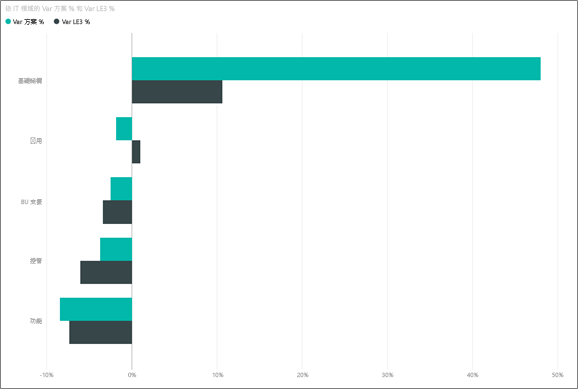
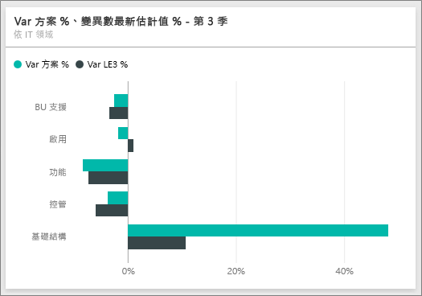
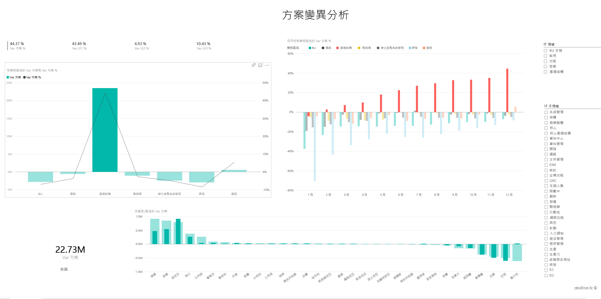

# Power BI 的 IT 支出分析範例教學
IT 支出分析[內容套件](service-organizational-content-pack-introduction.md) (儀表板、報表和資料集) 分析 IT 部門之計劃與實際成本的比較。 這項比較可幫助我們了解公司的年度計畫是否得當，並可針對大大偏離計畫的領域進行調查。 此範例中的公司，會經歷一年一度的計畫週期，然後按季產出新的「最新估計」(LE) 來協助分析 IT 支出於會計年度的變化。

此範例是系列中的一部分，該系列說明您可如何使用 Power BI 的商業導向資料、報表及儀表板。 此為來自 obviEnce 的匿名真實資料 (<http://obvience.com/>)。

* [取得 IT 支出分析內容套件](sample-tutorial-connect-to-the-samples.md)
* [只下載此範例的資料集 (Excel 活頁簿)](http://go.microsoft.com/fwlink/?LinkId=529783).

## IT 支出分析範例的儀表板
儀表板上具有兩個數字的磚， **浮動計畫 %** 和 **最新估計差異 % 第 3 季**，針對計畫與最新一季估計 (LE3 = 最新第 3 季估計) 的表現提供概觀。 整體上我們落後計畫 6%。 讓我們一起從時間點、地點及商品類別來了解造成此差異的原因。

## [YTD IT 支出趨勢分析] 頁面
選取 [依銷售區域的浮動計畫 %]  儀表板磚，會引導您至「IT 支出分析範例」報表的 [IT 支出趨勢分析] 頁面。 在此一眼就可看出我們在美國及歐洲為正差異，加拿大、拉丁美洲地區和澳洲則為負差異。 美國的最新估計約為 6% 正差異，而澳洲的最新估計則約為 7% 的負差異。

但如果只看此圖表就做出結論恐怕會產生誤導。 我們必須看看實際金額才能洞悉狀況。

1. 在「依銷售區域的浮動計畫 %」圖表中選取**澳洲和紐西蘭**，並觀察「IT 領域的浮動計畫」圖表。 
   
   
2. 現在請選取 **美國**。 想必這樣您就了解了，與美國相較之下，澳洲只在我們整體支出中佔了非常小的一部分。
   
    所以我們已將範圍縮小至美國，接下來呢？ 讓我們來探討美國的哪一類商品造成差異。

## 針對資料提問
1. 選取導覽列頂端的 [IT 費用分析範例]，返回儀表板。
2. 在問題方塊中輸入「顯示 IT 領域、浮動計畫 % 和最新第 3 季估計差異 % 長條圖」。
   
    
   
   在第一個 IT 領域，也就是 **基礎結構**中，初始的浮動計畫與最新估計的浮動計畫之間的百分比已有巨大差異。

## [依成本項目的 YTD 支出] 頁面
返回儀表板查看 [浮動計畫 %、最新第 3 季估計差異 %]  儀表板磚。

即可看到基礎結構的極大計畫正差異。

1. 按一下此磚，移至「IT 支出分析範例」報表的 [依成本項目的 YTD 支出] 頁面。
2. 按一下左下方「依 IT 領域的浮動計畫 % 和最新第 3 季估計差異 %」圖表中的 [基礎結構]  長條，觀察左邊 [依銷售區域的浮動計畫 %] 中的計畫差異。
   
    
3. 按一下交叉分析篩選器中每個成本項目群組的名稱，找出有很大差異的成本項目。
4. 在選取 [其他]  的情況下，按一下 [IT 領域] 中的 [基礎結構]  ，並按一下 [IT 子領域] 交叉分析篩選器中的子領域，找出具有最大差異的子領域。  
   
   我們會看到 [網路] 中有很大的差異。
   
   顯然公司決定提供員工電話服務做為福利，不過這項措施未經規劃。 

## [計畫浮動分析] 頁面
同樣在報表中，按一下報表底部的 [計畫浮動分析] 索引標籤，移至報表的第 3 頁。

在左側的「依業務區域的浮動計畫和浮動計畫 %」組合式圖表中，按一下 [基礎結構] 欄，反白顯示頁面其他部分的基礎結構值。

請注意「依月份和業務區域的浮動計畫 %」圖表上的基礎結構，從二月開始有正差異且持續增加。 另外也請注意在與所有業務區域的值相較之下，基礎結構的計畫差異如何隨國家/地區產生變化。 使用右側的 [ IT 領域] 和 [IT 子領域] 交叉分析篩選器篩選頁面其餘部分的值，而不是加以反白顯示。 按一下右側的其他 [IT 領域]，以別種方式研究資料。 您也可以按一下 [IT 子領域] 以該層級來檢視差異。

## 編輯報表
按一下左上角的 [編輯報表]  ，並在 [編輯檢視] 中瀏覽。

* 檢視頁面如何組成 – 每個圖表中的欄位、頁面上的篩選器
* 根據相同的資料新增頁面和圖表
* 變更每個圖表的視覺效果類型
* 將頁面釘選到您的儀表板

這是安全的作業環境。 您一律可以選擇不儲存變更。 但如果儲存了變更，您也可以隨時移至 [取得資料]，重新複製此範例。

## 下一步：連接到您的資料
我們希望本教學已示範 Power BI 儀表板、問與答和報表如何讓您深入了解 IT 支出的資料。 現在換您登場 — 連接到您自己的資料。 您可以透過 Power BI 連接到各式各樣的資料來源。 深入了解[開始使用 Power BI](service-get-started.md).

