# Power BI 的零售分析範例教學

這個產業範例的儀表板、基礎資料集和報表，會分析在多個門市和區域售出之品項的零售資料。 計量會比較今年與去年在以下領域的表現：銷售、單位、毛利率和變異數，以及新門市分析。 此為來自 obviEnce 的匿名真實資料 ([www.obvience.com](http://www.obvience.com))。

[!Note] 您也可以[只下載此範例的資料集 (Excel 活頁簿)](http://go.microsoft.com/fwlink/?LinkId=529778). 活頁簿包含您可檢視和修改的 Power View 工作表。  若要查看未經處理的資料，請選取 [Power Pivot] > [管理]。 

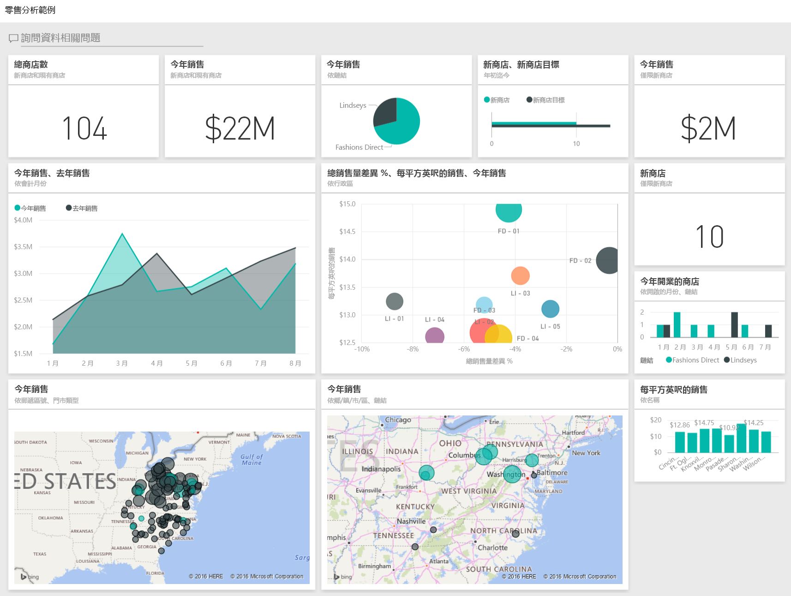

## 進入儀表板，然後開啟報表
1. 在儀表板中選取 [所有門市] 磚：
   
   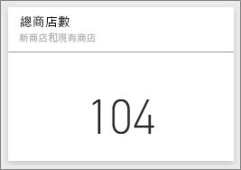  
   
   這會帶您前往報表中的 [銷售門市概觀] 頁面。 您會看到我們總共有 104 個門市，其中 10 個為新門市。 我們有兩種連鎖店：Fashions Direct 和 Lindseys。 Fashions Direct 的門市通常比較大。
2. 在圓形圖中選取 [Fashions Direct]。
   
   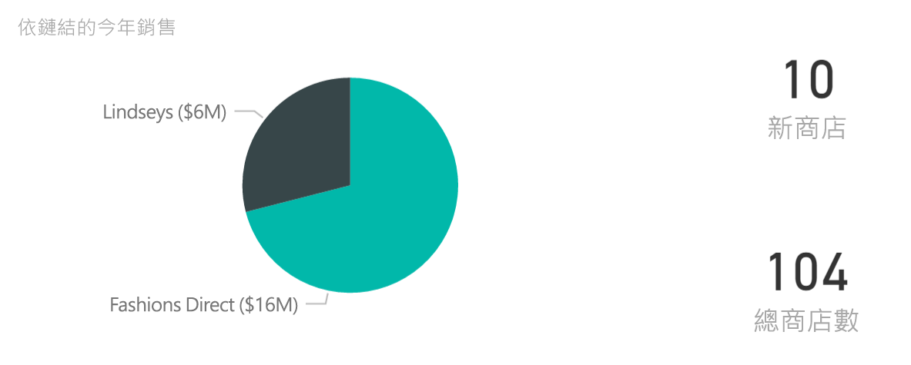  
   
   請注意泡泡圖中的結果：
   
   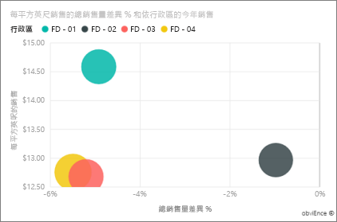  
   
   FD-01 區有每平方英呎最高的平均銷售額，FD-02 區與去年相比的變異數最低，FD-03 區和 FD-04 區的整體表現最差。
3. 選取個別泡泡或其他圖表，即可查看交叉醒目提示，呈現您選取範圍的影響。
4. 若要返回儀表板，請從上方導覽列 (階層連結) 選取其名稱。 
   
   
5. 在儀表板中選取標題為「本年度銷售量」的磚。
   
   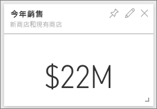
   
   這等同於在問題方塊中輸入「本年度銷售量」。
   
   您會看到這個畫面：
   
   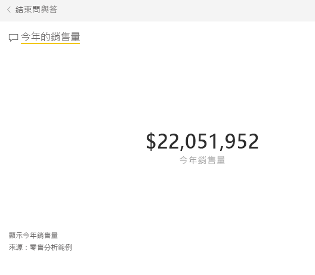

## 檢閱為 Power BI 問與答所建立的磚
讓我們詳加說明。

1. 在問題中加入「 **依區域**的本年度銷售量」。 觀察結果，您會發現答案自動呈現在橫條圖中，並建議其他片語：
   
   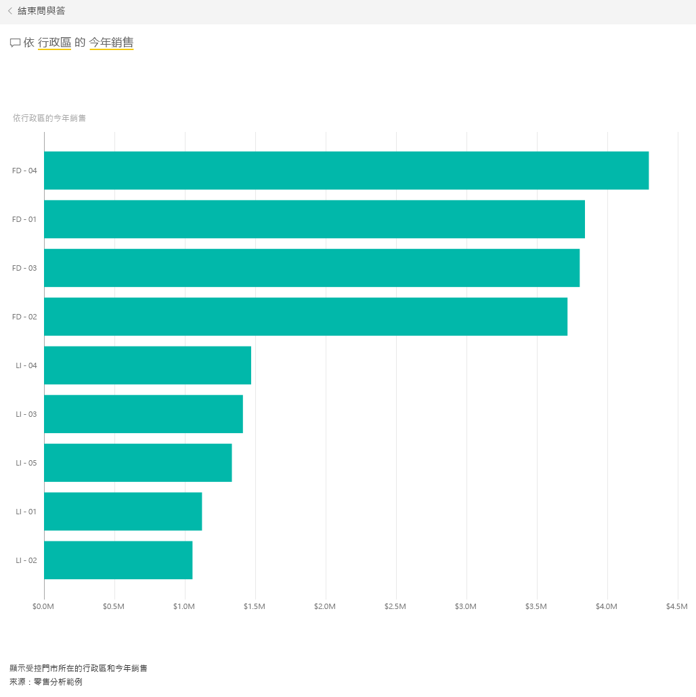
2. 現在將問題改為「 **依郵遞區號和連鎖店**的本年度銷售量」。
   
   請注意當您輸入適當的圖表時，它會如何回答。
3. 試問更多問題，看看會得到何種結果。
4. 當您準備好時，請返回儀表板。

## 深入探索資料
現在探討更詳細的層面，我們來查看區域的表現。

1. 在儀表板上，選取比較本年度和去年度銷售量的圖格。
   
   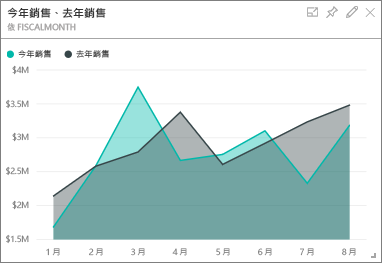
   
   請注意去年在差異 % 上有很大的變動，1 月、4 月和 7 月都是狀況特別不好的月份。
   
   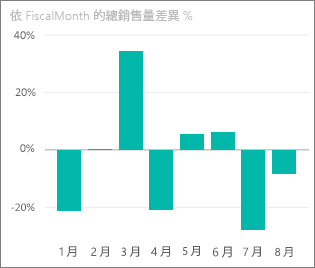
   
   現在來看看是否可以縮小範圍，找出問題所在。
2. 選取泡泡圖，然後選擇 [020-Mens] 。
   
   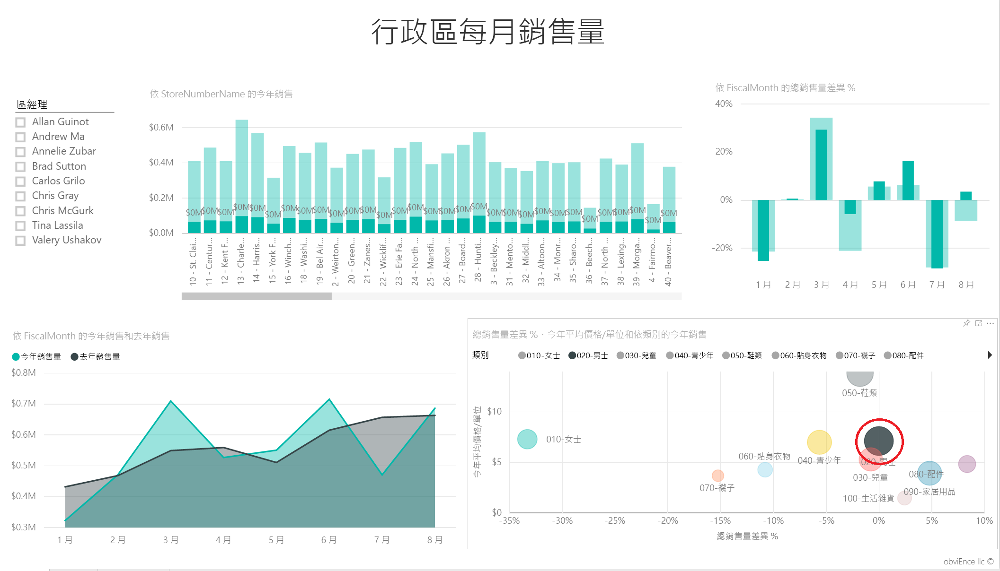  
   
   您會觀察到，男性類別在 4 月並沒有像整體生意那樣受到嚴重影響，但 1 月和 7 月仍是有問題的月份。
3. 現在選取 [010-Womens] 泡泡。
   
   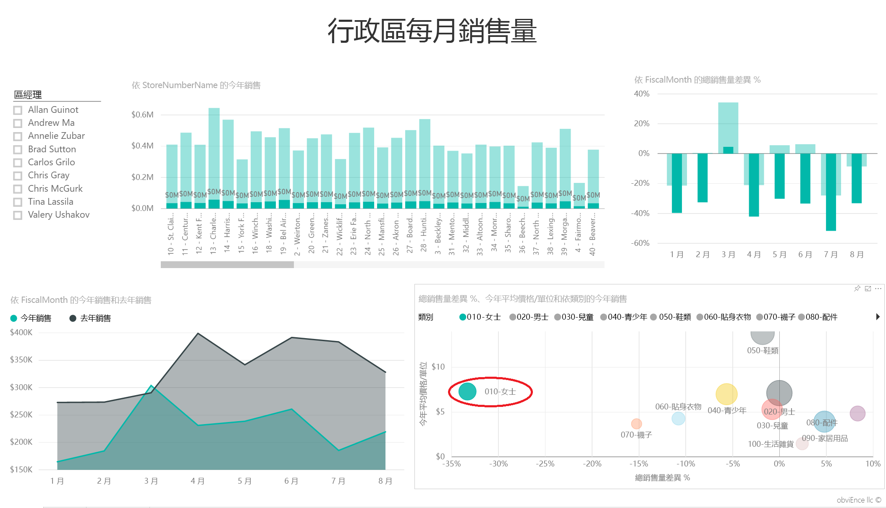
   
   請注意，女性類別在所有月份的表現都比整體生意更差，而且每個月的表現幾乎也都不如去年。
4. 再次選取泡泡即可清除篩選條件。

## 試用交叉分析篩選器
我們來看一看特定區域的表現。

1. 在左上方的交叉分析篩選器中選取 [Allan Guinot]。
   
   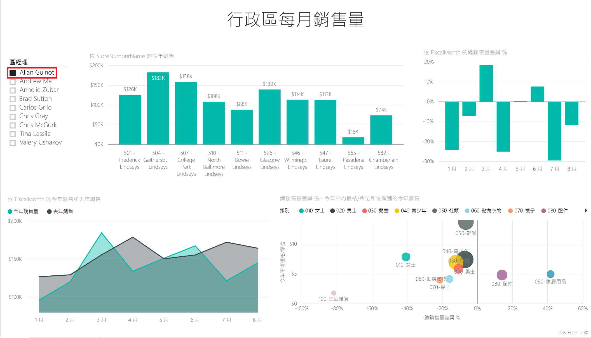
   
   請注意 Allan 的區域在 3 月和 6 月的表現優於去年。
2. 現在在已選取 Allan 的狀態下，按一下女性的泡泡。
   
   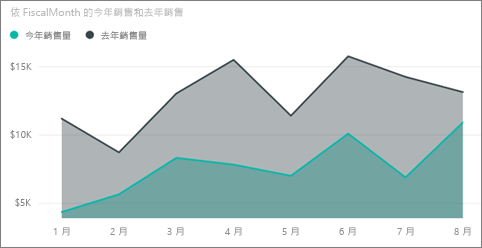
   
   請注意對於女性類別，他的區域從未達到去年營業額。
3. 探索其他區域的經理和商品類別狀況 – 您可找出其他的深入資訊嗎？
4. 當您準備好時，請返回儀表板。

## 從資料中，我們了解到本年度銷售成長隱藏了哪些含意？
我們要探討的最後一個領域是我們的成長 – 本年度新開的門市。

1. 選取 [本年度新開門市] 圖格。
   
   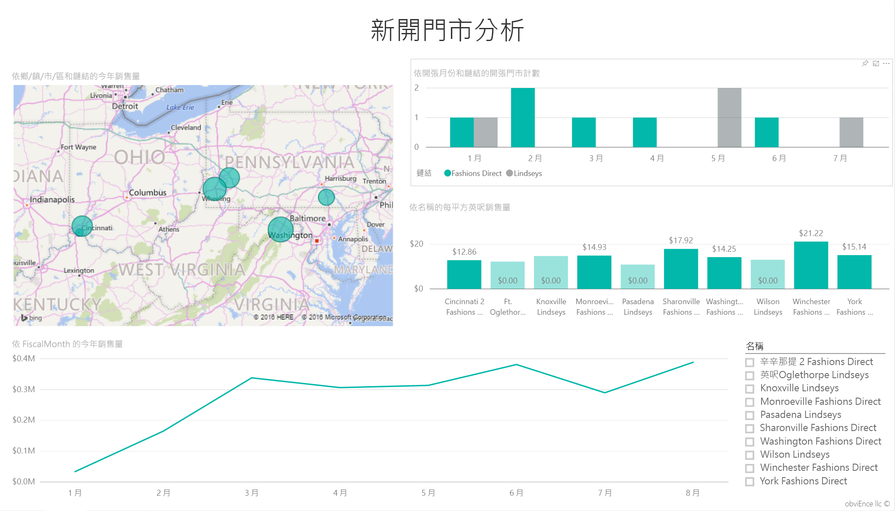
   
   如圖格顯示，本年度開張的 Fashions Direct 門市比 Lindseys 門市更多。
2. 觀察「依名稱的每平方英尺銷售量」圖表：
   
   
   
    各家新門市在「平均每平方英尺銷售量」上的差異相當大。
3. 按一下右上方圖表中的 Fashions Direct 圖例項目。 請注意即使是同一系列的連鎖店，最佳門市 (Fashions Direct 溫徹斯特店) 的表現顯著優於最差門市 (Fashions Direct 辛辛那提 2 號店)，分別是 $21.22 美元及 $12.86 美元。
   
   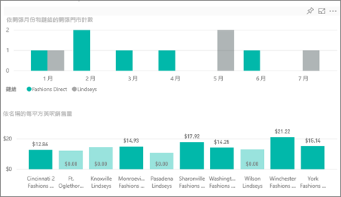
4. 按一下交叉分析篩選器中的 Fashions Direct 溫徹斯特店，然後觀察折線圖。 第一個銷售數字在二月報告。
5. 按一下交叉分析篩選器中的 Fashions Direct 辛辛那提 2 號店，折線圖中顯示該門市於 6 月開幕，似乎是表現最差的門市。
6. 請和之前一樣，在其他長條、折線和泡泡上按一下，看看您可以找到哪些深入資訊。

這是安全的作業環境。 您一律可以選擇不儲存變更。 但如果儲存了變更，您也可以隨時移至 [取得資料]，重新複製此範例。

## 連線到您的資料
希望本教學已讓您了解 Power BI 儀表板、問與答和報表能夠如何提供零售資料的深入資訊。 現在輪到您了 — 連接到您自己的資料。 您可以透過 Power BI 連接到各式各樣的資料來源。 深入了解[開始使用 Power BI](service-get-started.md).

## 後續步驟
* [下載零售分析範例的內容套件](sample-tutorial-connect-to-the-samples.md)    
* [下載這個 Power BI 範例中的 Excel 活頁簿](http://go.microsoft.com/fwlink/?LinkId=529778)    
* [取得 Power BI 的資料](service-get-data.md)    
* [Power BI - 基本概念](service-basic-concepts.md)    
* 有其他問題嗎？ [試試 Power BI 社群](http://community.powerbi.com/)

