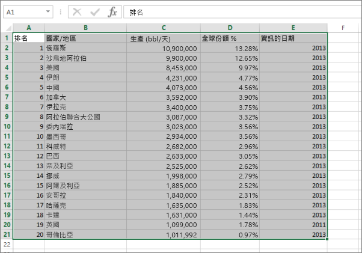

# 錯誤：在此 Excel 活頁簿中找不到任何資料。

>[!NOTE]
>本文適用於 Excel 2007 和較新版本。

當您將 Excel 活頁簿匯入 Power BI 時，您可能會看到下列錯誤：

*錯誤：在此 Excel 活頁簿中找不到任何資料。您的資料格式可能不正確。您必須在 Execl 中編輯您的活頁簿，然後重新匯入。*

## 快速解決方案
1. 編輯在 Excel 中的活頁簿。
2. 選取包含資料的資料格範圍。 第一個資料列應該包含您的資料行標頭 (資料行名稱)。
3. 按下 **Ctrl + T** 來建立資料表。
4. 儲存活頁簿。
5. 返回 Power BI 並再次匯入活頁簿，或如果您使用 Excel 2016 且已將活頁簿儲存至商務用 OneDrive，請在 Excel 中，按一下 [檔案] > [發行]。

## 詳細資料
### 原因
您可以在 Excel 中建立超出資料格範圍的 **資料表** ，這樣會更容易排序、篩選和格式化資料。

當您匯入 Excel 活頁簿時，Power BI 會尋找這些資料表，並匯入至資料集；如果找不到任何資料表，您就會看到這個錯誤訊息。

### 解決方案
1. 在 Excel 中開啟您的活頁簿。 
    >[!NOTE]
    >此處圖片中使用的是 Excel 2013。 如果您使用不同的版本，畫面看起來可能有點不同，但步驟都一樣。
    
    
2. 選取包含資料的資料格範圍。 第一個資料列應該包含您的資料行標頭 (資料行名稱)：
   
    
3. 在功能區的 [插入] 索引標籤上，按一下 [資料表] \(或是按下快捷鍵 **Ctrl + T**)。
   
    
4. 您會看到下列對話方塊。 請確定已核取 [有標題的表格]  ，然後選取 [確定] ：
   
    
5. 現在，您的資料會格式化為資料表：
   
    
6. 儲存活頁簿。
7. 返回 Power BI。 選取左瀏覽窗格底部的 [取得資料]。
   
    
8. 在 [檔案]  方塊中選取 [取得] 。
   
    
9. 再次匯入 Excel 活頁簿。 這次匯入後應該能找出該資料表，並成功完成步驟。
   
    如果匯入仍然失敗，請按一下 [說明] 功能表中的 [社群]，好讓我們知道：
   
    
