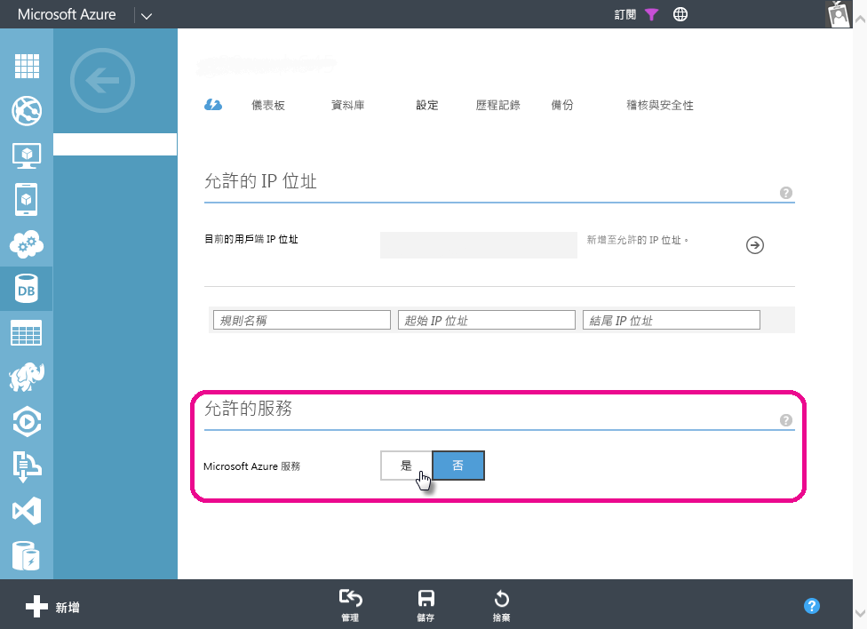

# Power BI 中的 Azure SQL Database 排程重新整理疑難排解
如需設定排程重新整理的詳細步驟，請務必參閱[重新整理 Power BI 中的資料](refresh-data.md)。

當您設定 Azure SQL Database 的排程重新整理時，如果在編輯認證期間收到錯誤碼 400 的錯誤，請嘗試下列步驟以設定適當的防火牆規則：

1. 登入 Azure 管理入口網站
2. 移至您要設定重新整理的 Azure SQL Server
3. 在 [允許的服務] 區段中，啟動「Windows Azure 服務」

  

有其他問題嗎？ [試試 Power BI 社群](http://community.powerbi.com/)

