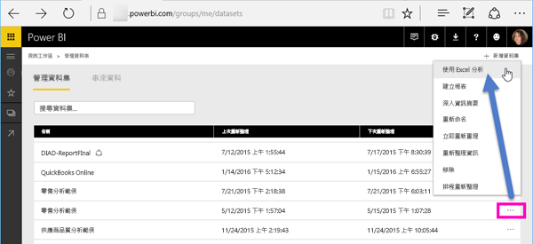
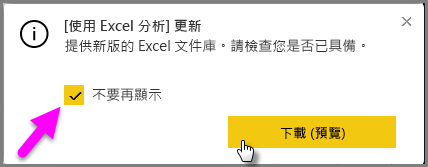
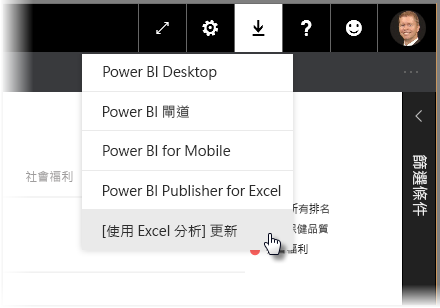
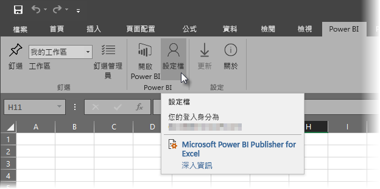
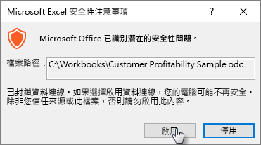
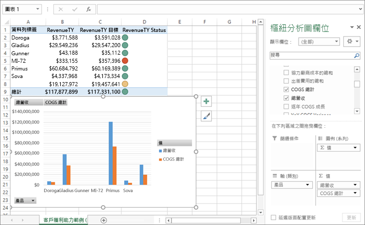

# 使用 Excel 分析
有時候您可能會想要使用 Excel 來檢視和與您有 Power BI 的資料集互動。 有了 [使用 EXCEL 分析]，您可以做到，並以存在於 Power BI 中的資料集為基礎來存取 Excel 的樞紐分析表、 圖表和交叉分析篩選器的功能。

## 需求
使用 [使用 EXCEL 分析] 有幾項要求：

* Microsoft Excel 2010 SP1 和更新版本支援 [使用 EXCEL 分析]。
* Excel 樞紐分析表不支援數值欄位的拖放功能彙總。 您在 Power BI 中的資料集 *必須有預先定義的量值* 。
* 某些組織可能會有防止安裝 [使用 EXCEL 分析] 必要更新的群組原則規則。 如果您無法安裝更新，請洽詢您的系統管理員。
* [在 Excel 中進行分析] 需要 Pro 授權。 若要深入了解免費和 Pro 授權之間的差異，請參閱 [Power BI 免費與 Pro](service-free-vs-pro.md)。 

## 運作方式
當您從省略符號功能表 (...) 相關聯的資料集或報表中的 **Power BI** 選取 [使用 EXCEL 分析]，Power BI 會建立 .ODC 檔案，並從瀏覽器下載到您的電腦。

當您在 Excel 中開啟檔案時，您會看到一個空白**樞紐分析表**，以及內含 Power BI 資料集中所有資料表、欄位和量值的**欄位**清單。 如同您可以在 Excel 中使用本機資料集工作一樣，您可以建立樞紐分析表、 圖表和分析該資料集。

.ODC 檔案具有 MSOLAP 連接字串，會連接到您在 Power BI 中的資料集。 當您分析或處理資料時，Excel 會查詢 Power BI 中的該資料集，並將結果傳回 Excel。 如果該資料集使用 DirectQuery 連接到即時資料來源，Power BI 會查詢資料來源，並將結果傳回 Excel。

[使用 Excel 分析] 對於連接到「Analysis Services 表格式」或「多維度」資料庫的資料集和報表非常有用，或是從 Power BI Desktop 檔案或 Excel 活頁簿連接的資料集和報表，其中的資料模型具有使用資料分析運算式 (DAX) 建立的模型量值。

## 開始使用 [使用 EXCEL 分析]
在 Power BI 中，選取報表或資料集旁邊的省略符號功能表 (報表或資料集名稱旁邊的 …)，然後從出現的功能表，選取 [使用 EXCEL 分析]。

### 安裝 Excel 更新
當您第一次使用 [使用 EXCEL 分析]，您需要將更新安裝至 Excel 文件庫。 系統會提示您下載並執行 Excel 更新 (這會啟動安裝 *SQL_AS_OLEDDB.msi* Windows 安裝程式套件)。 此套件會安裝 **Microsoft AS OLE DB Provider for SQL Server 2016 RC0 (Preview)**。

> [!NOTE]
> 請務必選取 [安裝 Excel 更新] 對話方塊中的 [不要再顯示]。 您只需要安裝更新一次。
> 
> 

如果您需要為 [使用 EXCEL 分析] 再次安裝 Excel 更新，您可以從 Power BI 中的**下載**圖示下載更新，如下圖所示。

### 登入 Power BI
即使您已經在瀏覽器中登入 Power BI，第一次在 Excel 中開啟新的 .ODC 檔案時，可能會要求您使用 Power BI 帳戶登入 Power BI。 這會驗證從 Excel 到 Power BI 的連線。

### 使用多個 Power BI 帳戶的使用者
某些使用者有多個 Power BI 帳戶，這些使用者可能會遇到的情況是：他們用某個帳戶登入 Power BI，但該帳戶與使用於 [使用 EXCEL 分析] 所存取的資料集的帳戶是不同的。 在這些情況下，若您嘗試存取用於 [使用 EXCEL 分析] 活頁簿中的資料集，可能會出現**禁止**錯誤或登入失敗。

您將有機會再次登入，屆時您可以使用用於 [使用 EXCEL 分析] 所存取之資料集的 Power BI 帳戶登入。 您也可以從 Excel 中的 **Power BI** 功能區索引標籤選取**設定檔**，其會識別您目前登入的帳戶，並提供一個連結讓您登出 (接著即可使用不同的帳戶登入)。

### 啟用資料連線
若要在 Excel 中分析您的 Power BI 資料，系統會提示您確認 .odc 檔案的路徑與檔案名稱，然後選取 [啟用]。

> [!NOTE]
> Power BI 租用戶的管理員可以使用 Power BI 管理入口網站，禁止位於 Analysis Services (AS) 資料庫中的內部部署資料集使用 [在 Excel 中進行分析]。 停用該選項時，AS 資料庫即無法使用 [在 Excel 中進行分析]，但其他資料集仍可使用者該功能。
> 
> 

## 分析為離開
已開啟 Excel 且您有空白的樞紐分析表，則您已準備好使用您的 Power BI 資料集進行各種分析。 如同其他本機活頁簿，您可以使用 [使用 EXCEL 分析] 來建立樞紐分析表、圖表、從其他來源新增資料等等。 當然，您可以使用資料的各種檢視來建立不同的工作表。

> [!NOTE]
> 請務必了解使用**在 Excel 中進行分析**會將所有詳細等級的資料公開給任何具有資料集權限的使用者。
> 
> 

## 儲存
如同任何其他活頁簿，您可以儲存此 Power BI 資料集來連接活頁簿。 但是，由於您只能將活頁簿發佈或匯入至資料表中有資料或有資料模型的 Power BI，您無法將活頁簿發佈或匯入至 Power BI。 因為新的活頁簿只要在 Power BI 中有連接至資料集，發佈或匯入至 Power BI 將會陷入循環！

## 共用
儲存活頁簿之後，您可以與組織中的其他 Power BI 使用者共用。

當與您共用活頁簿的使用者開啟活頁簿時，他們會看到樞紐分析表和資料最後儲存時的狀態，而不一定是最新版資料。 若要取得最新資料，使用者必須先按下 [資料] 功能區中的 [重新整理] 按鈕。 而且因為活頁簿連接到 Power BI 中的資料集，嘗試重新整理活頁簿的使用者必須登入 Power BI 和安裝首次嘗試使用此方法更新的 Excel 更新。

由於使用者必須重新整理資料集，但 Excel Online 不支援對外部連接重新整理，因此建議這些使用者在自己的電腦上用桌面版 Excel 來開啟活頁簿。

## 疑難排解
有時候使用 [使用 EXCEL 分析] 可能會取得非預期的結果，或功能無法如您預期般運作。 [此頁面可提供使用 [使用 EXCEL 分析] 時的常見問題解決方案](desktop-troubleshooting-analyze-in-excel.md)