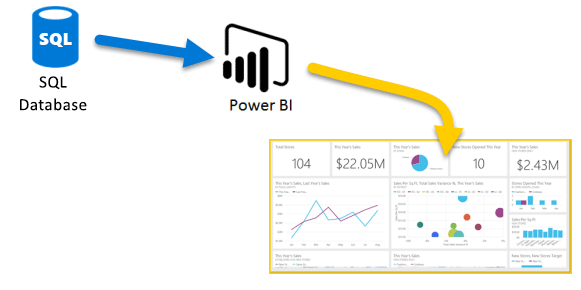
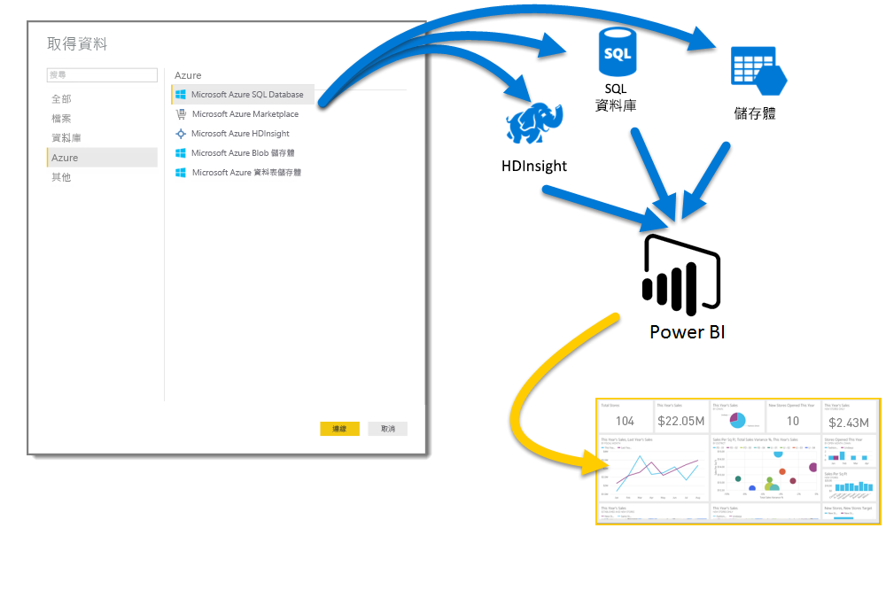
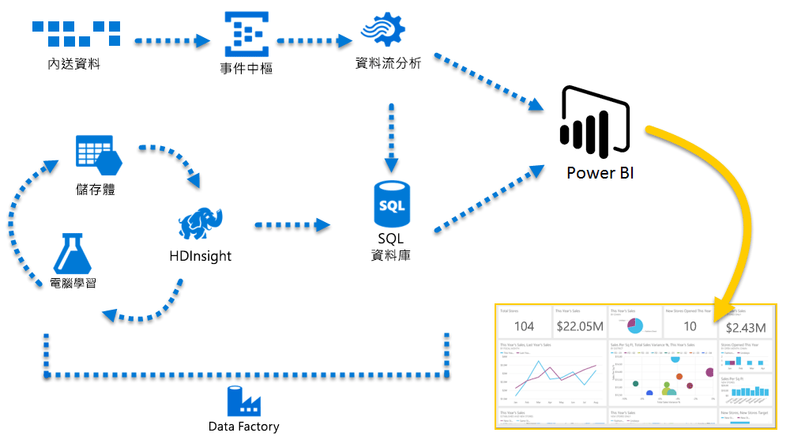

# Azure 和 Power BI
您可以使用 **Azure** 服務和 **Power BI**，將資料處理工作變成分析和報表，提供您洞察企業的即時資訊。 不論資料處理是雲端式或內部部署、簡單或複雜、單一來源或可大幅調整規模、資料倉儲或即時，Azure 與 Power BI 都具有內建連線和整合，可將您在商業智慧方面的努力化為現實。

Power BI 具有各種可用的 Azure 連接，而且您可以使用這些服務建立如同您的企業一般的獨特商業智慧方案，。 您可以最少只連接一個 Azure 資料來源，或連接幾項，然後塑造並精簡資料，用以建立自訂的報表。

### Azure SQL Database 和 Power BI
您可以開始直接連接到 Azure SQL Database，然後建立報表來監視您的企業進度。 使用 [Power BI Desktop](desktop-getting-started.md) 時，您可以建立用來判定趨勢的報表，以及帶動您企業發展的關鍵效能指標。

還有更多的資訊，可讓您深入了解 [Azure SQL Database](http://azure.microsoft.com/services/sql-database/)。

### 轉換、塑造和合併雲端資料
您是否有多個複雜資料和各種來源？ 沒問題。 使用 **Power BI Desktop** 和 Azure 服務時，只要點選 [取得資料] 對話方塊就能連接。 在相同的查詢內，您可以連接到 **Azure SQL Database**、**Azure HDInsight** 資料來源和 **Azure Blob 儲存體** (或 **Azure 資料表儲存體**)，然後在其中只選取您需要的每個子集，並從該處精簡。

您也可以為不同的觀眾建立不同的報表，方法是使用相同的資料連接，甚至是相同的查詢。 只要建置新的報表頁面、為每個觀眾調整視覺效果，然後就能看它如何使企業掌握狀況。

如需詳細資訊，請參閱下列資源：

* [Azure SQL Database](http://azure.microsoft.com/services/sql-database/)
* [Azure HDInsight](http://azure.microsoft.com/services/hdinsight/)
* [Azure 儲存體](http://azure.microsoft.com/services/storage/) (Blob 儲存體和資料表儲存體)

### 使用 Azure Services 和 Power BI 進行複雜的操作 (和進一步的操作)
您可以使用 Azure Services 和 Power BI 依需要盡可能擴充。 利用多重來源的資料處理、使用大量的即時系統，使用[串流分析](http://azure.microsoft.com/services/stream-analytics/)和[事件中樞](http://azure.microsoft.com/services/event-hubs/)，以及將各種 SaaS 服務合併到商業智慧報表，可讓您的企業占有優勢。

### 使用 Power BI API 連接您的 App 資料
您也可以使用 Power BI 深入了解現有的 App。 使用 Power BI API 時，應用程式開發人員可以用程式設計方式傳送整個資料集至 Power BI。 需要持續更新？ 藉由 Power BI API，當調整規模需求有必要時，開發人員可以傳送即時資料更新以快速開始使用，然後開始使用 Azure Stream Analytics。

在 [Power BI 開發人員入口網站](http://dev.powerbi.com)中有許多 Power BI API 的相關資訊。 您也可以在 [Power BI 開發人員部落格](http://blogs.msdn.com/powerbidev)中了解其他人使用 Power BI 以程式設計方式進行的操作。 另外還有一個針對[開始使用 Power BI 開發](https://msdn.microsoft.com/library/dn889824.aspx)的頁面。

### 您可以使用 Azure 和 Power BI 做什麼？
其中有各種結合 **Azure** 和 **Power BI** 的案例 - 種種可能和機會就如同您的企業一樣獨一無二。 如需 **Azure 服務**的詳細資訊，請簽出這個[概觀頁面](http://go.microsoft.com/fwlink/?LinkId=535031&clcid=0x409)，其中描述**使用 Azure 的資料分析案例**，並了解如何將資料來源轉換成商業智慧，引領您的企業向前邁進。

