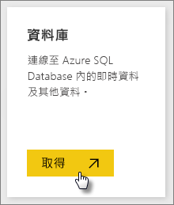
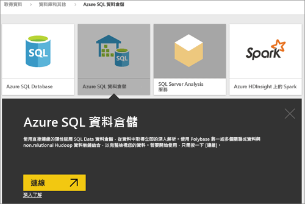
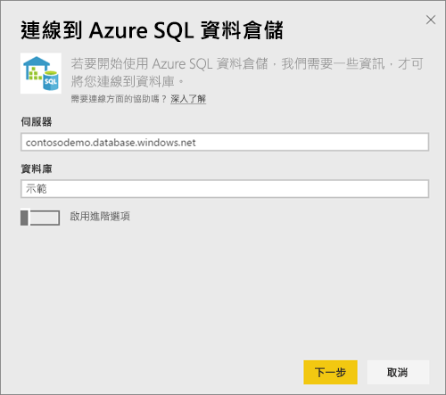
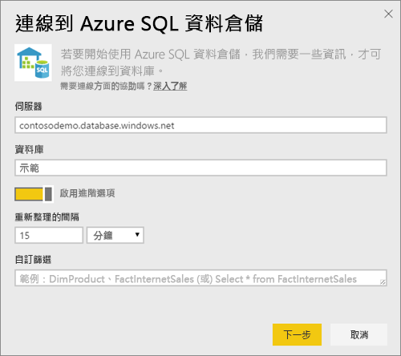
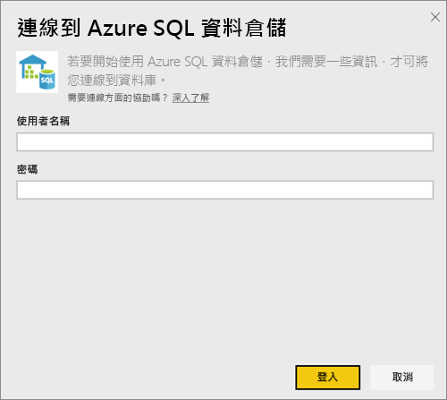
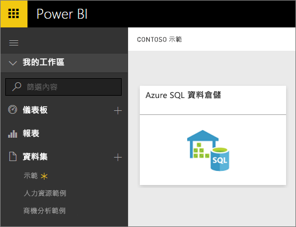
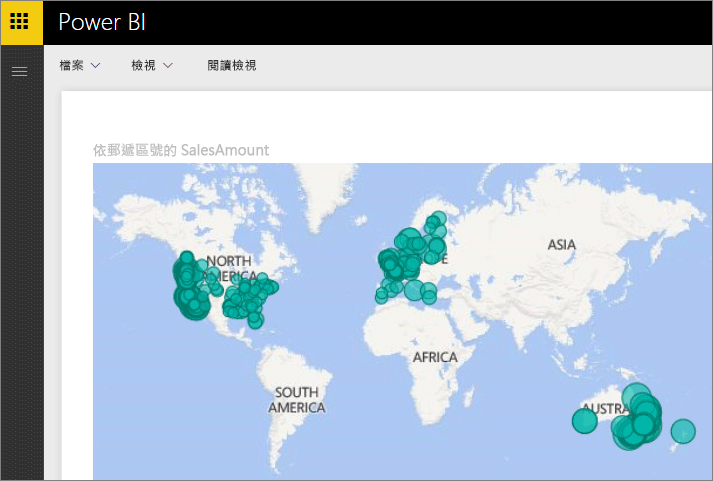
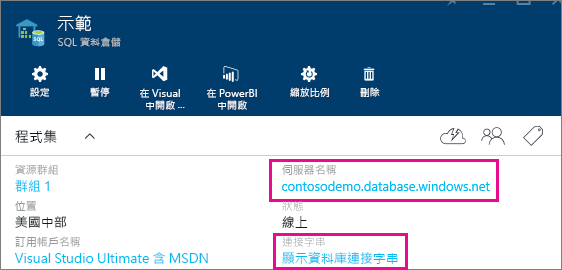

# 具有 DirectQuery 的 Azure SQL 資料倉儲
具有 DirectQuery 的 Azure SQL 資料倉儲可讓您根據 Azure SQL 資料倉儲中已有的資料和度量建立動態報表。 藉由 DirectQuery，當您瀏覽資料時，會即時將查詢傳回至您的 Azure SQL 資料倉儲。 這項功能搭配 SQL 資料倉儲的調整功能，可讓使用者依據數 TB 的資料，幾分鐘內就能建立動態報表。 此外，[在 Power BI 中開啟]  按鈕的引進可讓使用者將 Power BI 直接連接到其 SQL 資料倉儲，而不需要手動指定相關資訊。

使用 SQL 資料倉儲連接器時：

* 連接時，指定完整的伺服器名稱 (請參閱下列詳細資訊)
* 請確定已將伺服器的防火牆規則設定為「允許存取 Azure 服務」。
* 選取資料行或加入篩選等每一個動作，都會直接查詢資料倉儲
* 圖格已設定為大約每隔 15 分鐘重新整理一次，而且不需要排程重新整理  當您連接時，這可以在 [進階] 設定中調整。
* 問與答不能用於 DirectQuery 資料集
* 不會自動選擇結構描述變更

隨著我們持續改善這些體驗，這些限制和備註可能會變更。 連接的步驟如下所述。

## 使用 [在 Power BI 中開啟] 按鈕
在您的 SQL 資料倉儲與 Power BI 之間移動的最簡單方式是在 Azure Preview 入口網站內使用 [在 Power BI 中開啟]  按鈕。 這個按鈕可讓您無接縫地開始在 Power BI 中建立新的儀表板。

1. 若要開始使用，請巡覽至您在 Azure Preview 入口網站中的 SQL 資料倉儲執行個體。 請注意，SQL 資料倉儲目前只會出現在 Azure Preview 入口網站上。
2. 按一下 [在 Power BI 中開啟]  按鈕
   
    
3. 如果我們無法直接將您登入，或者您沒有 Power BI 帳戶，則必須由您進行登入。
4. 您會被導向至 SQL 資料倉儲連接頁面，其中已預先填入您的 SQL 資料倉儲中的資訊。 輸入您的認證並點選 [連接] 以建立連接。

## 透過 Power BI 連接
SQL 資料倉儲也會列在 Power BI 的 [取得資料] 頁面上。 

1. 選取左側瀏覽窗格底部的 [取得資料]  。  
   
    
2. 在 [資料庫] 內選取 [取得] 。
   
    
3. 選取 **SQL 資料倉儲**\> **連接**。
   
    
4. 輸入連接所需的資訊。 底下的＜尋找參數＞  一節說明這個資料可能在 Azure 入口網站上的位置。
   
    
   
    
   
    
   
   > [!NOTE]
   > 使用者名稱會是您 Azure SQL 資料倉儲執行個體中定義的使用者。
   > 
   > 
5. 選取新的磚或新建立的資料集 (以星號表示)，以鑽研資料集。 這個資料集會使用與您的資料庫相同的名稱。
   
    
6. 您可以瀏覽所有資料表和資料行。 選取資料行會將查詢傳送到來源，同時動態建立視覺效果。 篩選也會轉譯成查詢以傳回資料倉儲。 這些視覺效果可儲存在新報表中，並釘選回您的儀表板。
   
    

## 尋找參數值
在 Azure Preview 入口網站中可以找到您完整的伺服器名稱和資料庫名稱。 請注意，SQL 資料倉儲目前只會出現在 Azure Preview 入口網站上。

## 後續步驟
[開始使用 Power BI](service-get-started.md)  
[取得 Power BI 的資料](service-get-data.md)  
[Azure SQL 資料倉儲](https://azure.microsoft.com/en-us/documentation/services/sql-data-warehouse/)  
有其他問題嗎？ [試試 Power BI 社群](http://community.powerbi.com/)

