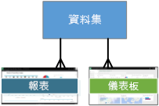
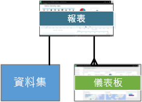
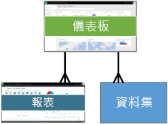
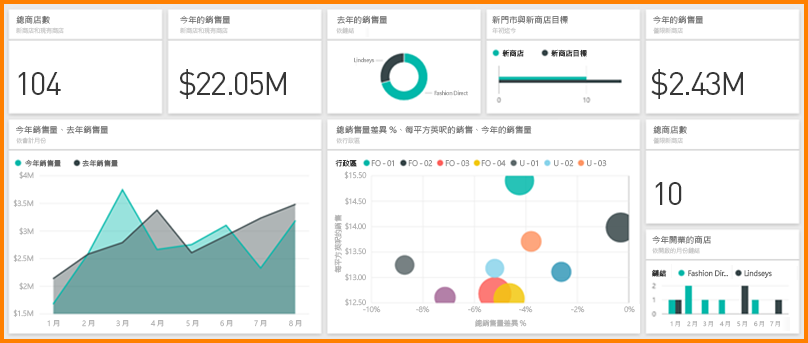

# Power BI - Power BI 服務的基本概念
<!-- Shared newnav Include -->
[!INCLUDE [newnavbydefault](./includes/newnavbydefault.md)]

本文假設您已經[註冊 Power BI](service-self-service-signup-for-power-bi.md) 並已[新增一些資料](service-get-data.md)。

當您開啟 Power BI 服務時會顯示「儀表板」。 「儀表板」是 Power BI 服務與 Power BI Desktop 的不同之處。

Power BI 服務 UI 的主要功能如下︰

1. 導覽列
2. 含有圖格的儀表板
3. 問與答的問題方塊
4. 說明與意見反應按鈕
5. 儀表板標題
6. Office 365 應用程式啟動器
7. Power BI 首頁按鈕
8. 其他儀表板動作

我們稍後會深入探討這些項目，不過首先來看 Power BI 的一些概念。

或者，您也可以先觀賞這段影片，再接著閱讀這篇文章的其餘部分。  在影片中，Will 會檢閱基本概念，並介紹 Power BI 服務。

<iframe width="560" height="315" src="https://www.youtube.com/embed/B2vd4MQrz4M" frameborder="0" allowfullscreen></iframe>

## Power BI 概念
Power BI 的 3 個主要建置組塊是：***儀表板***、***報表***和***資料集***。 儀表板或報表不能沒有資料 (確實可以有空白儀表板與空白報表，但如果當中沒有資料並沒有太大幫助)，因此讓我們先從 **資料集**開始。

## 資料集
「資料集」是您要在其中「匯入」或「連接」之資料的集合。 Power BI 可讓您連接和匯入各式各樣的資料集，並將所有資料整合到一個位置。  

在導覽列中，您已連接或匯入的資料集會列在 [資料集] 標題之下。 每個列出的資料集代表單一來源的資料，例如 OneDrive 上的 Excel 活頁簿、內部部署的 SSAS 表格式資料集，或 Salesforce 資料集。 其支援許多不同的資料來源，同時我們會不停加入新的資料來源。 [查看可搭配 Power BI 使用的資料集類型清單](service-get-data.md).

**一個** 資料集...

* 可一再重複使用。
* 可以用在許多不同的報表中。
* 可在許多不同的儀表板中顯示該單一資料集的視覺效果。
  
  

若要[連接或匯入資料集](service-get-data.md)，請選取導覽列底部的 [取得資料]，或選取 [資料集] 標題旁的加號圖示。 請遵循指示來連接或匯入特定來源，並將資料集新增至您的工作區中。 新的資料集會列在左側導覽列中並以黃色星號標示。 您在 Power BI 中執行的工作不會變更基礎資料集。

如果您是[「應用程式工作區」的一員](service-collaborate-power-bi-workspace.md)，則由某個工作區成員新增的資料集可供其他工作區成員使用。

您可以重新整理、重新命名、瀏覽、用來建立報表以及移除資料集。 若要瀏覽資料集，請選取該資料集。 您實際上會在報表編輯器中開啟資料集，您可以在編輯器中開始挖掘資料並建立視覺效果。 因此，讓我們前進到下一個主題 - 報表。

### 深入瞭解：
* [Power BI Premium - 這是什麼？](service-premium.md)
* [取得 Power BI 的資料](service-get-data.md)
* [Power BI 的範例資料集和內容套件](sample-datasets.md)

## 報表
Power BI 報表是一或多個頁面的視覺效果 (圖表和圖形，例如折線圖、圓形圖、樹狀圖和許多其他項目)。 視覺效果 (visualization) 也稱為「視覺效果」(visual)。 報表中的所有視覺效果都是來自單一資料集。 報表可以在 Power BI 從頭開始建立，也可以透過同事與您共用的儀表板匯入，或者可以在您連接到 Excel、Power BI Desktop、資料庫、SaaS 應用程式和[內容套件](service-organizational-content-pack-introduction.md)的資料集時建立報表。  例如，當您連接到包含 Power View 工作表的 Excel 活頁簿時，Power BI 會根據這些工作表建立報表。 而當您連接至 SaaS 應用程式時，Power BI 則會匯入預先建立的報表。

有 2 種模式可以檢視報表並與之互動：[閱讀檢視](service-report-open-in-reading-view.md)和[編輯檢視](service-interact-with-a-report-in-editing-view.md)。  只有報表建立者、共同擁有者及授與權限者，才能存取該報表之***編輯檢視***的所有瀏覽、設計、建立及共用功能。 而與這些人員共用報表的其他人員則可以使用***閱讀檢視***瀏覽報表並與之互動.   

在瀏覽窗格中，您的報表會列在 [報表] 標題之下。 每個列出的報表會根據其中一個基礎資料集，呈現一或多個頁面的視覺效果。 若要開啟報表，只要選取該報表即可。 根據預設，報表會先在閱讀檢視中開啟。  請直接選取 [編輯報表]，在 [編輯檢視] 中開啟報表 (如果您有必要權限)。  如果共用的儀表板有報表，在導覽列中您「不會」看到此報表。 相反地，請選取儀表板磚，直接從共用的儀表板開啟共用的報表 (稍後會詳細說明)。

**一個** 報表...

* 可以與多個儀表板相關聯 (從該單一報表釘選的磚可出現在多個儀表板上)。
* 可使用一個資料集的資料建立而成。 (其例外為 Power BI Desktop 可以將 1 個以上的資料集合併成單一報表，且該報表可匯入 Power BI)
  
  

## 儀表板
儀表板  是您所建立，或由同事建立並與您共用的東西。 其為含有零或多個磚與 Widget 的單一畫布。 每個磚會顯示從某個資料集建立並釘選到儀表板的單一[視覺效果](power-bi-report-visualizations.md)。 有許多方法可將磚加入儀表板中；本概觀主題無法全部涵蓋。 若要深入了解，請參閱 [Power BI 的儀表板磚](service-dashboard-tiles.md). 

在導覽列中，「屬於您的」儀表板會列在 [儀表板]  標題之下。 「屬於您的」表示您有權存取，但不一定是由您所建立。 每個儀表板表示基礎資料集其中一部分子集的自訂檢視。  如果您擁有儀表板，您也可以存取基礎資料集，而且這些資料集會出現在 [資料集] 下的導覽列中。  若是與您共用的儀表板，則會在一旁顯示共用圖示 ，而且根據共用方式，您不一定會看到導覽列中列出的基礎資料集。

> [!NOTE]
> ＜含有圖格的儀表板＞標題底下會更詳細探討釘選和圖格。
> 
> 

**一個** 儀表板...

* 可顯示許多不同資料集的視覺效果
* 可顯示許多不同報表的視覺效果
* 可以顯示從其他工具 (例如 Excel) 釘選的視覺效果
  
  

### 深入瞭解：
**儀表板可以[從頭開始建立](service-dashboard-create.md)** -- 建立新的空白儀表板，然後取得一些資料。 

**您或同事可以建立儀表板並[共用該儀表板](service-share-dashboards.md)** - 一旦您接受邀請，共用的儀表板 (以及任何相關聯的報表與資料集) 就會加入您的導覽列中。 需要 Power BI Pro 才能共用儀表板和檢視共用的儀表板。

**有時候儀表板是透過資料集匯入，或在您連接到資料集時建立而成**。 例如，Salesforce 的 [取得資料精靈]  會詢問您是否想要從資料集建立儀表板和/或報表。 

**為何要建立儀表板？**  以下只是部分原因：

* 所有必要的資訊一目了然，以利做出決策
* 監視最重要的業務相關資訊
* 確保所有同事有一致的共識，並檢視與使用相同資訊
* 監視企業、產品、業務單位或行銷活動等的狀況
* 建立較大型儀表板的個人化檢視 -- 放入所有重要的計量

## 我的工作區
現在回頭來看 Power BI 儀表板與工作區。 讓我們更仔細來看組成 Power BI 服務登陸頁面的組件。

### 1.**導覽列**
使用導覽列在 Power BI 建置組塊之間移動：儀表板、報表和資料集。  

  

* 選取 [取得資料]，[將資料集、報表和儀表板新增至 Power BI](service-get-data.md)。
* 使用此圖示  展開及摺疊導覽列。
* 使用 [搜尋]  來尋找導覽列中的特定項目。
* 選取加號圖示  來建立新的儀表板或取得新的資料集。
* 列出的 **儀表板、報表** 和 **資料集** 可供您使用。  共用的儀表板為唯讀並顯示共用圖示 。
* 儀表板、報表和資料集的名稱通常會與基礎資料集檔案的名稱相符 -- 但是您可以[將其重新命名](service-rename.md).
* 以滑鼠右鍵按一下儀表板、報表或資料集來顯示內容相關性功能表。 
  
  

按一下

* 標題以摺疊或展開
* 儀表板加以顯示
* 報表以閱讀檢視開啟
* 資料集進行探索

### 2.**含有磚的儀表板**
儀表板是由[磚](service-dashboard-tiles.md)所組成。  圖格可在報告 [編輯檢視]、[問與答]、其他儀表板中建立，而且可以從 Excel、SSRS 等項目釘選。 一種稱為 [Widget](service-dashboard-add-widget.md) 的特殊磚類型會直接加入儀表板中。 出現在儀表板上的圖格，為報表建立者/擁有者特別放置於此的。  將圖格加入儀表板中的動作稱為「釘選」 。

如需詳細資訊，請參閱 [儀表板]\(請見上方)。

### 3.**問與答的問題方塊**
瀏覽資料的方式之一為提問，讓 Power BI 問與答以視覺效果的形式為您解答。 問與答不能用來將內容加入報表中 -- 只能以圖格形式將內容加入儀表板中。

問與答會在連接到儀表板的資料集中尋找答案。  連接的資料集是指具有至少一個圖格釘選至該儀表板的資料集。

一旦您開始輸入問題，問與答就會帶您前往問與答的頁面。 您在輸入時，問與答會以修改措辭、自動填入、建議及更多方式，協助您詢問適當的問題並找尋最佳解答。 如果有您喜歡的視覺效果 (解答)，請予以釘選到您的儀表板中。 如需詳細資訊，請參閱 [Power BI 中的問與答](service-q-and-a.md)。

### 4.**全螢幕、通知、設定、下載、說明和意見反應**
右上角的圖示為您的資源，可供您設定、通知、下載、取得說明，並將意見反應提供給 Power BI 小組。 選取雙箭頭以 [全螢幕] 模式開啟儀表板。  

### 5.**儀表板標題** (又稱「何者為作用中儀表板？」)
有時要找出作用中的儀表板並不容易。  儀表板標題會出現在儀表板檢視頁面、問與答頁面、報表的編輯檢視中與報表的閱讀檢視中，以及在您開啟資料夾時。   

### 6.**Office 365 應用程式啟動器**
此應用程式啟動器專門用來協助您移至 Office 365 應用程式。

### 7.**Power BI 首頁**
選取此選項可讓您返回最近檢視過的儀表板。

   

### 8.**選項**
工作區的這個區域包含與儀表板互動的圖示。  除了 [新增磚]、[我的最愛] 和 [共用]之外，還可以選取省略符號顯示複製、列印及重新整理儀表板等選項。

   

## 後續步驟
[開始使用 Power BI](service-get-started.md)  
[Power BI 影片](videos.md)  
[Power BI Premium - 這是什麼？](service-premium.md)

有其他問題嗎？ [嘗試在 Power BI 社群提問](http://community.powerbi.com/)

