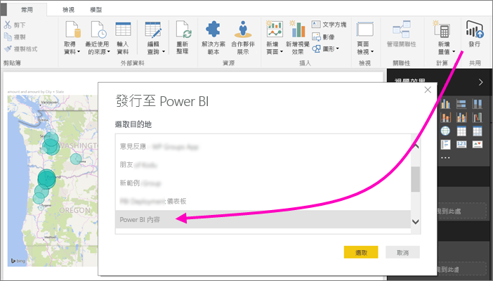
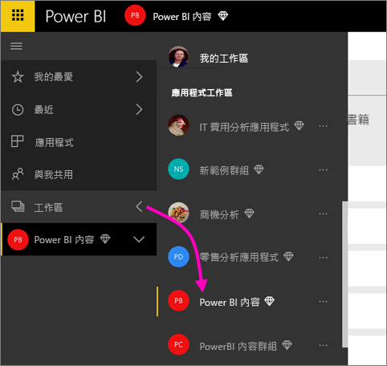
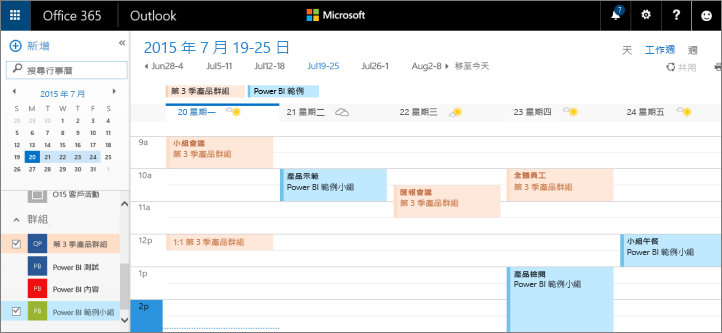

# 在 Power BI 應用程式工作區中共同作業
Power BI 應用程式工作區是與您的同事共同作業以利用儀表板、報表和資料集來建立「應用程式」的絕佳地方。 這就是設計工作區的目的 - 共同作業。 完成與同事共同作業來處理儀表板和報表之後，接著將它封裝成應用程式並進行散發。 深入了解[在 Power BI 中建立應用程式和應用程式工作區](service-create-distribute-apps.md)。 

共同作業不會止於 Power BI 中的工作區。 Office 365 提供其他群組服務，例如共用商務用 OneDrive 上的檔案、Exchange 中的交談、共用行事曆和工作等等。 深入了解 [Office 365 的群組](https://support.office.com/article/Create-a-group-in-Office-365-7124dc4c-1de9-40d4-b096-e8add19209e9)。

僅 [Power BI Pro](service-free-vs-pro.md) 提供應用程式工作區。

## 在應用程式工作區中的 Power BI Desktop 檔案上共同作業
建立 Power BI Desktop 檔案之後，如果您將其發佈到 Power BI 應用程式工作區，則工作區中的每個人都可以對它共同作業。

1. 在 Power BI Desktop 的 [首頁] 功能區中選取 [發佈]，然後在 [選取目的地] 方塊中，選取您的應用程式工作區。
   
    
2. 在 Power BI 服務中，選取 [工作區] 旁邊的箭號 > 選取您的應用程式工作區。
   
    
3. 選取 [報表] 索引標籤，然後選取您的報表。
   
    ![[報表] 索引標籤](media/service-collaborate-power-bi-workspace/power-bi-workspace-report.png)
   
    從這裡開始，就像 Power BI 任何其他報表一樣。 您和應用程式工作區中的其他人可以[修改報表](service-reports.md)，並將磚儲存到您選擇的儀表板。

## 在 Office 365 中共同作業
在 Office 365 中共同作業是從 Power BI 中的應用程式工作區開始。

1. 在 Power BI 服務中，選取工作區旁的箭號 > 選取工作區名稱旁邊的省略符號 (**...**)。 
   
   ![[工作區] 功能表](media/service-collaborate-power-bi-workspace/power-bi-app-ellipsis.png)
2. 從這個功能表中，您有幾個方法可以和您的群組共同作業︰ 
   
   * [在 Office 365 中建立群組交談](service-collaborate-power-bi-workspace.md#have-a-group-conversation-in-office-365)。
   * 在應用程式的群組工作區行事曆上[排程事件](service-collaborate-power-bi-workspace.md#schedule-an-event-on-the-group-workspace-calendar)。
   
   第一次移至您在 Office 365 中的應用程式群組工作區時，可能需要一些時間。 需要 15 到 30 分鐘，然後請重新整理瀏覽器。

## 在 Office 365 中建立群組交談
1. 選取應用程式工作區名稱旁邊的省略符號 (...) \> [交談]。 
   
    ![[交談] 索引標籤](media/service-collaborate-power-bi-workspace/power-bi-app-ellipsis.png)
   
   這會在 Outlook for Office 365 中開啟您應用程式群組工作區的電子郵件和交談網站。
   
   ![[行事曆] 功能表項目](media/service-collaborate-power-bi-workspace/pbi_grps_o365convo.png)
2. 進一步了解[適用於 Office 365 的 Outlook 群組交談](https://support.office.com/Article/Have-a-group-conversation-a0482e24-a769-4e39-a5ba-a7c56e828b22).

## 在應用程式的群組工作區行事曆上排程事件
1. 選取應用程式工作區名稱旁邊的省略符號 (**…**) \> [行事曆]。 
   
   ![[行事曆] 索引標籤](media/service-collaborate-power-bi-workspace/power-bi-app-ellipsis.png)
   
   這會在 Outlook for Office 365 中開啟您應用程式群組工作區的行事曆。
   
   
2. 深入了解 [Office 365 中 Outlook 的群組行事曆](https://support.office.com/Article/Add-edit-and-subscribe-to-group-events-0cf1ad68-1034-4306-b367-d75e9818376a).

## 管理應用程式工作區
如果您是應用程式工作區的擁有者或系統管理員，也可以新增或移除工作區成員。 深入了解[管理 Power BI 應用程式工作區](service-manage-app-workspace-in-power-bi-and-office-365.md)。

## 後續步驟
* [在 Power BI 中建立應用程式和應用程式工作區](service-create-distribute-apps.md)
* 有其他問題嗎？ [試試 Power BI 社群](http://community.powerbi.com/)
* 想提出意見反應嗎？ 請前往 [Power BI Ideas](https://ideas.powerbi.com/forums/265200-power-bi)

