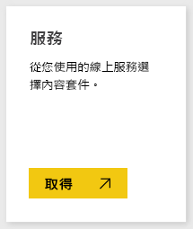
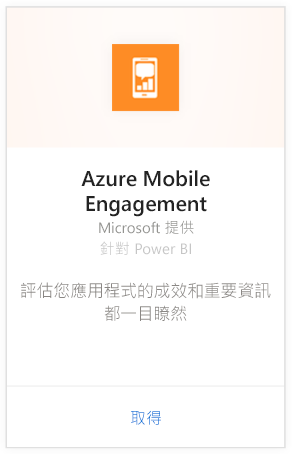
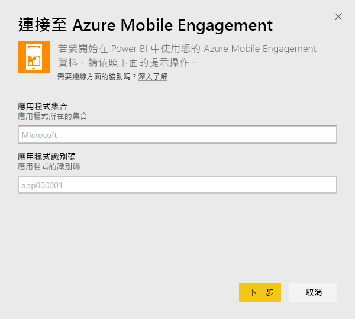
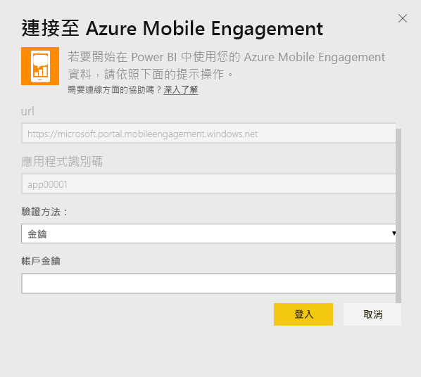
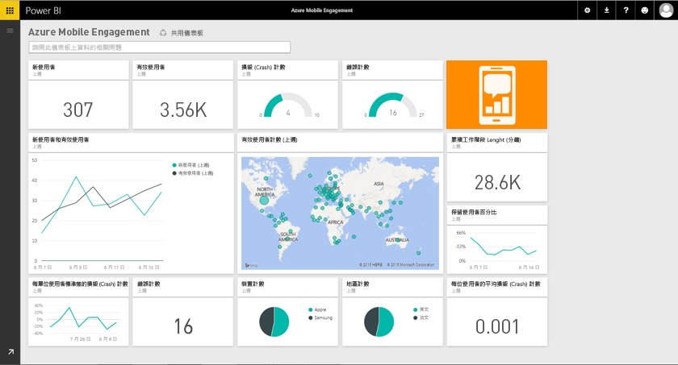

# 使用 Power BI 連接到 Azure Mobile Engagement
Power BI Azure Mobile Engagement 內容套件可讓您快速深入了解 App 資料。

連接到 Power BI 的 [Azure Mobile Engagement 內容套件](https://app.powerbi.com/groups/me/getdata/services/azme)。

## 如何連接
1. 選取左側瀏覽窗格底部的 [取得資料]  。
   
    
2. 在 [服務]  方塊中，選取 [取得] 。
   
    
3. 選取 [Azure Mobile Engagement] \> [取得]。
   
     
4. 指定您的 App 集合物件和 App 名稱。 可以在 Azure Mobile Engagement 帳戶中找到此資訊。
   
     
5. 針對驗證方法，請提供您的金鑰，然後按一下 [登入]。
   
    
6. Power BI 匯入資料之後，您會在左側瀏覽窗格中看到新的儀表板、報表和資料集。 新的項目會以黃色星號 \* 標示，選取之後就會消失。
   
    

 **接下來呢？**

* 請嘗試在儀表板頂端的[問與答方塊中提問](service-q-and-a.md)
* [變更儀表板中的圖格](service-dashboard-edit-tile.md)。
* [選取圖格](service-dashboard-tiles.md)，開啟基礎報表。
* 雖然資料集排程為每天重新整理，但是您可以變更重新整理排程，或使用 [立即重新整理] 視需要嘗試重新整理

## 後續步驟
[開始使用 Power BI](service-get-started.md)

[取得 Power BI 中的資料](service-get-data.md)

