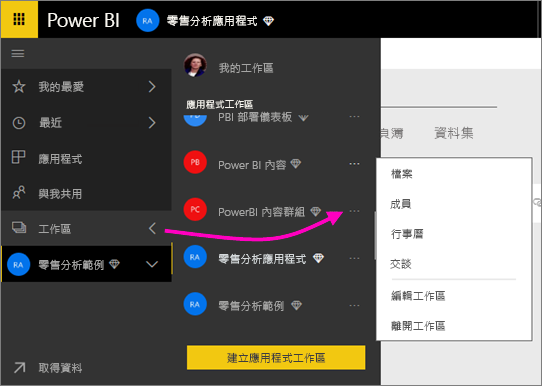
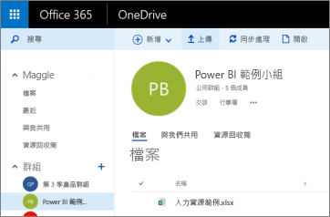
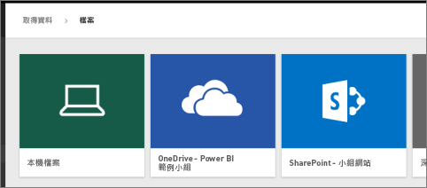
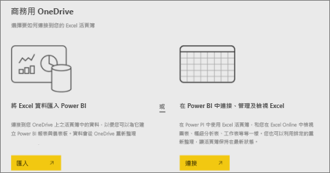
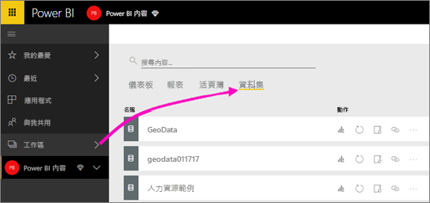
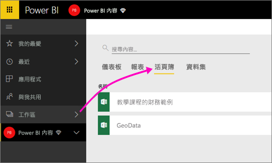

# 連接到 Power BI 應用程式工作區中儲存在 OneDrive 的檔案
您[在 Power BI 中建立應用程式工作區](service-create-distribute-apps.md)後，即可將 Excel、CSV 及 Power BI Desktop 檔案儲存至 Power BI 應用程式工作區的商務用 OneDrive。 您可以繼續更新儲存至 OneDrive 的檔案，而這些更新會自動反映到以這些檔案為基礎的 Power BI 報表和儀表板中。 

將檔案新增至應用程式工作區是兩步驟的程序： 

1. 首先，您[將檔案上傳至應用程式工作區的商務用 OneDrive](service-connect-to-files-in-app-workspace-onedrive-for-business.md#1-upload-files-to-the-onedrive-for-business-for-your-app-workspace)。
2. 然後您[從 Power BI 連接至這些檔案](service-connect-to-files-in-app-workspace-onedrive-for-business.md#2-import-excel-files-as-datasets-or-as-excel-online-workbooks)。

> [!NOTE]
> 僅 [Power BI Pro](service-free-vs-pro.md) 提供應用程式工作區。
> 
> 

## 1 將檔案上傳至應用程式工作區的商務用 OneDrive
1. 在 Power BI 服務中，選取工作區旁的箭號 > 選取工作區名稱旁邊的省略符號 (**...**)。 
   
   
2. 選取 [檔案] 開啟 Office 365 應用程式工作區的商務用 OneDrive。
   
   > [!NOTE]
   > 如果您在應用程式工作區功能表上看不到 [檔案]，請選取 [成員] 以開啟應用程式工作區的商務用 OneDrive。 在該處選取 [檔案] 。 Office 365 會設定應用程式群組工作區檔案的 OneDrive 儲存位置。 此程序可能需要一些時間。 
   > 
   > 
3. 您可以在這裡將檔案上傳至應用程式工作區的商務用 OneDrive。 選取 [上傳] ，並瀏覽至您的檔案。
   
   

## 2 將 Excel 檔案匯入為資料集或 Excel Online 活頁簿
既然檔案已在應用程式工作區的商務用 OneDrive 中，您就有選擇。 您可以： 

* [將 Excel 活頁簿的資料匯入為資料集](service-get-data-from-files.md)，並使用此資料建置可在網頁瀏覽器和行動裝置上檢視的報表和儀表板。
* 或者[連接到 Power BI 的完整 Excel 活頁簿](service-excel-workbook-files.md)，讓其顯示畫面完全與在 Excel Online 一樣。

### 匯入或連接至應用程式工作區中的檔案
1. 在 Power BI 中，切換至應用程式工作區，讓應用程式工作區名稱顯示於左上角。 
2. 選取左側瀏覽窗格底部的 [取得資料]  。 
   
   
3. 在 [檔案]  方塊中選取 [取得] 。
   
   
4. 選取 [OneDrive - <應用程式工作區名稱>]。
   
    
5. 選取您想要的檔案 > [連接]。
   
    此時您需決定是要[從 Excel 活頁簿匯入資料](service-get-data-from-files.md)，或[連接至整個 Excel 活頁簿](service-excel-workbook-files.md)。
6. 選取 [匯入]  或 [連接] 。
   
    
7. 如果您選取 [匯入]，則活頁簿會出現在 [資料集] 索引標籤中。 
   
    
   
    如果您選取 [連線]，則活頁簿會出現在 [活頁簿] 索引標籤中。
   
    

## 後續步驟
* [在 Power BI 中建立應用程式和應用程式工作區](service-create-distribute-apps.md)
* [從 Excel 活頁簿匯入資料](service-get-data-from-files.md)
* [連接至整個 Excel 活頁簿](service-excel-workbook-files.md)
* 有其他問題嗎？ [試試 Power BI 社群](http://community.powerbi.com/)
* 想提出意見反應嗎？ 請前往 [Power BI Ideas](https://ideas.powerbi.com/forums/265200-power-bi)

