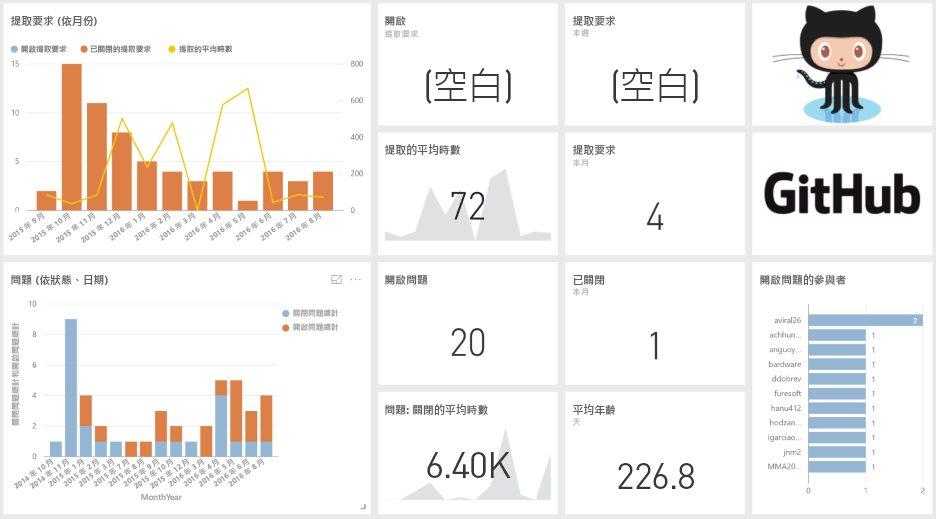

# 使用 Power BI 連接到 GitHub
適用於 Power BI 的 GitHub 內容套件可讓您藉由參與、問題、提取要求和作用中的使用者相關資料，深入了解 GitHub 儲存機制 (也稱為 repo)。

連接到 [GitHub 內容套件](https://app.powerbi.com/getdata/services/github)或深入了解 Power BI 與 [GitHub 的整合](https://powerbi.microsoft.com/integrations/github)。

>[!NOTE]
>此內容套件需要能夠存取此儲存機制的 GitHub 帳戶。 下方有需求的詳細資料。

## 如何連接
1. 選取左側瀏覽窗格底部的 [取得資料]  。
   
    
2. 在 [服務]  方塊中，選取 [取得] 。
   
    
3. 選取 [GitHub] [取得]\> 。
   
   
4. 輸入該儲存機制的儲存機制名稱和儲存機制擁有者。 請參閱以下關於[尋找這些參數](#FindingParams)的詳細資料。
   
   
5. 請提供您的 GitHub 認證 (如果您已經登入瀏覽器，此步驟可能會略過)。 
6. 針對 [驗證方法] 選取 [oAuth2] \> [登入]。 
7. 請遵循 GitHub 驗證畫面進行。 授與適用於 GitHub 的 Power BI 內容套件對於 GitHub 資料之權限。
   
   
   
   這會連接 Power BI 與 GitHub ，並可讓 Power BI 連接到資料。  資料會每天重新整理一次。
8. 連接到儲存機制之後，Power BI 會匯入資料。 您會在左功能窗格中看到新的 [GitHub 儀表板](https://powerbi.microsoft.com/integrations/github)、報表和資料集。 新的項目會以黃色星號標示\*。
   
   

**接下來呢？**

* 請嘗試在儀表板頂端的[問與答方塊中提問](power-bi-q-and-a.md)
* [變更儀表板中的圖格](service-dashboard-edit-tile.md)。
* [選取圖格](service-dashboard-tiles.md)，開啟基礎報表。
* 雖然資料集排程為每天重新整理，但是您可以變更重新整理排程，或使用 [立即重新整理] 視需要嘗試重新整理

## 包含的內容
在 Power BI 中 GitHub 提供下列資料：     

| 資料表名稱 | 描述 |
| --- | --- |
| 參與 |參與資料表提供每週彙總參與者所撰寫的總計新增、刪除和認可。 包含前 100 名參與者。 |
| 問題 |列出所有選取儲存機制的問題，其中包含計算，像是已解決問題的總計和平均時間、未解決問題總數、已解決問題總數。 當儲存機制中沒有任何問題時，此資料表為空白。 |
| 提取要求 |此表格包含此儲存機制和提取要求者之所有提取要求。 它也包含相關計算，像是有多少未解決、已解決和總計的提取要求，花多少時間來提取這些要求，以及提取要求所耗用平均時間。 當儲存機制中沒有任何問題時，此資料表為空白。 |
| 使用者 |下表提供 GitHub 使用者或參與者的清單，他們針對選取的儲存機制參與、提出問題或解決提取要求。 |
| 里程碑 |它具有所選儲存機制的所有里程碑。 |
| DateTable |此資料表包含從今天開始推算，過去幾年來的日期，可讓您依日期分析 GitHub 資料。 |
| ContributionPunchCard |這個資料表可以當做所選取儲存機制的參與穿孔卡片。 它會依一週中各天和一天中各小時顯示認可。 此資料表未連接到模型中的其他資料表。 |
| RepoDetails |此資料表會提供選取的儲存機制詳細資料。 |

## 系統需求
* 可存取儲存機制的 GitHub 帳戶。  
* 第一次登入期間授與適用於 GitHub 應用程式之 Power BI 的權限。 請參閱以下撤銷存取權的詳細資訊。  
* 有足夠可用的 API 呼叫，以便提取和重新整理資料。  

### 取消授權 Power BI
若要將 Power BI 從 GitHub 儲存機制的連接取消授權，您可以撤銷 GitHub 中的存取。 如需詳細資訊，請參閱 [GitHub 說明](https://help.github.com/articles/keeping-your-ssh-keys-and-application-access-tokens-safe/#reviewing-your-authorized-applications-oauth)主題。

## 尋找參數
您可以查看在 GitHub 本身的儲存機制來判斷擁有者和儲存機制：

第一個部分的 "Azure" 是擁有者，而第二個部分 "azure-sdk-for-php" 是儲存機制本身。  您會在儲存機制的 URL 中看到這兩個相同項目：

    <https://github.com/Azure/azure-sdk-for-php> .

## 疑難排解
如有必要，您可以確認您的 GitHub 認證。  

1. 在另一個瀏覽器視窗中，移至 GitHub 網站並登入 GitHub。 在 GitHub 網站右上角，可以看到您已登入。    
2. 在 GitHub 中瀏覽至您計劃要在 Power BI 中存取之儲存機制的 URL。 例如：https://github.com/dotnet/corefx。  
3. 回到 Power BI，嘗試連接至 GitHub。 在 [設定 GitHub] 對話方塊中，請使用相同儲存機制的儲存機制名稱和儲存機制擁有者名稱。  

## 後續步驟
* [開始使用 Power BI](service-get-started.md)
* [取得資料](service-get-data.md)
