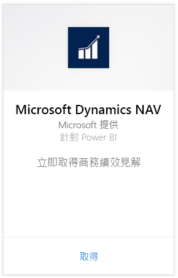
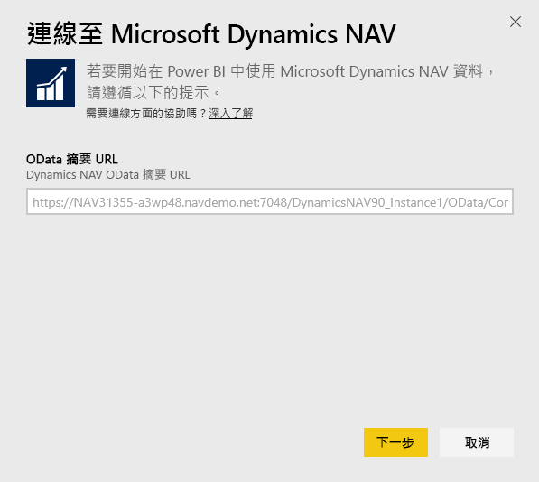
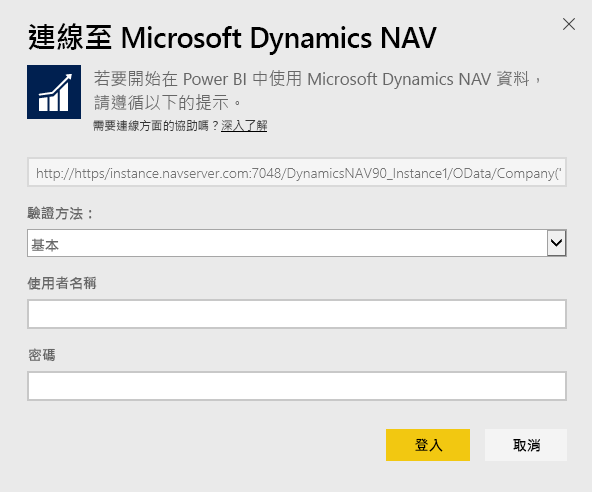
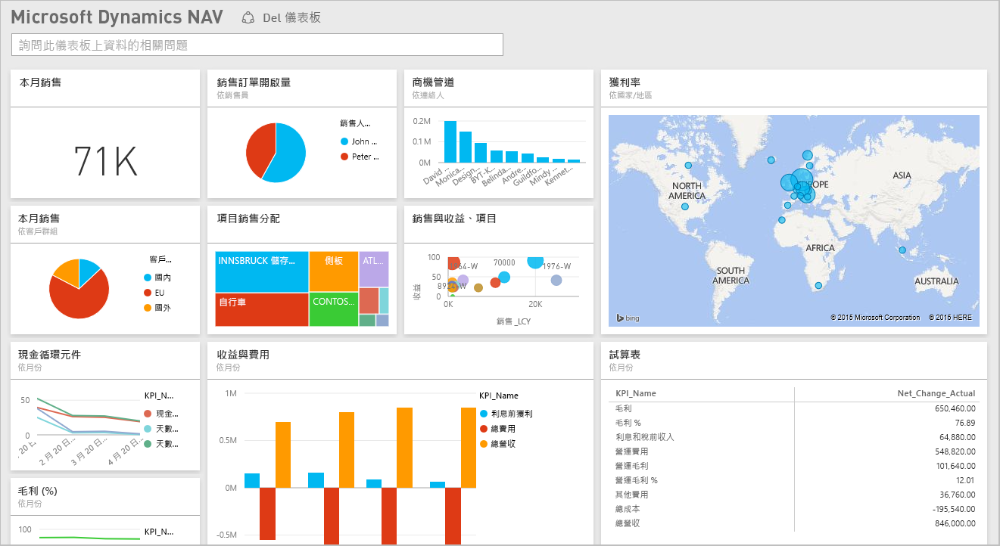

# 使用 Power BI 連接到 Microsoft Dynamics NAV
您可以使用 Power BI，輕鬆獲得 Microsoft Dynamics NAV 資料的深入解析。 Power BI 會擷取您的資料 (銷售和財務)，然後根據該資料建置含有儀表板和報表的應用程式。 Power BI 需要有資料擷取來源資料表的權限，本例中為銷售和財務資料。 下方有需求的詳細資料。 安裝應用程式之後，即可在 Power BI 服務 ([https://powerbi.com](https://powerbi.com)) 及 Power BI 行動應用程式中，檢視儀表板與報表。 

[連接到 Power BI 的 Microsoft Dynamics NAV](https://app.powerbi.com/getdata/services/microsoft-dynamics-nav) 或深入了解 Power BI 與 [Dynamics NAV 的整合](https://powerbi.microsoft.com/integrations/microsoft-dynamics-nav)。

## 如何連接
[!INCLUDE [powerbi-service-apps-get-more-apps](./includes/powerbi-service-apps-get-more-apps.md)]

1. 選取 [Microsoft Dynamics NAV]，然後選取 [取得]。  
   
2. 出現提示時，輸入您的 Microsoft Dynamics NAV OData URL。 URL 應符合下列模式：
   
    `https//instance.navserver.com:7048/DynamicsNAV90_Instance1/OData/Company('CRONUS%20International%20Ltd.')`
   
   * 以您的 NAV 伺服器名稱取代 "instance.navserver.com"
   * 以您的 NAV 伺服器執行個體名稱取代 "DynamicsNAV90\_Instance1"
   * 以您的 NAV 公司名稱取代 "Company('CRONUS%20International%20Ltd.')"
     
     取得這個 URL 的簡單方法是在 Dynamics NAV 中，移至 Web 服務，尋找 powerbifinance Web 服務並複製 Odata URL，但省略 URL 字串中的 "/powerbifinance"。  
     
3. 選取 [基本]，並輸入您的 Microsoft Dynamics NAV 認證。
   
    您需要 Microsoft Dynamics NAV 帳戶的系統管理員認證 (或至少需要銷售和財務資料權限)。  目前僅支援基本 (使用者名稱和密碼) 驗證。
   
    
4. Power BI 會擷取您的 Microsoft Dynamics NAV 資料，並為您建立現成可用的儀表板和報表。   
   

## 檢視儀表板和報表
[!INCLUDE [powerbi-service-apps-open-app](./includes/powerbi-service-apps-open-app.md)]

[!INCLUDE [powerbi-service-apps-open-app](./includes/powerbi-service-apps-what-now.md)]

## 包含的內容
儀表板和報表包含下列資料表的資料 (區分大小寫)：  

* ItemSalesAndProfit  
* ItemSalesByCustomer  
* powerbifinance  
* SalesDashboard  
* SalesOpportunities  
* SalesOrdersBySalesPerson  
* TopCustomerOverview  

## 系統需求
若要將 Microsoft Dynamics NAV 資料匯入 Power BI，您需要有銷售和財務資料的資料表權限，而該類資料表為資料擷取所在 (如上所示)。 資料表也必須有一些資料，目前無法匯入空白資料表。

## 疑難排解
Power BI 會使用 Microsoft Dynamics NAV 的 Web 服務來擷取資料。 如果您在 Microsoft Dynamics NAV 執行個體中有很多資料，建議將 Web 服務使用量影響降到最低，根據您的需求變更重新整理頻率。 另一個建議是讓一位系統管理員建立應用程式供大家共用，而不是讓每位系統管理員自行建立。

**「參數驗證失敗。請確定所有參數都有效。」**  
如果您在輸入 Microsoft Dynamics NAV URL 之後看到此錯誤。 請確定已滿足下列需求：

* URL 要嚴格遵循這種模式：
  
    `https//instance.navserver.com:7048/DynamicsNAV90_Instance1/OData/Company('CRONUS%20International%20Ltd.')`
  
  * 以您的 NAV 伺服器名稱取代 "instance.navserver.com"
  * 以您的 NAV 伺服器執行個體名稱取代 "DynamicsNAV90\_Instance1"
  * 以您的 NAV 公司名稱取代 "Company('CRONUS%20International%20Ltd.')"
* 請確定所有字母都是小寫。  
* 請確定 URL 是使用 'https'。  
* 請確定在 URL 結尾沒有尾端斜線。

**「登入失敗」**  
使用 Microsoft Dynamics NAV 認證登入後，如果收到「登入失敗」錯誤，可能是遇到下列其中一個問題：

* 所用帳戶沒有從您的帳戶擷取 Microsoft Dynamics NAV 資料的權限。 請確認它是系統管理員帳戶，然後重試一次。
* 嘗試連接的 Dynamics NAV 執行個體無有效的 SSL 憑證。 在此情況下，您會看到更詳細的錯誤訊息 (「無法建立信任的 SSL 關係 」)。 請注意，自我簽署的憑證不受支援。

**「糟糕」**  
如果通過 [驗證] 對話方塊之後看到「糟糕」錯誤對話方塊，表示 Power BI 載入資料時遇到了問題。

* 請確認 URL 遵循上文所指定的模式。 常見的錯誤是指定：
  
    `https//instance.navserver.com:7048/DynamicsNAV90\_Instance1/OData`
  
    不過，您必須在 NAV 公司名稱中包括 'Company('CRONUS%20International%20Ltd.')' 區段：
  
    `https//instance.navserver.com:7048/DynamicsNAV90\_Instance1/OData/Company('CRONUS%20International%20Ltd.')`

## 後續步驟
* [Power BI 中的應用程式是什麼？](service-install-use-apps.md)
* [取得 Power BI 中的資料](service-get-data.md)
* 有其他問題嗎？ [嘗試在 Power BI 社群提問](http://community.powerbi.com/)

