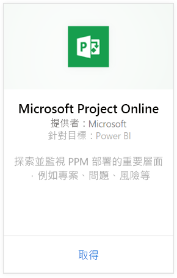
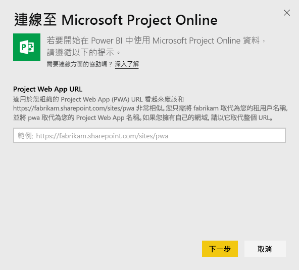
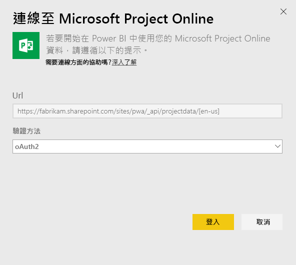
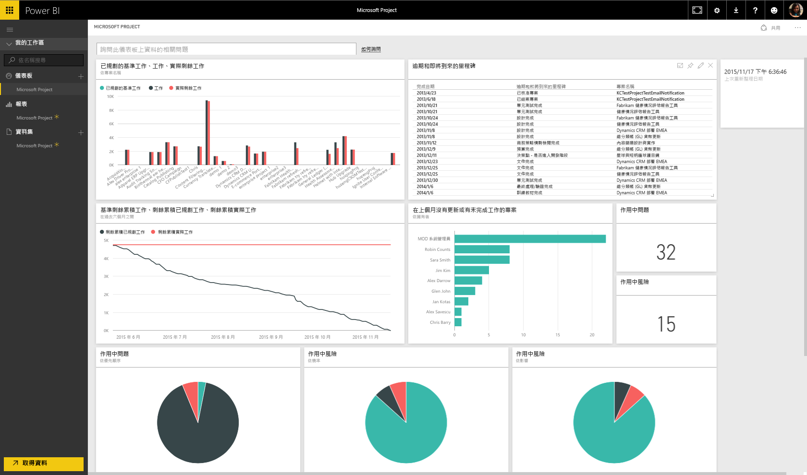

# 使用 Power BI 連接到 Project Online
Microsoft Project Online 是針對專案組合管理 (PPM) 與日常工作的靈活線上解決方案。 Project Online 可讓組織開始、優先排定專案投資組合並提供預期的商業價值。 Power BI 的 Project Online 內容套件可讓您瀏覽專案資料的最新度量，例如投資組合狀態和專案合規性。

連接到 Power BI 的 [Project Online 內容套件](https://app.powerbi.com/getdata/services/project-online)。

## 如何連接
1. 選取左側瀏覽窗格底部的 [取得資料]  。
   
    
2. 在 [服務]  方塊中，選取 [取得] 。
   
   
3. 選取 [Microsoft Project Online] \> [取得]。
   
   
4. 在 [Project Web App URL]  文字方塊中，輸入您想要連接的 Project Web App (PWA) 的 URL，並點擊 [下一步] 。 請注意，自訂網域可能和範例不一樣。
   
    
5. 針對 [驗證方法] 選取 [oAuth2] \> [登入]。 出現提示時，輸入 Project Online 認證，並遵循驗證程序。
   
    
6. 您會看到通知，指出正在載入資料。 時間長短視帳戶大小而定。 Power BI 匯入資料之後，您會在左側瀏覽窗格中看到新的儀表板、報表和資料集。 這是 Power BI 建立的預設儀表板，可顯示您的資料。 您可以修改此儀表板，以您想要的任何方式來顯示資料。
   
   

**接下來呢？**

* 請嘗試在儀表板頂端的[問與答方塊中提問](power-bi-q-and-a.md)
* [變更儀表板中的圖格](service-dashboard-edit-tile.md)。
* [選取圖格](service-dashboard-tiles.md)，開啟基礎報表。
* 雖然資料集排程為每天重新整理，但是您可以變更重新整理排程，或使用 [立即重新整理] 視需要嘗試重新整理

## 後續步驟
[開始使用 Power BI](service-get-started.md)

[取得 Power BI 中的資料](service-get-data.md)

