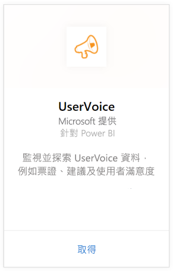
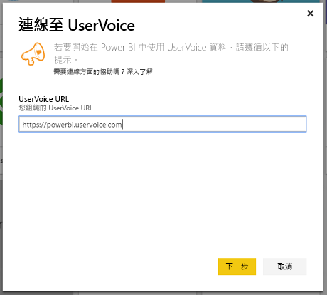
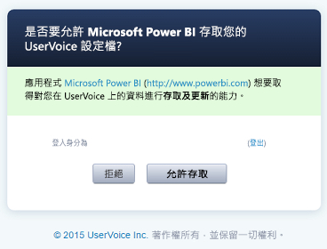
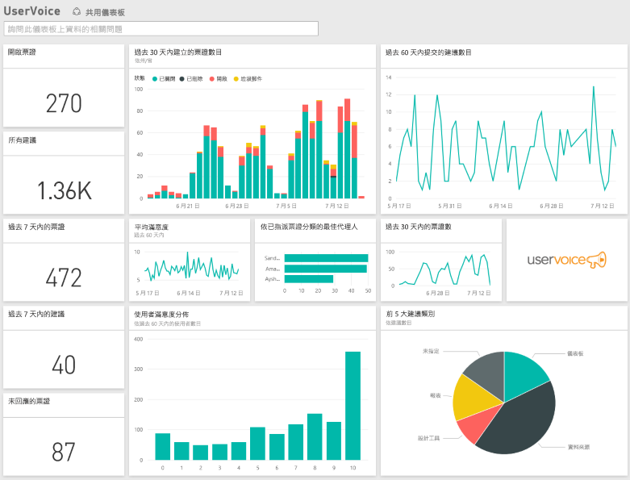

# 使用 Power BI 連接到 UserVoice
透過 Power BI 和 UserVoice 內容套件來追蹤和瀏覽 UserVoice 資料很容易。 Power BI 會擷取資料，包括票證、建議和滿意度評等，然後根據該資料建置現成的儀表板和報表。

連接到 Power BI 的 [UserVoice 內容套件](https://app.powerbi.com/getdata/services/uservoice)。

>[!NOTE]
>需要管理帳戶，才能連接至 Power BI 內容套件。 此內容套件也會利用 UserVoice API，並會增加 UserVoice 限制的使用量。 請參閱下列詳細資訊。

## 如何連接
1. 選取左側瀏覽窗格底部的 [取得資料]  。
   
   
2. 在 [服務]  方塊中，選取 [取得] 。
   
    
3. 選取 [UserVoice]，然後選取 [取得]。
   
   
4. 出現提示時，輸入您的 UserVoice URL。 URL 必須完全遵循下列模式 `https://fabrikam.uservoice.com` 並將 "fabrikam" 取代成您的產品或服務名稱。
   
   >[!NOTE]
   >結尾沒有尾端斜線，且連線是使用 http**s**。
   
   
5. 出現提示時，輸入 UserVoice 認證，並遵循 UserVoice 驗證程序。 如果您已經在瀏覽器中登入 UserVoice，可能就不會出現輸入認證的提示。 按一下 [允許存取]，授與 Power BI 應用程式對您資料的存取權。
   
   >[!NOTE]
   >您需要 UserVoice 帳戶的系統管理員認證。
   
   
6. Power BI 將擷取 UserVoice 資料並為您建立現成可用的儀表板和報表。 Power BI 會擷取下列資料：您的所有建議、所有未決的票證、在過去 30 天內建立的所有票證且包括已關閉的票證，以及所有使用者滿意度評等。
   
   

**接下來呢？**

* 請嘗試在儀表板頂端的[問與答方塊中提問](power-bi-q-and-a.md)
* [變更儀表板中的圖格](service-dashboard-edit-tile.md)。
* [選取圖格](service-dashboard-tiles.md)，開啟基礎報表。
* 雖然資料集排程為每天重新整理，但是您可以變更重新整理排程，或使用 [立即重新整理] 視需要嘗試重新整理

## 疑難排解
**「參數驗證失敗。請確定所有參數都有效。」**

如果您在輸入 UserVoice URL 之後看到此錯誤。 請確定已滿足下列需求：

* URL 完全遵循此模式 `https://fabrikam.uservoice.com`，然後將 "fabrikam" 以正確的 UserVoice URL 前置詞取代。
* 請確定所有字母都是小寫。
* 請確定 URL 是使用 'http**s**'。
* 請確定在 URL 結尾沒有尾端斜線。

**「登入失敗」**

如果您使用 UserVoice 認證登入之後收到「登入失敗」的錯誤，則您使用的帳戶沒有權限可從您的帳戶擷取 UserVoice 資料。 請確認它是系統管理員帳戶，然後重試一次。

「**糟糕！發生錯誤**」

如果您載入資料時收到這個錯誤訊息，請確定 UserVoice 帳戶尚未超過其每月的 API 用量配額。 如果一切看來正常，請嘗試重新連接。 如果此問題持續發生，請連絡 Power BI 支援：[https://community.powerbi.com](https://community.powerbi.com/)。

**其他**  

Power BI UserVoice 內容套件使用 UserVoice 的 API 來擷取您的資料。 請確定您監控 API 用量，不要超過您的限制。 如果您在 UserVoice 帳戶中有很多資料，將 API 用量影響降到最低的建議是根據您的需求，將重新整理頻率從目前的預設值一天一次，變更為只在工作日重新整理，或是每隔一天重新整理一次。 另一個建議是讓系統管理員建立內容套件，並與團隊的其他人共用，而不要讓組織中的每位系統管理員都自行建立，因而造成 API 不必要的額外負載。

## 後續步驟
[開始使用 Power BI](service-get-started.md)

[取得 Power BI 中的資料](service-get-data.md)

