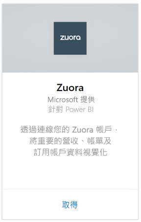
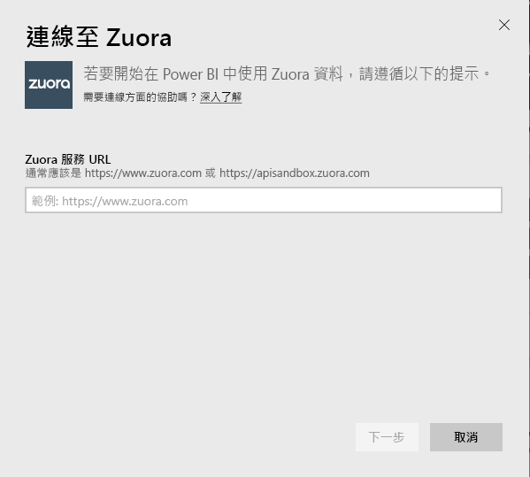
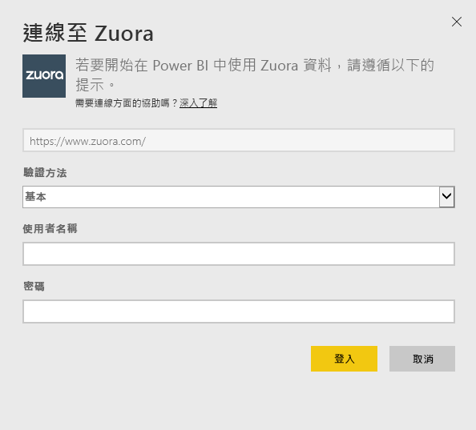
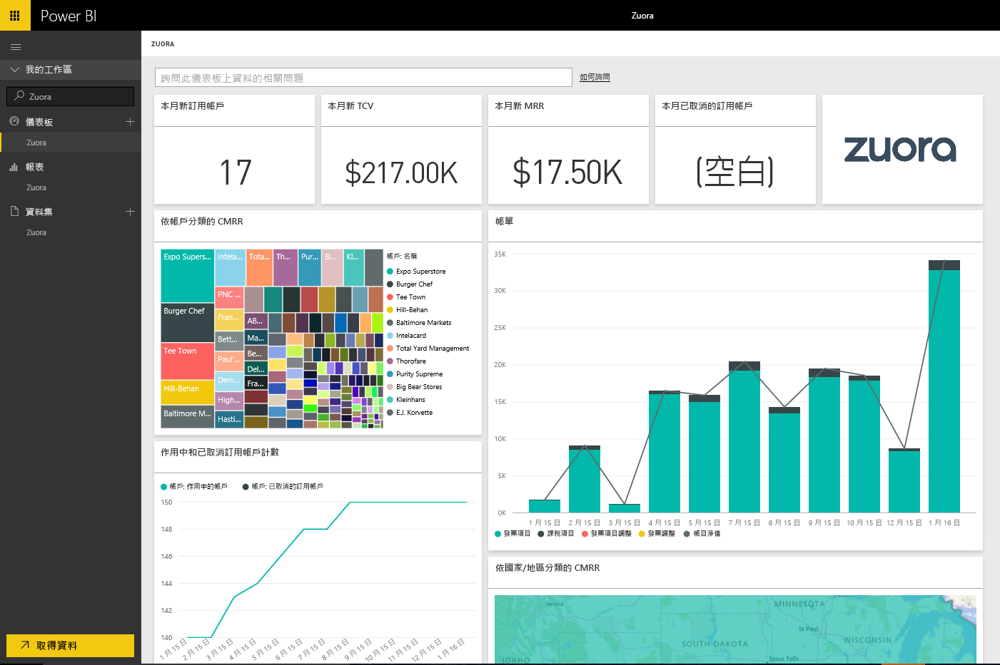

# 使用 Power BI 連接到 Zuora
Zuora for Power BI 可讓您以視覺化方式顯示重要的營收、帳單與訂閱資料。 使用預設儀表板與報表來分析使用狀況趨勢、追蹤帳單與付款，以及監視週期性營收，或根據您自己的獨特儀表板與報告需求進行自訂。

連接到 [Zuora](https://app.powerbi.com/getdata/services/Zuora) for Power BI。

## 如何連接
1. 選取左側瀏覽窗格底部的 [取得資料]  。

   
2. 在 [服務]  方塊中，選取 [取得] 。

   
3. 選取 [Zuora] \> [取得]。

   
4. 指定您的 Zuora URL。 一般來說為 " <https://www.zuora.com> "，請參閱以下[尋找這些參數](#FindingParams)，以了解詳細資料。

   
5. 在 [ **驗證方法**] 選取 [ **基本** ]，然後輸入使用者名稱及密碼，再選取 [ **登入**]。

    
6. 一經核准，匯入程序會自動開始。 完成時，新的儀表板、報表和模型會出現在瀏覽窗格中。 選取儀表板以檢視匯入的資料。

     

**接下來呢？**

* 請嘗試在儀表板頂端的[問與答方塊中提問](power-bi-q-and-a.md)
* [變更儀表板中的圖格](service-dashboard-edit-tile.md)。
* [選取圖格](service-dashboard-tiles.md)，開啟基礎報表。
* 雖然資料集排程為每天重新整理，但是您可以變更重新整理排程，或使用 [立即重新整理] 視需要嘗試重新整理

## 包含的內容
此內容套件使用 Zuora AQUA API 來提取下列資料表︰

| 資料表 |  |  |
| --- | --- | --- |
| Account |InvoiceItemAdjustment |Refund |
| AccountingCode |Payment |RevenueSchedule |
| AccountingPeriod |PaymentMethod |RevenueScheduleItem |
| BillTo |Product |Subscription |
| DateDim |ProductRatePlan |TaxationItem |
| Invoice |ProductRatePlanCharge |Usage |
| InvoiceAdjustment |RatePlan | |
| InvoiceItem |RatePlanCharge | |

它也包含下列導出量值︰

| 量值 | 描述 | 虛擬計算 |
| --- | --- | --- |
| 帳戶︰付款 |根據付款有效日期之時間週期內的總付款金額。 |SUM (Payment.Amount)  WHERE Payment.EffectiveDate =< TimePeriod.EndDate AND    Payment.EffectiveDate >= TimePeriod.StartDate |
| 帳戶︰退款 |根據退款日期之時間週期內的總退款金額。 金額會以負數回報。 |-1*SUM(Refund.Amount) WHERE Refund.RefundDate =< TimePeriod.EndDate AND    Refund.RefundDate >= TimePeriod.StartDate |
| 帳戶：付款淨值 |時間週期內的帳戶付款加上帳戶退款。 |Account.Payments + Account.Refunds |
| 帳戶：使用中的帳戶 |時間週期內的使用中帳戶計數。 訂閱必須已在時間週期開始日期當天或之前啟動。 |COUNT (Account.AccountNumber) WHERE     Subscription.Status != "Expired" AND    Subscription.Status != "Draft" AND    Subscription.SubscriptionStartDate <= TimePeriod.StartDate AND    (Subscription.SubscriptionEndDate > TimePeriod.StartDate OR Subscription.SubscriptionEndDate = null) –evergreen subscription |
| 帳戶：平均週期性營收 |每個使用中帳戶在時間週期內的總 MRR。 |Gross MRR / Account.ActiveAccounts |
| 帳戶：取消的訂閱 |時間週期內取消訂閱的帳戶計數。 |COUNT (Account.AccountNumber) WHERE Subscription.Status = "Cancelled" AND    Subscription.SubscriptionStartDate <= TimePeriod.StartDate AND    Subscription.CancelledDate >= TimePeriod.StartDate |
| 帳戶︰付款失敗 |付款失敗的總值。 |SUM (Payment.Amount) WHERE Payment.Status = "Error" |
| 營收排程項目︰已辨識的營收 |會計週期內已辨識的總營收。 |SUM (RevenueScheduleItem.Amount) WHERE AccountingPeriod.StartDate = TimePeriod.StartDate |
| 訂閱：新訂閱 |時間週期內的新訂閱計數。 |COUNT (Subscription.ID) WHERE Subscription.Version = "1" AND    Subscription.CreatedDate <= TimePeriod.EndDate AND    Subscription.CreatedDate >= TimePeriod.StartDate |
| 發票︰發票項目 |發票項目費用金額在時間週期內的總計。 |SUM (InvoiceItem.ChargeAmount) WHERE     Invoice.Status = "Posted" AND    Invoice.InvoiceDate <= TimePeriod.EndDate AND    Invoice.InvoiceDate >= TimePeriod.StartDate |
| 發票：課稅項目 |課稅項目課稅金額在時間週期內的總計。 |SUM (TaxationItem.TaxAmount) WHERE Invoice.Status = "Posted" AND    Invoice.InvoiceDate <= TimePeriod.EndDate AND    Invoice.InvoiceDate >= TimePeriod.StartDate |
| 發票︰發票項目調整 |發票項目調整金額在時間週期內的總計。 |SUM (InvoiceItemAdjustment.Amount)  WHERE     Invoice.Status = "Posted" AND    InvoiceItemAdjustment.AdjustmentDate <= TimePeriod.EndDate AND    InvoiceItemAdjustment.AdjustmentDate >= TimePeriod.StartDate |
| 發票︰發票調整 |發票調整金額在時間週期內的總計。 |SUM (InvoiceAdjustment.Amount)  WHERE     Invoice.Status = "Posted" AND    InvoiceAdjustment.AdjustmentDate <= TimePeriod.EndDate AND    InvoiceAdjustment.AdjustmentDate >= TimePeriod.StartDate |
| 發票︰帳目淨值 |發票項目、課稅項目、發票項目調整和發票調整在時間週期內的總和。 |Invoice.InvoiceItems + Invoice.TaxationItems + Invoice.InvoiceItemAdjustments + Invoice.InvoiceAdjustments |
| 發票︰發票過時結餘 |已過帳的發票餘額總和。 |SUM (Invoice.Balance)  WHERE     Invoice.Status = "Posted" |
| 發票︰帳目總值 |已過帳發票的發票項目費用金額在時間週期內的總和。 |SUM (InvoiceItem.ChargeAmount)  WHERE     Invoice.Status = "Posted" AND    Invoice.InvoiceDate <= TimePeriod.EndDate AND    Invoice.InvoiceDate >= TimePeriod.StartDate |
| 發票︰調整總計 |與已過帳發票建立關聯之已處理的發票調整和發票項目調整總和。 |SUM (InvoiceAdjustment.Amount)  WHERE     Invoice.Status = "Posted" AND    InvoiceAdjustment.Status = "Processed" + SUM (InvoiceItemAdjustment.Amount)  WHERE     Invoice.Status = "Posted" AND    invoiceItemAdjustment.Status = "Processed" |
| 費率方案費用︰總 MRR |來自訂閱的每月週期性營收在時間週期內的總和。 |SUM (RatePlanCharge.MRR)  WHERE     Subscription.Status != "Expired" AND    Subscription.Status != "Draft" AND    RatePlanCharge.EffectiveStartDate <= TimePeriod.StartDate AND        RatePlanCharge.EffectiveEndDate > TimePeriod.StartDate     OR    RatePlanCharge.EffectiveEndDate = null --evergreen subscription |

## 系統需求
需要 Zuora API 存取權。

## 尋找參數
提供您通常用來登入以存取 Zuora 資料的 URL。 有效的選項為：  

* https://www.zuora.com  
* https://www.apisandbox.zuora.com  
* 對應至服務執行個體的 URL  

## 疑難排解
Zuora 內容套件會提取 Zuora 帳戶的許多不同層面。 如果您未使用某些功能，可能會看到對應的磚/報表空白。 如果載入時發生任何問題，請連絡 Power BI 支援人員。

## 後續步驟
[開始使用 Power BI](service-get-started.md)

[取得 Power BI 中的資料](service-get-data.md)
