# 使用 Power BI 中的儀表板和報表建立並發佈應用程式

在 Power BI 中，您可以建立「應用程式」將相關的儀表板和報表全都帶到同一處，然後發佈到組織中的大型群組。 您也可連線到 [ Power BI 應用程式以使用外部服務](service-connect-to-services.md)，例如 Google Analytics (分析) 和 Microsoft Dynamics CRM。

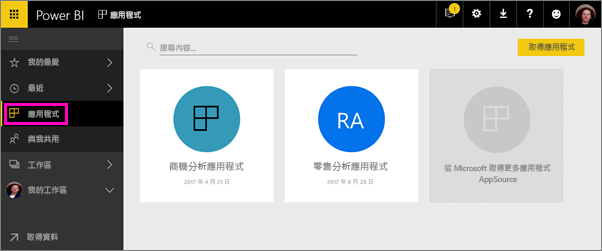

商務使用者通常需要多個 Power BI 儀表板和報表來執行業務。 應用程式會整合一切，因此他們不需要記住所有這些儀表板的名稱和位置。  

透過 Power BI 應用程式 (目前在預覽階段)，您可以建立多組儀表板和報表，然後將這些應用程式發佈至整個組織、特定的人員或群組。 如果您是報告建立者或系統管理員，應用程式可讓您更輕鬆地管理許多儀表板的權限。

商務使用者可透過幾個不同的方式取得您的應用程式。 如果 Power BI 系統管理員賦予您權限，您可以在您同事的 Power BI 帳戶中自動安裝應用程式。 否則，他們可以從 Microsoft AppSource 安裝您的應用程式，或者您可以將直接連結傳送給他們。 他們可以輕鬆地找到並傳回至您的內容，因為它就在一個地方。 他們會自動取得更新，而且您可以控制資料重新整理的頻率。 深入了解[商務使用者的應用程式體驗](service-install-use-apps.md)。

### 應用程式的授權
如果您是應用程式建立者，則您需要 Power BI Pro 授權。 您的應用程式使用者有兩個選項。

* 選項 1：所有商務使用者都需要 **Power BI Pro** 授權，才能檢視您的應用程式。 
* 選項 2：如果您的應用程式位於 Power BI Premium 容量中，則組織中的免費使用者可以檢視應用程式內容。 如需詳細資訊，請參閱[什麼是 Power BI Premium？](service-premium.md)。

### 應用程式和組織內容套件
應用程式是組織內容套件的演進。 如果您已經有組織內容套件，則它們會繼續與應用程式並存運作。

既然您已經概略了解應用程式，就讓我們聊聊可在其中建立應用程式的「應用程式工作區」。 

## 影片：應用程式及應用程式工作區
<iframe width="640" height="360" src="https://www.youtube.com/embed/Ey5pyrr7Lk8?showinfo=0" frameborder="0" allowfullscreen></iframe>

## 應用程式工作區
「應用程式工作區」是可供您建立應用程式的位置，因此，您必須先建立應用程式工作區，然後再建立應用程式。 如果您曾在 Power BI 中使用過群組工作區，則會熟悉應用程式工作區。 它們是群組工作區的演進 - 應用程式中內容的臨時區域和容器。 

您可以將同事新增至這些工作區，作為成員或系統管理員。 應用程式工作區的所有成員和系統管理員都需要 Power BI Pro 授權。 在工作區中，所有成員皆可在儀表板、報表和其他文章上共同作業，以準備發佈給更多對象，甚至整個組織。 

當內容就緒時，您選擇想要發佈的儀表板及報表，然後發佈應用程式。 您可以將直接連結傳送給更多的對象，或者可以移至 [從 AppSource 下載並探索更多應用程式]，從 [應用程式] 索引標籤找到您的應用程式。 這些人無法修改應用程式的內容，但可以在 Power BI 服務或其中一個行動裝置應用程式中與它互動 - 篩選、反白顯示和排序資料本身。 

## 建立應用程式工作區
[!INCLUDE [powerbi-service-create-app-workspace](./includes/powerbi-service-create-app-workspace.md)]

它是空白的，因此您現在可以在其中新增內容。 請注意，首次建立需要等候一小時左右，工作區才會散佈到 Office 365。 

新增內容就像將內容新增至 [我的工作區] 一樣，差異在於工作區中的其他人可以查看同時處理它。 有一個明顯的差異是當您完成時，您可以將內容發佈為應用程式。 位於應用程式工作區時，您可以上傳或連接至檔案，或連接至協力廠商服務，就像在您自己的 [我的工作區] 中一樣。 例如：

* [連接至服務](service-connect-to-services.md)，例如 Microsoft Dynamics CRM、Salesforce 或 Google Analytics。
* [從檔案取得資料](service-get-data-from-files.md)，例如 Excel、CSV 或 Power BI Desktop (PBIX) 檔案。

當您在應用程式工作區中檢視內容時，擁有者會顯示為應用程式工作區的名稱。

## 將影像新增至應用程式 (選擇性)
Power BI 預設會為您的應用程式建立一些彩色圓形，以及應用程式的縮寫。 但是，您可能會想要使用影像來進行自訂。 若要新增影像，您需要有 Exchange Online 的授權。

1. 選取 [工作區]，並選取工作區名稱旁邊的省略符號 (...)，然後選取 [成員]。 
   
     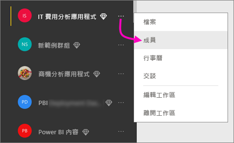
   
    工作區的 Office 365 Outlook 帳戶會在新的瀏覽器視窗中開啟。
2. 當您將滑鼠游標移至左上方的彩色圖形上方時，它會變成鉛筆圖示。 請加以選取。
   
     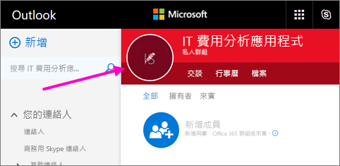
3. 再次選取鉛筆圖示，然後尋找您想要使用的影像。
   
     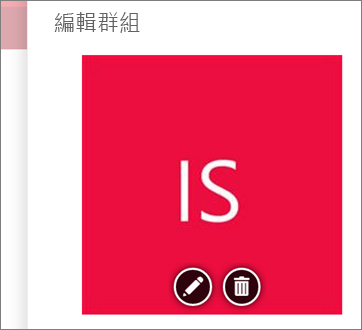
4. 選取 [儲存]。
   
     ![選取 [儲存]](media/service-create-distribute-apps/power-bi-apps-workspace-save-image.png)
   
    此影像會取代 Office 365 Outlook 視窗中的彩色圖形。 
   
     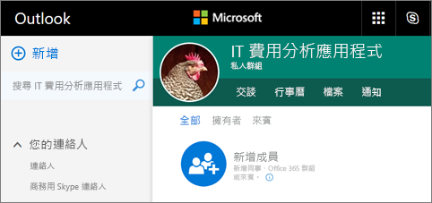
   
    在幾分鐘的時間內，它也會出現在 Power BI 的應用程式中。
   
     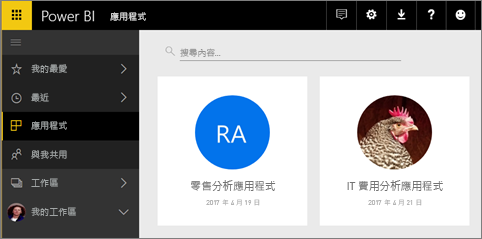

## 發佈您的應用程式
當應用程式工作區中的儀表板和報表準備就緒時，您就可以將它們發佈為應用程式。 請記住，您不必將所有報表和儀表板都發佈到工作區。 您可以只發佈已準備就緒的項目。 

1. 在工作區清單檢視中，決定您想要在應用程式中包含哪些儀表板和報表。

     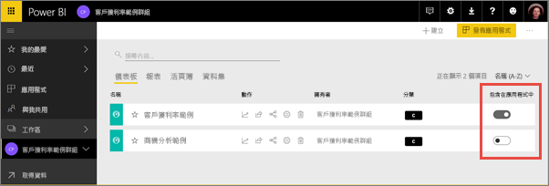

     如果您選擇不發佈報表，您就會在報表和其相關儀表板旁看到警告。 您仍然可以發佈應用程式，但相關的儀表板將會在該報表中遺失磚。

     

1. 選取右上角的 [發佈應用程式] 按鈕，來啟動共用該工作區中所有內容的程序。
   
     

2. 在 [詳細資料] 上，填寫描述以協助人員尋找應用程式。 您可以設定背景色彩來進行個人化。
   
     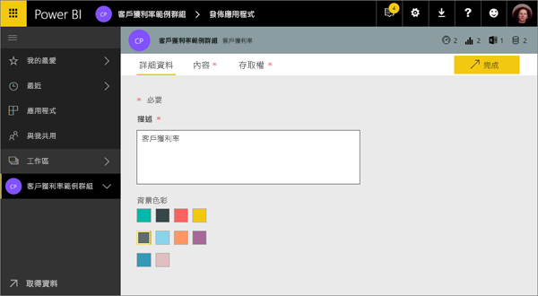

3. 在 [內容] 上，您會看到即將發佈為應用程式一部分的內容，即您在該工作區中選取的所有內容。 您也可以設定應用程式登陸頁面，這是儀表板或報表人員移至您的應用程式時先看到的頁面。 您可以選擇 [無]。 接著，他們會到達應用程式中所有內容的清單。 
   
     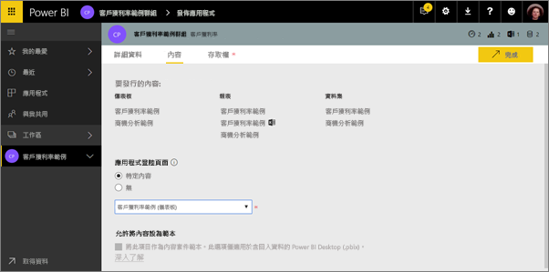

4. 在 [存取] 上，決定誰可以存取應用程式：組織中的所有人、特定人員、Active Directory 安全性群組。 如果您有權限，您可以決定為收件者自動安裝應用程式。

    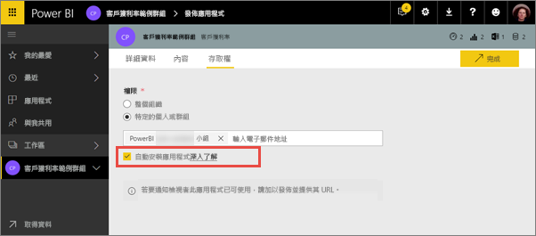

5. 當您選取 [完成] 時，會看到確認它已準備好要發佈的訊息。 在成功對話方塊中，您可以複製直接連結至此應用程式的 URL，並將它傳送給您已與之共用的人員。
   
     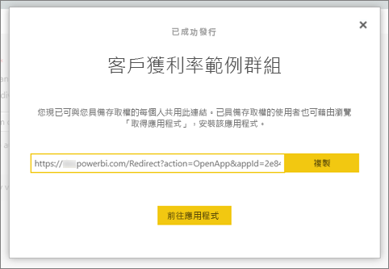

您已對其發佈應用程式的商務使用者可以透過幾種不同的方式找到它。 如果您可以自動安裝應用程式，該應用程式就會出現在其 Power BI 帳戶的 [應用程式] 底下。 您可以將應用程式的直接連結傳送給他們，或者他們可以在 Microsoft AppSource 中搜尋它，而在 Microsoft AppSource 中，他們可以看到所有可存取的應用程式。 無論取得方式為何，之後只要他們移至 [應用程式]，就會在其清單中看到此應用程式。

深入了解[商務使用者的應用程式體驗](service-install-use-apps.md)。

## 變更已發佈的應用程式
在您發佈應用程式之後，可能想要進行變更或更新。 如果您是應用程式工作區的系統管理員或成員，則很容易進行更新。 

1. 開啟對應至應用程式的應用程式工作區。 
   
     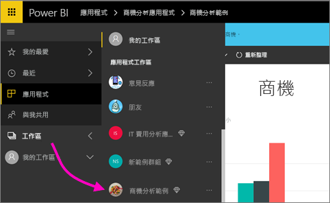
2. 開啟儀表板或報表。 您可以看到您可以進行任何您想要的變更。
   
     應用程式工作區是臨時區域；因此，您的變更在重新發佈之前不會即時推入應用程式中。 這可讓您進行變更，而不影響已發佈的應用程式。  
 
1. 回到內容的應用程式工作區清單，然後選取 [更新應用程式]。
   
     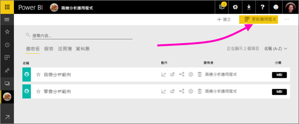

4. 更新 [詳細資料]、[內容] 和 [存取]\(必要時)，然後選取 [更新應用程式]。
   
     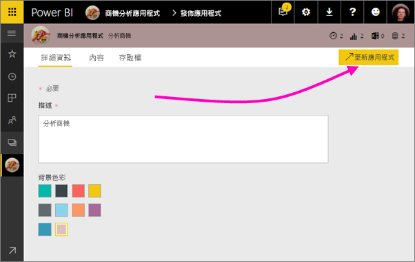

您已對其發佈應用程式的人員會自動看到應用程式的已更新版本。 

## 解除發佈應用程式
應用程式工作區的任何成員都可以解除發佈應用程式。

* 在應用程式工作區中，選取右上角的省略符號 (**...**) > [Unpublish app]\(解除發佈應用程式)。
  
     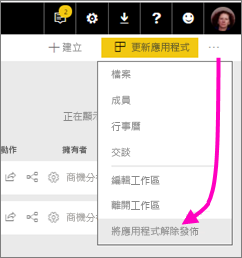

這個動作會解除安裝您發佈給每個人的應用程式，而且他們將無法再存取該應用程式。 它不會刪除應用程式工作區或其內容。

## Power BI 應用程式常見問題集
### 應用程式工作區與群組工作區的差異為何？
在這個版本中，我們已將所有群組工作區都重新命名為應用程式工作區。 您可以從其中任一工作區發佈應用程式。 在大部分情況下，此功能仍然與群組工作區同等重要。 接下來的幾個月，我們計劃對應用程式工作區進行下列增強︰ 

* 與群組工作區不同，建立應用程式工作區並不會在 Office 365 中建立對應實體。 因此，您可以建立任意數目的應用程式工作區，而不需要擔心在幕後建立不同的 Office 365 群組 (您仍然可以使用 Office 365 群組的商務用 OneDrive 來儲存檔案)。 
* 現在您只能將個人新增至成員和系統管理員清單。 很快您就能夠將多個 AD 安全性群組或最新群組新增至這些清單，更輕鬆地進行管理。  

### 應用程式與組織內容套件的差異為何？
應用程式是內容套件的演進和簡化，但有一些主要差異。 

* 商務使用者在安裝內容組件之後失去其群組身分識別︰它只是與其他儀表板和報表穿插的儀表板和報表清單。 相反地，應用程式會維護其群組和身分識別，即使在安裝之後也是一樣。 這可讓商務使用者在經過一段時間之後仍可輕鬆地繼續進行導覽。  
* 您可以從任何工作區建立多個內容套件，但應用程式與其工作區具有 1:1 關聯性。 我們相信這可讓應用程式在執行一段長時間之後更容易了解和維護。 如需如何計劃改善這個區域的詳細資訊，請參閱 Power BI 部落格的＜藍圖＞一節。 
* 經過一段時間之後，我們計劃要淘汰組織內容套件，因此建議您從現在開始建立應用程式。  

### 群組中的唯讀成員如何？
在群組中，您可以新增只能檢視內容的唯讀成員。 這種方法的主要問題是您無法將安全性群組新增為成員。 

您可以使用應用程式將應用程式工作區的唯讀版本發佈給大量對象，包括安全性群組。 您可以預備應用程式中儀表板和報表的變更，而不會影響使用者。 建議您日後透過這種方式來使用應用程式。 在長期執行之後，我們也計劃取代工作區的唯讀成員。  

## 後續步驟
* [在 Power BI 中安裝和使用應用程式](service-install-use-apps.md)
* [外部服務的 Power BI 應用程式](service-connect-to-services.md)
* 有問題嗎？ [嘗試在 Power BI 社群提問](http://community.powerbi.com/)

