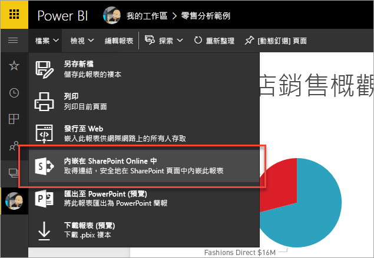
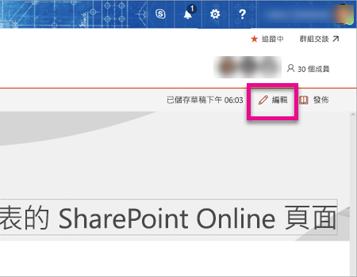
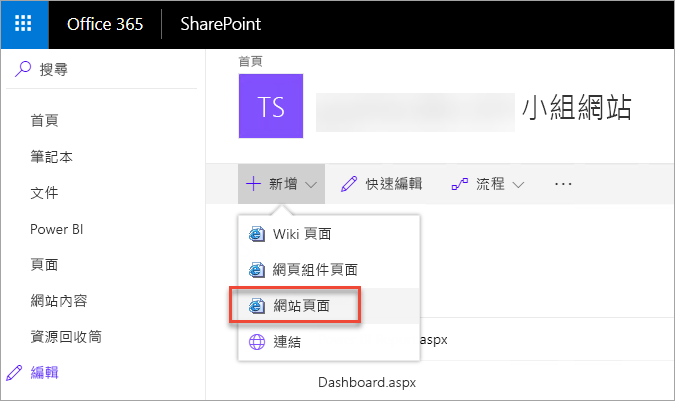
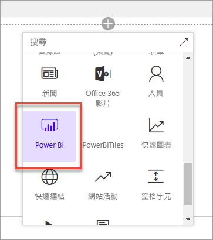
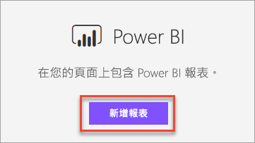
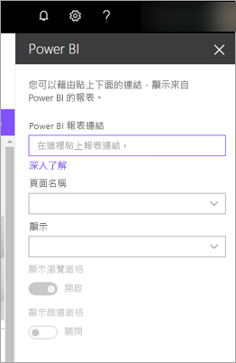
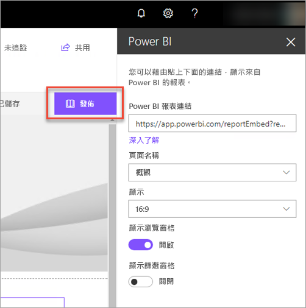
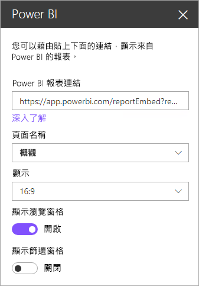
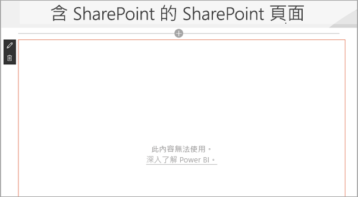

# 在 SharePoint Online 中嵌入報表網頁組件

你可以使用 SharePoint Online 的 Power BI 新報表網頁組件，輕鬆地在 SharePoint Online 的網頁中內嵌互動式 Power BI 報表。

當使用新的 [內嵌在 SharePoint Online 中] 選項時，內嵌的報表受會到全面性的防護，所以您可以輕鬆地建立安全的內部入口網站。

## 需求

為了讓**內嵌在 SharePoint Online 中**的報表運作，必須達成幾項需求。

* SharePoint Online 的 Power BI Web 組件需要[新式網頁](https://support.office.com/article/Allow-or-prevent-creation-of-modern-site-pages-by-end-users-c41d9cc8-c5c0-46b4-8b87-ea66abc6e63b)。

## 內嵌報表

若要將報表嵌入 SharePoint Online，您必須先取得報表的 URL，然後在 SharePoint Online 中的新 Power BI 組件使用該 URL。

### 取得報表的 URL

1. 在 Power BI 服務中檢視報表。

2. 選取 [檔案] 功能表項目。

3. 選取 [內嵌於 SharePoint Online]。
   
    

4. 從對話方塊複製 URL。

    

   > [!NOTE]
   > 您也可以使用檢視報表時，顯示在網頁瀏覽器網址列中的 URL。 URL 會包含目前所檢視的報表頁面。 如果您想要使用不同的頁面，您必須從 URL 移除報表區段。

### 將 Power BI 報表新增至 SharePoint Online 頁面

1. 在 SharePoint Online 中開啟要使用的頁面，然後選取 [編輯]。

    

    或者藉由選取 SharePoint Online 內的 [+ 新增]，以建立新的新式網站頁面。

    

2. 選取 **+** 然後選取 [Power BI] Web 組件。

    

3. 選取 [新增報告] 。

    

4. 將報表 URL 傳送至屬性窗格。 這是您從上述步驟所複製的 URL。 報表將會自動載入。

    

5. 選取 [發佈]，讓 SharePoint Online 使用者能看見您所做的變更。

    

## 授與報表存取權

在 SharePoint Online 中內嵌報表，並不會自動授予使用者檢視報表的權限。 在 Power BI 服務中，具有檢視報表所需的權限。

> [!IMPORTANT]
> 請務必檢閱可以看到 Power BI 服務內報表的成員，並將存取權授與未列出的成員。

有兩個方法可提供 Power BI 服務內報表的存取權。 如果您使用 Office 365 群組來建置 SharePoint Online 小組網站，則會將使用者列為 Power BI 服務內的應用程式工作區成員。 如此可確保使用者能夠檢視該群組的內容。 如需詳細資訊，請參閱[在 Power BI 中建立和散發應用程式](service-create-distribute-apps.md)。

或者您可以執行下列動作，以將您的報表存取權授與使用者。

1. 將報表中的磚新增至儀表板。

2. 與需要存取報表的使用者共用儀表板。 如需詳細資訊，請參閱 [Share a dashboard with colleagues and others](service-share-dashboards.md) (與同事和其他人共用儀表板)。

## 網頁組件設定

以下是 SharePoint Online 的 Power BI 網頁組件之可調整設定的描述。

| 屬性 | 描述 |
| --- | --- |
| 頁面名稱 |設定網頁組件所顯示的預設頁面。 從下拉式清單中選取一個值。 如果沒有顯示任何頁面，可能是您的報表只有一個頁面，或您所貼上的 URL 包含頁面名稱。 從 URL 移除報表區段，以選取特定頁面。 |
| 顯示 |調整報表如何被納入 SharePoint Online 頁面的選項。 |
| 顯示功能窗格 |顯示或隱藏頁面功能窗格。 |
| 顯示篩選窗格 |顯示或隱藏篩選窗格。 |

## Multi-Factor Authentication

如果您的 Power BI 環境需要您使用多重要素驗證進行登入，您可能會被要求使用安全性裝置進行登入，以驗證您的身分識別。 如果您沒有使用多重要素驗證登入 SharePoint.Online，但您的 Power BI 環境需要使用安全性裝置來驗證的帳戶時，就會發生此情形。

> [!NOTE]
> Azure Active Directory 2.0 尚不支援多重要素驗證。 使用者會收到指出「錯誤」的訊息。 如果使用者使用他們的安全性裝置再次登入 SharePoint Online ，他們可能可以檢視報表。

## 不會載入的報表

您的報表可能未在 Power BI Web 組件中載入，並可能顯示下列訊息。

*此內容無法使用。*

有兩個常見的原因會導致此訊息的出現。

1. 您沒有存取此儀表板的權限。
2. 報表已刪除。

您應該連絡 SharePoint Online 頁面的擁有者，以協助您解決問題。

## 已知的問題及限制

* **錯誤："An error occurred, please try logging out and back in and then revisiting this page.Correlation id: undefined, http response status: 400, server error code 10001, message: Missing refresh token"** (發生錯誤。請登出再登入，然後再次前往此頁面。相互關聯識別碼: 未定義。HTTP 回應的狀態: 400。伺服器錯誤碼 10001。訊息: 缺少重新整理權杖)
  
  收到此錯誤時，請嘗試執行下列其中一項動作。
  
  1. 登出再登入 SharePoint。 請務必關閉所有瀏覽器視窗，然後再重新登入。

  2. 若您的使用者帳戶需要多重要素驗證 (MFA)，請確定您是使用多重要素驗證裝置 (手機應用程式、智慧卡等等) 登入 SharePoint。

* Power BI 與 SharePoint Online 支援的當地語系化語言不盡相同。 因此，您可能會在內嵌報表中看到未適當當地語系化的內容。

* 您若使用 Internet Explorer 10，可能會遇到問題。 您可以參閱 [Power BI](service-browser-support.md) 及 [Office 365](https://products.office.com/office-system-requirements#Browsers-section) 的瀏覽器支援。

## 後續步驟

[允許或防止終端使用者建立新式網站頁面](https://support.office.com/article/Allow-or-prevent-creation-of-modern-site-pages-by-end-users-c41d9cc8-c5c0-46b4-8b87-ea66abc6e63b)  
[在 Power BI 中建立和散發應用程式](service-create-distribute-apps.md)  
[Share a dashboard with colleagues and others](service-share-dashboards.md) (與同事和其他人共用儀表板)  
[Power BI Premium - 這是什麼？](service-premium.md)  

有其他問題嗎？ [嘗試在 Power BI 社群提問](http://community.powerbi.com/) 

