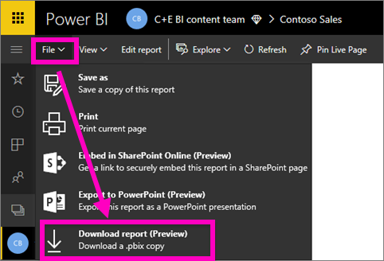
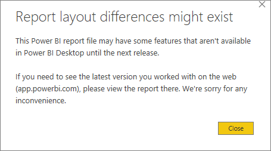

# 將報表從 Power BI 服務匯出至 Desktop (預覽)
在 Power BI Desktop 中，您可以匯出 (也稱為「下載」) 報表至 Power BI 服務，方法是儲存報表，並選取 [發佈]。 您也可以另一個方向來匯出，並從 Power BI 服務下載報表到 Desktop。 在任一方向中，匯出的檔案副檔名為 *.pbix* 。

有幾項需要注意的限制和考量，將在本文稍後討論。

## 將報表下載為 .pbix
若要下載 .pbix 檔案，請遵循下列步驟：

1. 在 [Power BI 服務] 中，以[編輯檢視](service-reading-view-and-editing-view.md)開啟您想要下載的報表。
2. 從功能表列中，選取 [檔案] > [下載報表]。
   
   > [!NOTE]
   > 報表必須是在 2016 年 11 月 23 日後[使用 Power BI Desktop 建立](guided-learning/publishingandsharing.yml#step-2)，並在那之後進行更新，才能順利下載。 如果沒有，Power BI 服務中的「下載報表」功能表選項會是灰色。
   > 
   > 
3. 建立 .pbix 檔案時，狀態橫幅會顯示進度。 當檔案已準備就緒時，系統會要求您開啟或儲存 .pbix 檔案。 檔案名稱與報表標題相符。
   
    
   
    您現在有使用 Power BI 服務 (app.powerbi.com) 或 Power BI Desktop 開啟 .pbix 檔案的選項。     
4. 若要立即在 Desktop 中開啟報表，請選取 [開啟]。 若要將檔案儲存至特定位置，請選取 [儲存] > [另存新檔]。 如果您還沒有這麼做，請[安裝 Power BI Desktop](desktop-get-the-desktop.md)。
   
    當您在 Desktop 中開啟報表時，警告訊息可讓您了解 Power BI 服務報表的某些功能可能無法用於 Desktop。
   
    

5. Desktop 中的報表編輯器與 Power BI 服務中的報表編輯器非常類似。  
   
    

## 考量與疑難排解
從 Power BI 服務下載 (匯出) *.pbix* 檔案有幾項重要的相關考量和限制。

* 若要下載檔案，您必須要有報表的編輯存取權
* 報表必須是使用 **Power BI Desktop** 建立，並已*發佈*到 **Power BI 服務**，或是必須已將 .pbix *上傳*到服務。
* 報表必須在 2016 年 11 月 23 日之後發佈或更新。 在這之前發佈的報表無法下載。
* 此功能無法對原先是在 **Power BI 服務**中建立的報表運作，包括內容套件。
* 開啟下載的檔案時，應一律使用最新版本的 **Power BI Desktop**。 下載的 *.pbix* 檔案無法在舊版 **Power BI Desktop** 中開啟。
* 如果您的系統管理員已關閉匯出資料的功能，在 **Power BI 服務**中就不會看到此功能。

## 後續步驟
檢視 **Guy in a Cube** 關於此功能的一分鐘影片：

<iframe width="560" height="315" src="https://www.youtube.com/embed/ymWqU5jiUl0" frameborder="0" allowfullscreen></iframe>

此外，以下其他幾篇文章可以協助您了解如何使用 **Power BI 服務**：

* [Power BI 中的報表](service-reports.md)
* [Power BI - 基本概念](service-basic-concepts.md)

一旦安裝 **Power BI Desktop**，下列內容能幫助您快速啟動並執行：

* [開始使用 Power BI Desktop](desktop-getting-started.md)

有其他問題嗎？ [試試 Power BI 社群](http://community.powerbi.com/)   

