# 開始使用 Power BI 服務 (app.powerbi.com)
本教學課程可協助您開始使用 ***Power BI 服務***。 若要了解 Power BI 服務如何與其他 Power BI 供應項目相配合，強烈建議您先閱讀[什麼是 Power BI](guided-learning/gettingstarted.yml#step-1)。

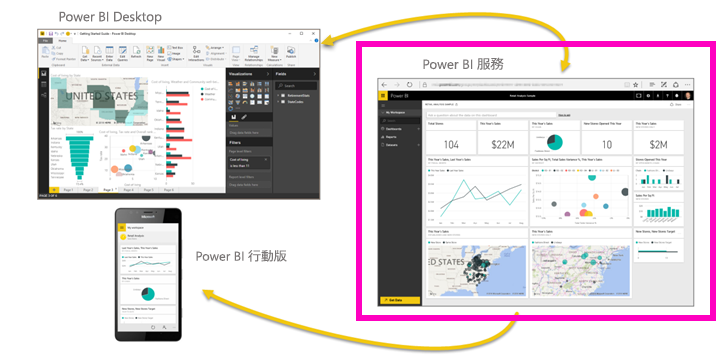

Power BI 服務有免費版本和專業版本。 無論您使用哪個版本，如果您已有帳戶，請開啟瀏覽器並輸入 app.powerbi.com 以開啟 Power BI 服務。 如果您是新使用者，建議改從 www.powerbi.com 著手。 從這裡，您可以在登入服務前深入了解 Power BI。  當您準備好進行試用時，請選取您在右上角看到的 [免費註冊] 連結。 如果您的系統管理員已經為您啟用 Power BI，請勿使用 [免費註冊] 按鈕，但改為直接前往 app.powerbi.com。 

如果您需要 Power BI Desktop 的協助，請參閱[開始使用 Desktop](desktop-getting-started.md). 如果您想要尋求 Power BI Mobile 的協助，請參閱[行動裝置的 Power BI 應用程式](mobile-apps-for-mobile-devices.md)。

> [!TIP]
> 偏好免費自修訓練課程？ [註冊在 EdX 上的資料分析與視覺化課程](http://aka.ms/edxpbi)。

請瀏覽我們在 [YouTube 上的播放清單](https://www.youtube.com/playlist?list=PL1N57mwBHtN0JFoKSR0n-tBkUJHeMP2cP)。 從「Power BI 服務簡介」影片開始是很好的選擇：
> 
> <iframe width="560" height="315" src="https://www.youtube.com/embed/B2vd4MQrz4M" frameborder="0" allowfullscreen></iframe>
> 
> 
> 

Microsoft Power BI 協助您掌握關切資訊的最新狀態。  使用 Power BI 服務，***儀表板***能助您掌握商務脈動。  儀表板顯示的***磚***，可讓您按一下以開啟「報表」來進一步探索。  連接到多個***資料集***，讓所有相關資料集中到一處。 您想要了解構成 Power BI 的建置組塊嗎？  請參閱 [Power BI - 基本概念](service-basic-concepts.md)。

如果 Excel 或 CSV 檔案中有重要的資料，您可以建立 Power BI 儀表板在任何位置掌握其動態，並與他人交流意見。  您訂閱了 Salesforce 之類的 SaaS 應用程式嗎？  預先連線到 Salesforce 以自動從該資料建立儀表板，或[查看您可以連線的所有其他 SaaS 應用程式](service-get-data.md)。 如果您是組織的一員，請查看是否曾為您發佈過任何的[應用程式](service-create-distribute-apps.md)。

閱讀[取得 Power BI 的資料](service-get-data.md)的所有其他方式.

## 步驟 1：取得資料
本例從 CSV 檔案取得資料。 想遵循本教學課程嗎？ [下載此範例 CSV 檔案](http://go.microsoft.com/fwlink/?LinkID=521962).

1. [登入 Power BI](http://www.powerbi.com/)。 沒有帳戶嗎？ 別擔心，您可以免費註冊。
2. Power BI 會在您的瀏覽器中開啟。 選取左導覽列底部的 [取得資料] 。
   
   
3. 選取 [檔案] 。 
   
   
4. 瀏覽至電腦上的檔案，然後選擇 [開啟]。 如果您在商務用 OneDrive 中儲存它，請選取該選項。 如果您在本機儲存它，請選取 [本機檔案]。 
   
   
5. 在本教學課程中，我們將選取 [匯入] 以將 Excel 檔案新增為資料集，接著使用該資料集來建立報表和儀表板。 如果您選取 [上傳]，整個 Excel 活頁簿會上傳至 Power BI，在其中，您可以在 Excel Online 中進行開啟和編輯。
   
   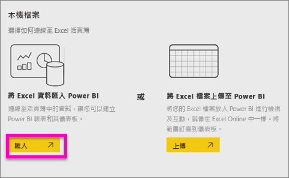
6. 您的資料集就緒時，請選取 [檢視資料集] 以在報表編輯器中進行開啟。 

    

    由於我們尚未建立任何視覺效果，所以報告畫布會空白。

    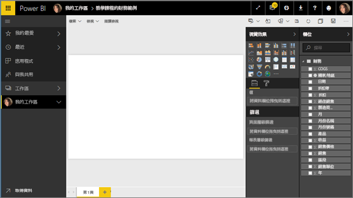

6. 看看頂端功能表列，並請注意，有 [閱讀檢視] 的選項。 由於您有 [閱讀檢視] 的選項，這表示您目前處於**編輯檢視**中。 

    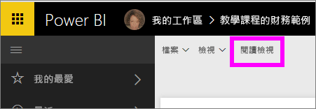

    在 [編輯檢視] 中，您可以建立和修改報告，因為您是報告的「擁有者」；您是「建立者」。 當您與同事共用您的報告時，他們只能夠在 [閱讀檢視] 中與報告互動；他們是「取用者」。 深入了解[閱讀檢視和編輯檢視](service-reading-view-and-editing-view.md)。
    
    熟悉報表編輯器的一項好方法為[進行導覽](service-the-report-editor-take-a-tour.md)
   > 
 

## 步驟 2：開始探索資料集
現在您已連線到資料，請開始進行探索。  當您發現感興趣的物件時，您可以建立儀表板來監視該物件，以及查看其變更情況。 讓我們來看看它的運作方式。
    
1. 在報告編輯器中，我們會使用頁面右側的 [欄位] 窗格來建立視覺效果。  選取 [總銷售額] 旁的核取方塊，然後按一下 [日期]。
   
   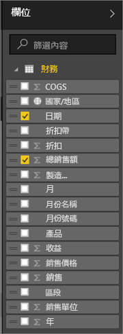

2. Power BI 會分析資料並建立視覺效果。  如果先選取 [日期]  就會看到資料表。  如果先選取 [總銷售額]  就會看到圖表。 切換不同的資料顯示方式。 讓我們以折線圖形式查看此資料。 從 [視覺效果] 窗格中選取折線圖圖示 (也稱為範本)。
   
   

3. 這看起來很有趣，讓我們將它「釘選」到儀表板。 將滑鼠停留在視覺效果上，並選取 [釘選] 圖示。  釘選這個視覺效果時，它會儲存在儀表板上並保持最新狀態，讓您一眼就能追蹤最新的值。
   
   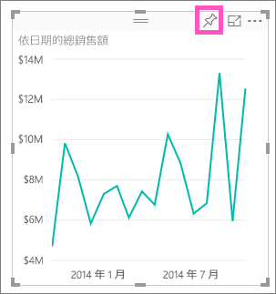

5. 因為這是一份新報告，系統會提示您先儲存該報告，才可將視覺效果釘選到儀表板。 為報告命名 (例如「銷售歷史數據」) 並選取 [儲存並繼續]。 
   
   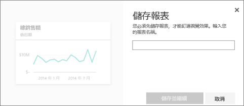
   
6. 讓我們將折線圖釘選到新的儀表板，並將它命名為「教學課程的財務範例」。 
   
   
   
 1. 選取 [釘選] 。
   
    靠近右上角的成功訊息讓您知道，視覺效果已當成磚加入儀表板。
   
    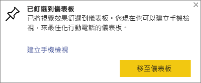

8. 選取 [移至儀表板] 將釘選的折線圖視為全新儀表板的圖格。 藉由新增更多視覺效果圖格，以及[重新命名、調整大小、連結和調整圖格位置](service-dashboard-edit-tile.md)，讓您的儀表板更完善。
   
   
   
   選取儀表板上新的磚，即可隨時返回報表。 Power BI 會讓您回到 [閱讀檢視] 中的報告編輯器。 若要切換回 [編輯檢視]，請選取頂端功能表列中的 [編輯報告]。 一旦在 [編輯檢視] 中，請繼續瀏覽及釘選圖格。 

## 步驟 3：使用 [問與答] 繼續探索 (自然語言查詢)
1. 如要快速瀏覽資料，請試著在問與答方塊中提問。 [問與答] 問題方塊位於儀表板頂端 (**詢問一個與資料相關的問題**) 以及報告的頂端功能表列中 (**詢問問題**)。 例如，試試看輸入「營收最高的部門」。
   
   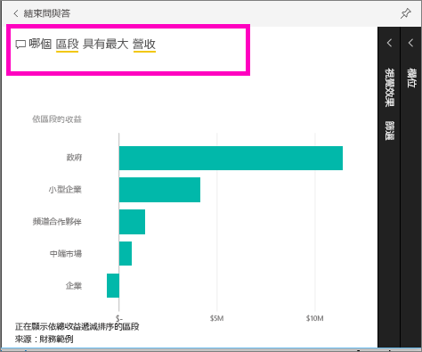

2. [問與答] 會搜尋答案，並以視覺效果的形式呈現。 選取釘選圖示  以在儀表板上顯示此視覺效果。
3. 將視覺效果釘選到「教學課程的財務範例」儀表板。
   
    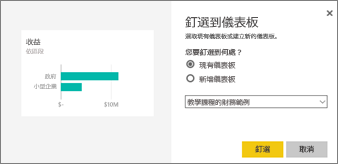

4. 返回儀表板，您會在這裡看到新的圖格。

   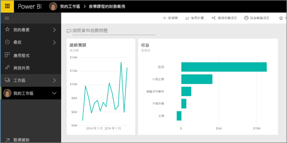

## 後續步驟
準備試試其他的嗎？  以下是一些探索 Power BI 的絕佳方法。

* [連接至另一個資料集](service-get-data.md).
* 與同事[共用您的儀表板](service-share-dashboards.md)。
* 閱讀[設計儀表板的秘訣](service-dashboards-design-tips.md).
* 使用[行動裝置上的 Power BI 應用程式](mobile-apps-for-mobile-devices.md)檢視儀表板

想要再等等？ 請從這些主題開始，它們會幫助您熟悉適應 Power BI。

* [了解報表、資料集、儀表板和磚如何相互搭配](service-basic-concepts.md)
* 請瀏覽我們的 [Power BI 導引式學習](guided-learning/index.md)網站，並參與一些 (很短的) 課程
* 觀看一些 [Power BI 影片](videos.md)
* [查看我們供您使用的範例](sample-datasets.md)

### 掌握 Power BI 的最新動態
* 在 Twitter 上關注 [@MSPowerBI](https://twitter.com/mspowerbi)
* 訂閱我們的 [YouTube 影片頻道](https://www.youtube.com/channel/UCy--PYvwBwAeuYaR8JLmrfg)
* 點播觀賞 [Power BI 使用者入門網路研討會](webinars.md)
* 不確定如何尋求協助？ 請參閱我們的 [10 個祕訣協助您取得說明](service-tips-for-finding-help.md)頁面

有其他問題嗎？ [嘗試在 Power BI 社群提問](http://community.powerbi.com/)

