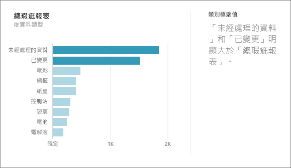
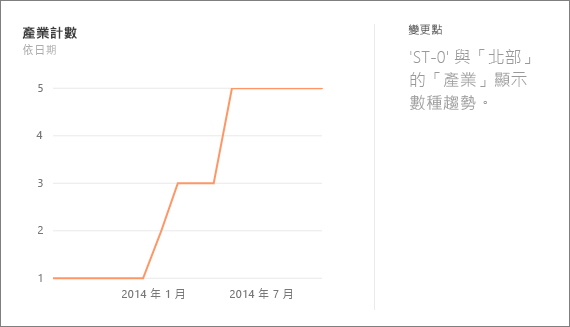
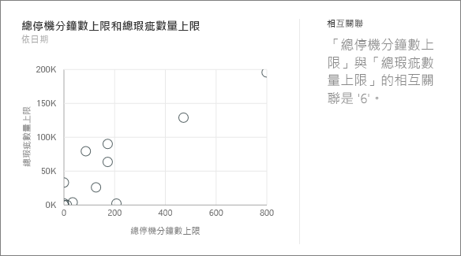
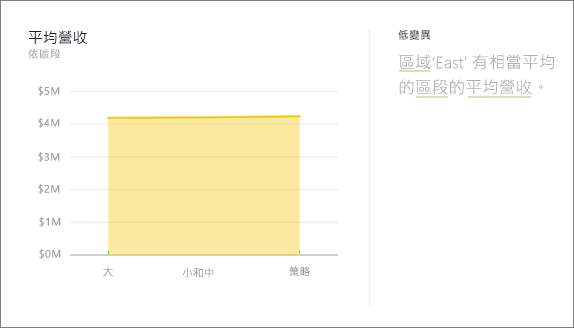
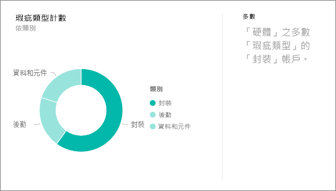
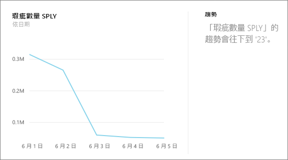
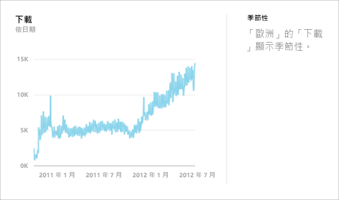
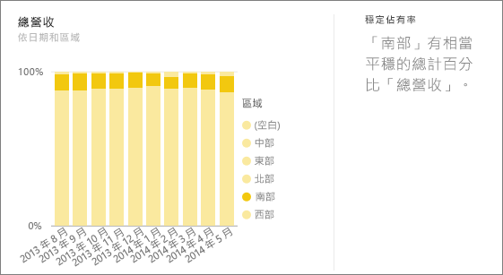
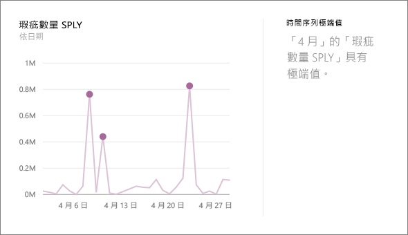

# Power BI 支援的深入解析類型
## 深入解析如何運作？
Power BI 可快速地搜尋資料集的不同子集，同時套用一組複雜的演算法來探索潛在相關的深入剖析資訊。 Power BI 會在分配的時間內盡可能掃描資料集。

您可以針對資料集或儀表板圖格執行深入解析。   

## 我們可以尋找哪些類型的深入剖析資訊？
以下是我們所使用的一些演算法：

## 類別極端值 (上/下)
針對模型中的量值，醒目提示維度的一或兩個成員值大於維度的其他成員值的情況。  

## 變更時間序列中的點
醒目提示資料時間序列中的趨勢明顯變更的情況。

## 相互關聯
偵測當根據資料集中的某個維度繪製多個量值時，多個量值彼此之間顯示相互關聯的情況。

## 低變異數
偵測到資料點距離平均值不遠的情況。

## 多數 (主要因素)
尋找當總值由另一個維度分解時，其多數可能歸因於單一因素的情況。  

## 時間序列中的整體趨勢
偵測時間序列資料中的向上或向下趨勢。

## 時間序列中的季節性
尋找時間序列資料中的週期模式，例如每週、每月或每年的季節性。

## 穩定佔有率
醒目提示子值的部分相對於跨連續變數的整體父值有父子相互關聯的情況。

## 時間序列極端值
針對跨時間序列的資料，偵測特定日期或時間值明顯不同於其他日期/時間值的情況。

## 後續步驟
[Power BI 深入解析](service-insights.md)

如果您擁有資料集，請[針對深入解析將它最佳化](service-insights-optimize.md)。

有其他問題嗎？ [試試 Power BI 社群](http://community.powerbi.com/)

