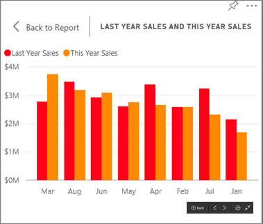

# 在 Power BI 中與閱讀檢視的報表互動
## 閱讀檢視
[閱讀檢視] 的互動性雖不如[編輯檢視](service-interact-with-a-report-in-editing-view.md)高，但仍然提供您許多選項來探索資料。 有些[與您共用](service-share-dashboards.md)的報表只能在 [閱讀檢視] 中開啟，因此要檢視這類報表時，[閱讀檢視] 就能派上用場。

[閱讀檢視] 是實驗及了解資料之有趣且安全的方式。 在 [閱讀檢視] 中，您可以交叉醒目提示及交叉篩選頁面上的視覺效果。  只要反白顯示或選取一個視覺效果中的值，就能立即看到其對其他視覺效果的影響。 使用 [篩選] 窗格可在報表頁面上加入及修改篩選，並變更在視覺效果中排序值的方式。 您執行的任何篩選和反白顯示都不會與報表一起儲存。

## 交叉醒目提示頁面上的相關視覺效果
單一報表頁面上的視覺效果皆彼此「連接」。  意思就是說，如果您在一種視覺效果中選取一個或多個值，將會根據該選取項目，變更使用相同值的其他視覺效果。

> [!NOTE]
> 若要在視覺效果中選取多個項目，請按住 CTRL 鍵。
> 
> 

## 將滑鼠停留在視覺項目以便查看詳細資料

## 排序視覺效果中的資料
選取省略符號 (...) 開啟 [排序方式]。 選取下拉式箭號，以選擇要依據哪一個欄位排序，或選取 AZ 圖示在遞增和遞減之間切換。 

 

## 與篩選互動
如果報表作者將篩選加入報表中的頁面，您就可以在 [閱讀檢視] 與其互動。 您所做的變更將不會與報表一起儲存。

1. 選取右上角的篩選圖示。
   
     
2. 您會看到所有篩選已套用至您選取的視覺效果 (視覺層級篩選)、跨整個報表頁面 (頁面層級篩選)，以及跨整份報表 (報表層級篩選)。
   
   
3. 將滑鼠停留在篩選，並選取向下箭號將其展開。
   
   
4. 對篩選進行變更，並查看視覺效果如何受到影響。  
   
   * 在此範例中，我們設定了 [連鎖店] 頁面層級篩選。 若要變更為 [Fashions Direct] 而不是 [Lindseys]，您可移除後者的核取記號，然後將核取記號新增至前者。
     
     
   * 或者，您可以選取橡皮擦圖示  或選取這兩家連鎖店，以完全移除 [連鎖店] 的篩選。
   * 選取 [District] 頁面層級篩選，並切換至 [進階篩選]。 篩選至僅顯示開頭為 **FD** 且不包含數字 4 的區域。
     
     

如需詳細資訊，請參閱[將篩選加入報表](power-bi-report-add-filter.md)和[關於報表中的篩選和醒目提示](power-bi-reports-filters-and-highlighting.md).

## 放大個別視覺效果
將滑鼠暫留在視覺效果上，並選取**焦點模式**圖示 。 當您以焦點模式檢視視覺效果時，其會展開並填滿整個報表畫布，如下所示。

若要顯示該相同視覺效果，而不受功能表列、篩選窗格和其他 Chrome 的干擾，請從頂端功能表列，選取**全螢幕**圖示 。

若要深入了解，請參閱[報表的焦點模式](service-focus-mode.md)和[報表的全螢幕模式](service-fullscreen-mode.md)。

## 調整顯示尺寸
報表可在許多不同的裝置上檢視，這些裝置的螢幕大小和外觀比例有所不同。  預設呈現方式可能不是您要在裝置上查看的方式。  若要調整，請選取 [檢視] 並選擇︰

* 調整成一頁：縮放內容到最能符合頁面的程度
* 調整成視窗寬度：縮放內容至頁面的寬度
* 實際大小：以全尺寸顯示內容  

  在 [閱讀檢視] 中，您選取的顯示選項是暫時性的，當您關閉報表時不會儲存。

  若要深入了解，請參閱[教學課程：變更報表顯示設定](power-bi-change-report-display-settings.md)。

## 後續步驟
[Power BI 中的報表](service-reports.md)

[開啟編輯檢視](service-reading-view-and-editing-view.md)

有其他問題嗎？ [試試 Power BI 社群](http://community.powerbi.com/)

