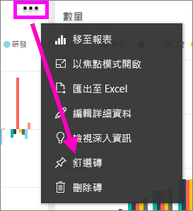
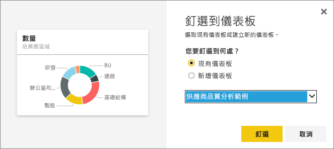

# 將儀表板的圖格釘選到另一個儀表板
加入新[儀表板磚](service-dashboard-tiles.md)的一種方法是從另一個儀表板複製過來。 每個圖格都是一個連結，按一下就會返回其建立位置，問與答或報表。 

> [!NOTE]
> 您不能釘選共用儀表板上的磚。

## 將磚釘選到另一個儀表板
1. [取得資料](service-get-data.md). 本範例使用 [IT 費用分析範例](sample-it-spend.md)。
2. 開啟[儀表板](service-dashboards.md).
3. 將滑鼠停留在要釘選的圖格上，選取省略符號 (...)，然後選擇 [釘選圖示]。  
   
   
4. 將磚釘選至現有的儀表板或新的儀表板上。 
   
   * **現有儀表板**：從下拉式清單中選取儀表板的名稱。
   * **新儀表板**：輸入新儀表板的名稱。
   
   
5. 選取 [釘選] 。
   靠近右上角的成功訊息讓您知道，視覺效果已當成圖格加入所選儀表板。
   
   
6. 選取 [移至儀表板] 以查看釘選的磚。 您可以在這裡[重新命名、調整大小、連結和移動](service-dashboard-edit-tile.md)釘選的視覺效果。

## 後續步驟
[Power BI 中的磚](service-dashboard-tiles.md)  
[Power BI 中的儀表板](service-dashboards.md)  
有其他問題嗎？ [試試 Power BI 社群](http://community.powerbi.com/)

