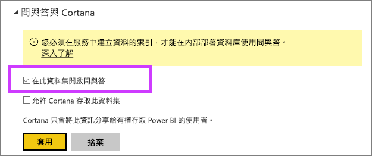

# 啟用即時連線的問與答
## 什麼是內部部署資料閘道？  什麼是即時連線？
Power BI 中的資料集可匯入 Power BI，或者您可以建立與資料集的即時連接。 即時連接的資料集通常稱為「內部部署」。 您可以使用[閘道](service-gateway-onprem.md)管理即時連線，並使用即時查詢以來回傳送資料及查詢。

## 內部部署資料閘道資料集問與答
如果您想要搭配透過閘道存取的資料集使用問與答，必須先啟用資料集。

啟用之後，Power BI 會建立資料來源的索引，並將該資料子集上傳到 Power BI，以允許詢問問題。 建立初始索引可能需要幾分鐘的時間，Power BI 會維護索引並隨著您的資料變更自動更新索引。 搭配這些資料集使用問與答與將資料發佈到 Power BI 的行為相同。 這兩種情況都支援問與答體驗中可用的完整功能集，包括搭配 Cortana 使用資料來源。

當您在 Power BI 中詢問問題時，問與答會使用資料集的索引，來判斷要建構的最佳視覺效果，或用來回答問題的報表工作表。 判斷可能的最佳答案之後，問與答會使用 DirectQuery 透過閘道從資料來源擷取即時資料，來填入圖表和圖形。 這可確保 Power BI 問與答結果一律會直接從基礎資料來源顯示最新資料。

因為 Power BI 問與答使用資料來源中的文字和結構描述值，來判斷如何查詢基礎模型以取得答案，所以搜尋特定的新文字值或已刪除的文字值 (例如詢問與新加入之文字記錄相關的客戶名稱) 需要以最新值更新索引。 Power BI 會在變更後的 60 分鐘內自動更新文字和結構描述索引。

如需詳細資訊，請參閱：

* 什麼是[內部部署資料閘道](service-gateway-onprem.md)？
* [Power BI 問與答簡介](power-bi-q-and-a.md)

## 啟用問與答
設定資料閘道之後，從 Power BI 連線到您的資料。  您可以使用內部部署資料建立儀表板，或上傳使用內部部署資料的 .pbix 檔案。  您也可能在與您共用的儀表板、報表和資料集中已有內部部署資料。

1. 選取 Power BI 右上角的齒輪圖示 ，然後選擇 [設定]。
   
   ![[設定] 功能表](media/service-q-and-a-direct-query/powerbi-settings.png)
2. 選取 [資料集]，然後選擇資料集以啟用問與答。
   
   ![[設定] 功能表的 [資料集] 畫面](media/service-q-and-a-direct-query/power-bi-q-and-a-settings.png)
3. 展開 \[Q&A and Cortana] \(問與答及 Cortana)，選取 \[Turn on Q&A for this dataset] \(在此資料集開啟問與答) 核取方塊，然後選擇 \[套用]。
   
    

## 會快取哪些資料，以及如何保護隱私權？
當您啟用內部部署資料的問與答時，會快取服務中的資料子集。 這樣做是為了確保問與答的執行效能最理想。 Power BI 會從快取中排除長度超過 24 個字元的值。 當您取消核取 \[Turn on Q&A for this dataset] \(在此資料集開啟問與答) 來停用問與答或在刪除資料集時，快取會在幾小時內刪除。

## 考量與疑難排解
此功能的預覽階段期間有幾項限制︰

* 一開始，此功能僅適用於 SQL Server 2016 Analysis Services 表格式資料來源。 此功能已最佳化，現在可使用表格式資料。 某些功能適用於多維度資料來源，但多維度尚未支援完整的問與答體驗。 內部部署資料閘道支援的其他資料來源將隨著時間推出。
* 公開預覽一開始並未完整支援 SQL Server Analysis Services 中定義的資料列層級安全性。 在問與答中詢問問題時，輸入問題後的「自動完成」功能可顯示使用者無權存取的字串值。 不過，報表和圖表視覺效果會使用模型中定義的 RLS，因此不會公開任何基礎數值資料。 未來更新將會發行控制此行為的選項。
* 僅支援即時連線至內部部署資料閘道。 因此，這無法用於個人閘道器。

## 後續步驟
[內部部署資料閘道](service-gateway-onprem.md)  
[管理您的資料來源─Analysis Services](service-gateway-enterprise-manage-ssas.md)  
[Power BI - 基本概念](service-basic-concepts.md)  
[Power BI 問與答概觀](power-bi-q-and-a.md)  

有其他問題嗎？ [嘗試在 Power BI 社群提問](http://community.powerbi.com/)

