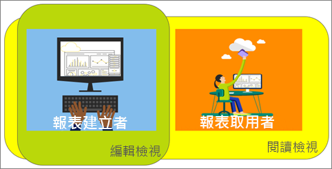

# Power BI 服務報告中的閱讀檢視和編輯檢視
在 Power BI 服務 (而非 Power BI Desktop) 中，有兩種模式可與報告互動：閱讀檢視和編輯檢視。 [閱讀檢視] 適用於所有使用者，特別是針對資料「取用者」而設計，[編輯檢視] 則僅適用於報表「建立者」和擁有者。

## 報表閱讀檢視

 [閱讀檢視] 是您瀏覽和與報表互動的方式，它很有趣且安全，可以操作及了解您的資料。 [閱讀檢視] 的設計對象包括報表「取用者」亦即從應用程式開啟報表的人，或[與他們共用](service-share-dashboards.md)報表的人。 [閱讀檢視] 可確保特定報表的每一位取用者會看到相同的報表、相同的視覺效果，並選擇性地套用相同的篩選。  取用者可與報表互動、可變更現有的篩選 (這些變更會與報表一起儲存)，但無法新增篩選。

>**注意**：在某些情況下，報告取用者可能會因為資料列層級安全性和資料權限而看到不同的資料。

## 報表編輯檢視

編輯檢視僅適用於建立報表的人員，或[以應用程式工作區的成員或管理員身分共同擁有報表](service-create-distribute-apps.md)的人員。

編輯檢視的設計對象是報表「建立者」。 這是建立者匯入和連線到資料集、瀏覽資料，以及建置報表和儀表板的位置。 在 [編輯檢視] 中，「建立者」可以透過新增和移除欄位、變更視覺效果類型、建立新的視覺效果以及新增和刪除報表的視覺效果和頁面，更深入探討資料。 然後，他們可以與同事共用他們建立的報表。

## 閱讀檢視與編輯檢視
此圖表不會列出 Power BI 服務的所有報表功能！ 它只會列出無法在 [閱讀檢視] 和 [編輯檢視] **兩者**中都提供的報表工作。

|工作  | 閱讀檢視  | 編輯檢視 |
|-------------------------|-------|-------|
|**完整報表**  |
| [建立或編輯報表](service-report-create-new.md) | 否  | 是 |
| [共用報表](service-share-reports.md)| 是 | 是，也可以管理權限，包括提供其他人「擁有者」權限。 |
| [從 [篩選] 窗格建立持續性 (永久) 的視覺效果層級、鑽研、頁面層級和報表層級的篩選](power-bi-report-add-filter.md) | 否  | 是 |
| [使用報表 [篩選] 窗格](power-bi-how-to-report-filter.md) | 是，可使用現有的篩選且變更可與報表一起儲存，但無法新增篩選。 | 是 |
| [使用報表 [分析] 窗格](service-analytics-pane.md) | 否 | 是 |
| [報表**檢視**選項](power-bi-report-display-settings.md) | 是，但有些例外狀況。 | 是，所有項目，包括格線、貼齊，以及鎖定。 |
| [建立重新整理排程](refresh-data.md) | 否  | 是 |
| [訂閱報表](service-report-subscribe.md) | 是 | 否 |
| [問與答 - 在報表中詢問問題](power-bi-q-and-a.md) | 否  | 是 |
| [檢視使用計量](service-usage-metrics.md) | 是，在報表畫布上。 | 是，在報表清單中 (內容檢視) |
| [檢視相關項目](service-related-content.md) | 是，在報表畫布上。 | 是，在報表清單中 (內容檢視) |
| [儲存報表](service-report-save.md) | 是，但只使用 [另存新檔]。 | 是 |
| [刪除報表](service-delete.md) | 否  | 是 |
|**報表頁面** |
| [新增或重新命名報表頁面](power-bi-report-add-page.md)  | 否  | 是  |
| [複製報表頁面](power-bi-report-copy-paste-page.md) | 否  | 是 |
| [刪除報表頁面](service-delete.md) | 不可以 | 可以 |
|**使用報表視覺效果**|
| [將視覺效果新增至報表](power-bi-report-add-visualizations-i.md) | 否  | 是 |
| [在報表中新增文字方塊和圖形](power-bi-reports-add-text-and-shapes.md) | 否  | 是 |
| [使用報表 [格式] 窗格](service-the-report-editor-take-a-tour.md) | 否 | 是 |
| [設定視覺效果的互動方式](service-reports-visual-interactions.md) | 否  | 是 |
| [顯示用來建立視覺效果的資料](service-reports-show-data.md) | 否  | 是 |
| [設定鑽研](power-bi-visualization-drill-down.md) | 否  | 是 |
| [變更所使用的視覺效果](power-bi-report-change-visualization-type.md) | 否 | 是|
| [刪除視覺效果、文字方塊或圖形](service-delete.md)| 否 | 是 |

## 在編輯檢視與閱讀檢視之間巡覽
請記住，只有報表建立者和擁有者能夠在 [編輯檢視] 中開啟報表。

1. 根據預設，報告通常會在 [閱讀檢視] 中開啟。 如果您看到 [編輯報告] 的選項，您可以表明您處於 [閱讀檢視] 中。 如果 [編輯報告] 呈現灰色，您就沒有在 [編輯檢視] 中開啟報告的權限。

   

2. 如果 [編輯報告] 未呈現灰色，加以選取即可在 [編輯檢視] 中開啟報告。

   

   報表目前處於 [編輯檢視] 中，使用的是您上次在 [閱讀檢視] 中使用的[顯示設定](power-bi-report-display-settings.md)。

2. 若要返回 [閱讀檢視]，請從上方導覽列中選取 [閱讀檢視]。

    ![[閱讀檢視] 選項](media/service-reading-view-and-editing-view/power-bi-reading-view.png)

### 後續步驟
在 [閱讀檢視] 中與報告互動的方式有很多種，切割與細分資料可以深入了解資訊並找到問題的解答。  下一個主題：[在 [閱讀檢視] 中與報表互動](service-interact-with-a-report-in-editing-view.md)，會詳細描述這其中的一些功能。    
回到 [Power BI 中的報告](service-reports.md)    
有其他問題嗎？ [試試 Power BI 社群](http://community.powerbi.com/)
