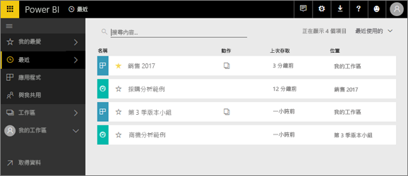
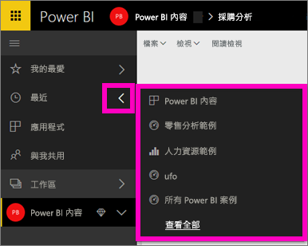
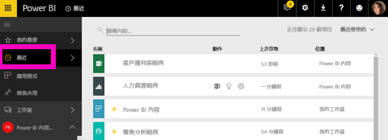

# Power BI 服務中的 [最近] 內容

## 什麼是最近內容
最近內容是您瀏覽的最後一個項目，最大值上限為 20 個項目。  這些包含：所有工作區中的儀表板、報表、應用程式和活頁簿。

觀看 Amanda 示範如何填入 [最近] 內容清單，然後遵循以下影片中的逐步指示，自己試試看。

<iframe width="560" height="315" src="https://www.youtube.com/embed/G26dr2PsEpk" frameborder="0" allowfullscreen></iframe>

## 顯示最近內容
若要查看您最近瀏覽過的五個項目，請從左側導覽中選取 [最近] 右側的箭號。  您可以從這裡選取最近內容，加以開啟。 只會列出五個最新的項目。

如果您最近瀏覽過項目超過五個，請選取 [See all]\(查看全部) 以開啟 [最近] 畫面 (請參閱下面)。 您也可以從左側導覽中選取 [最近] 或最近 圖示。

您可以在這裡與內容互動，就像在個別[**儀表板**](service-dashboards.md)、[**報表**](service-reports.md)和**活頁簿**索引標籤以及在[**應用程式**](service-install-use-apps.md)畫面上互動一樣。

## 後續步驟
[Power BI 服務應用程式](service-install-use-apps.md)

有其他問題嗎？ [試試 Power BI 社群](http://community.powerbi.com/)

