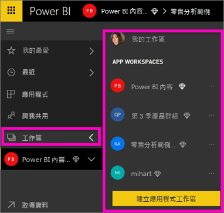
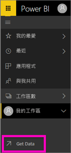
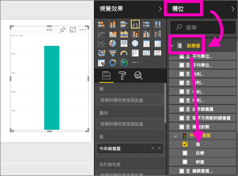
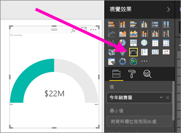
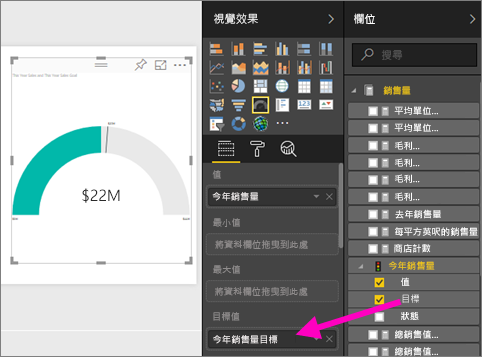
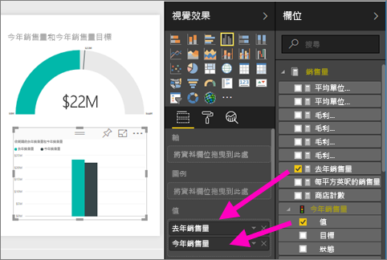
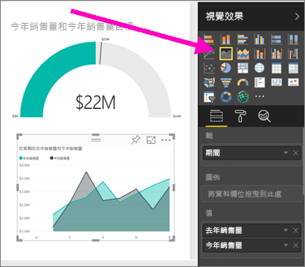
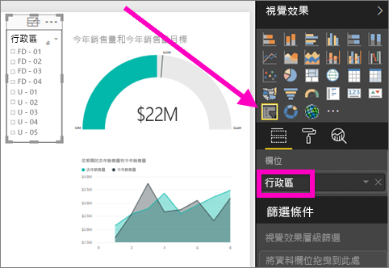

# 匯入資料集以在 Power BI 服務中建立新的報表
您已閱讀 [Power BI 中的報表](service-reports.md)，現在想要建立自己的報表。 有許多不同的方式可建立報表，在本文中，我們一開始是使用 Power BI 服務從 Excel 資料集建立非常基本的報表。 了解建立報表的基本概念之後，底部的＜後續步驟＞會將您導向更進階的報表主題。  

> **提示**︰若要透過複製現有報表來建立報表，請參閱[複製報表](power-bi-report-copy.md)。
> 
### 先決條件
- Power BI 服務 (若要使用 Power BI Desktop 建立報表，請參閱 [Desktop 的報表檢視](desktop-report-view.md))  
- 零售分析範例資料集

## 匯入資料集
這種建立報表的方法會從資料集和空白報表畫布開始。 如果要跟著做，請[下載零售分析範例 Excel 資料集](http://go.microsoft.com/fwlink/?LinkId=529778)，並將它儲存至商務用 OneDrive (慣用) 或本機。

1. 我們會在 Power BI 服務工作區中建立報表，因此請選取現有工作區或建立新工作區。
   
   
2. 在左側導覽窗格底部，選取 [取得資料]。
   
   
3. 選取 [檔案]，然後導覽至您已儲存零售分析範例的位置。
   
    ![選取 [檔案]](media/service-report-create-new/power-bi-select-files.png)
4. 在此練習中請選取 [匯入]。
   
   ![選取 [匯入]](media/service-report-create-new/power-bi-import.png)
5. 匯入資料集之後，請選取 [檢視資料集]。
   
   ![選取 [檢視儀表板]](media/service-report-create-new/power-bi-view-dataset.png)
6. 檢視資料集其實就是開啟報表編輯器。  您會看到空白的畫布和報表編輯工具。
   
   

> **提示**︰如果您不熟悉報表編輯畫布，或需要重新整理程式，請先[導覽報表編輯器](service-the-report-editor-take-a-tour.md)，再繼續進行。
> 
> 

## 將星形量測計新增至報表
既然已匯入我們的資料集，就讓我們開始回答一些問題。  我們的行銷長 (CMO) 想要知道我們距離本年度的銷售目標還有多遠。 量測計是[不錯的視覺效果選擇](power-bi-report-visualizations.md)，可顯示這種類型的資訊。

1. 在 [欄位] 窗格中，選取 [銷售] > [This Year Sales]\(本年度銷售額) > [值]。
   
    
2. 從 [視覺效果] 窗格選取量測計範本 ，將視覺效果轉換成量測計。
   
    
3. 將 \[銷售] > \[This Year Sales]\(本年度銷售額) > \[目標] 拖曳至 \[目標值] 庫。 看起來我們非常接近我們的目標。
   
    
4. 現在是[儲存報表](service-report-save.md)的好時機。
   
   ![[檔案] 功能表](media/service-report-create-new/powerbi-save.png)

## 將區域圖和交叉分析篩選器新增至報表
我們的 CMO 已回答一些其他問題。 她想要知道今年與去年的銷售額比較。 而且，她想要依區域查看發現結果。

1. 首先，清出畫面上的一些空間。 選取 [量測計]，然後將它移至右上角。 接著抓取並拖曳其中一個角落，將它設為較小。
2. 取消選取量測計。 在 [欄位] 窗格中，選取 [銷售] > [This Year Sales]\(本年度銷售額) > [值]，然後選取 [銷售] > [Last Year Sales]\(去年度銷售額)。
   
    
3. 從 [視覺效果] 窗格選取區域圖範本 ，以將視覺效果轉換成區域圖。
4. 選取 [時間] > [期間] 以將它新增至 [軸] 井。
   
    
5. 若要依時間期間排序視覺效果，請選取省略符號，然後選擇 [依據期間排序]。
6. 現在讓我們新增交叉分析篩選器。 選取畫布上的空白區域，然後選擇交叉分析篩選器     範本。 這樣會將空白交叉分析篩選器新增至畫布。
   
        
7. 從 [欄位] 窗格中，選取 [區域] > [區域]。 移動和調整交叉分析篩選器大小。
   
      
8. 使用交叉分析篩選器，依區域尋找模式和深入資訊。
   
     

繼續探索資料，並新增視覺效果。 當您找到特別有趣的深入解析時，請[將它們釘選到儀表板](service-dashboard-pin-tile-from-report.md)。

## 後續步驟
* [在報表中新增頁面](power-bi-report-add-page.md)  
* 了解如何[將視覺效果釘選到儀表板](service-dashboard-pin-tile-from-report.md)   
* 有其他問題嗎？ [試試 Power BI 社群](http://community.powerbi.com/)

