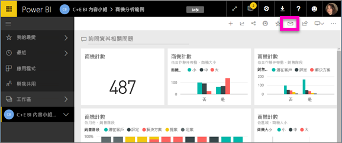

# 訂閱 Power BI 服務 (app.powerbi.com) 中的報表或儀表板
讓您最重要的儀表板和報表維持最新的狀態從沒這麼容易過。 您可以為自己和同事訂閱對您來說最重要的報表頁面和儀表板，Power BI 會以電子郵件寄送快照集到您的收件匣。 您要告訴 Power BI 需要收到電子郵件的頻率︰從一天一次到每週一次。 

電子郵件和快照集將使用 Power BI 設定中設定的語言 (請參閱 [Power BI 支援的語言與國家/地區](supported-languages-countries-regions.md))。 如果未定義任何語言，Power BI 會使用您目前瀏覽器中地區設定的語言。 若要查看或設定語言喜好設定，請選取齒輪圖示  > [設定] > [一般] > [語言]。 

![[語言] 下拉式清單](media/service-report-subscribe/power-bi-language.png)

只能在 Power BI 服務中建立訂閱。 當您收到電子郵件時，其中會包含「前往報表或儀表板」的連結。 在安裝 Power BI 應用程式的行動裝置上，選取此連結會啟動應用程式 (而不是在 Power BI 網站上開啟報表或儀表板的預設動作)。

## 需求
- **建立**訂閱是 Power BI Pro 功能，您必須具有內容 (儀表板或報表) 的編輯權限，才能建立該訂閱。 
- 因為訂閱電子郵件只會在資料集更新或重新整理時送出，所以訂閱不適用於不會更新或重新整理的資料集。

## 訂閱儀表板或報表頁面
不論您是要訂閱儀表板還是報表，程序都非常相似。 同樣的按鈕可讓您為自己 (和他人) 訂閱 Power BI 服務儀表板與報表。
 
.

1. 開啟儀表板或報表。
2. 從頂端功能表列，選取 [訂閱] 或選取信封圖示。
   
   

3. 使用黃色的滑桿開啟和關閉訂閱。  將滑桿設定為關閉並不會刪除訂閱。 若要刪除訂閱，請選取垃圾桶圖示。

4. 填寫電子郵件訊息詳細資料。 系統會預先填入您的電子郵件，但您也可以將其他電子郵件新增至訂閱。 只能新增處於相同網域的電子郵件地址 (如需更多詳細資料，請參閱下方的**考量與疑難排解**)。 若報表或儀表板託管於 [Premium 容量](service-premium.md)中，您就可以使用個人電子郵件地址與群組別名來為其他人訂閱。 若報表或儀表板並為託管於 Premium 容量中，您仍可使用他人的個人電子郵件地址為其訂閱，但他們也必須具有 Power BI Pro 授權。

    在下方的螢幕擷取畫面中，您可以注意到當您在訂閱報表時，實際上是在訂閱報表「頁面」。  若要訂閱報表中的多個頁面，請選取 [新增另一個訂閱] 再選取其他頁面。 
      
   

5. 選取 [儲存並關閉] 來儲存訂閱。 每當任何一個基礎資料集發生變更時，這些訂閱者都會收到儀表板或報表的電子郵件與快照集。 若儀表板或報表在一天內會重新整理多次，則只會在第一次重新整理後傳送電子郵件。  
   
   
   
   > [!TIP]
   > 想要立即看到電子郵件嗎？ 您可以重新整理與儀表板或報表相關的資料集，來觸發電子郵件。 (如果您沒有編輯資料集的權限，則必須要求有這些權限的人為您執行這項操作。)若要了解有哪些正在使用的資料集，請選取**檢視相關項目**圖示  以開啟 [相關內容]，然後選取重新整理圖示 。 
   > 
   > 
   
   

## 如何決定電子郵件排程
下表描述您將會收到電子郵件的頻率。 它完全取決於儀表板或報表所根據的資料集連線方式 (DirectQuery、即時連線、匯入到 Power BI 或 OneDrive 或 SharePoint Online 中的 Excel 檔案)，以及可用和已選取的訂閱選項 ([每日]、[每週]，或 [無])。

|  | **DirectQuery** | **Live Connect** | **排定的重新整理 (匯入)** | **OneDrive/SharePoint Online 中的 Excel 檔案** |
| --- | --- | --- | --- | --- |
| **報表/儀表板重新整理的頻率？** |每隔 15 分鐘 |Power BI 會每隔 15 分鐘檢查一次，並且如果資料集已變更，會重新整理報表。 |使用者選取 [無]、[每天] 或 [每週]。 每日最多可達一天 8 次。 每週實際上是使用者建立並設定的每週排程，重新整理最少為每週一次，最多則為每日。 |每小時一次 |
| **使用者對訂閱電子郵件排程有多大的控制權？** |選項有︰[每日] 或 [每週] |沒有選項︰如果報表重新整理，便會傳送電子郵件給使用者，但每天不會超過一次。 |如果重新整理排程為每日，選項有 [每日] 和 [每週]。  如果重新整理排程為每週，選項只有 [每週]。 |沒有選項︰每當資料集更新，便會傳送電子郵件給使用者，但每天不會超過一次。 |

## 管理您的訂閱
只有建立訂閱的使用者能夠進行管理。  有 2 條路徑可到達管理您訂閱的畫面。  第一種方法是從 [訂閱電子郵件] 對話方塊選取 [管理所有訂閱] (請參考下方的螢幕擷取畫面與上方的步驟 4)。 第二是藉由從頂端功能表列選取 Power BI 齒輪圖示 ，然後選擇 [設定]。

![選取 [設定]](media/service-report-subscribe/power-bi-subscribe-settings.png)

顯示的特定訂閱將取決於哪一個工作區目前為使用中。  若要一次查看所有工作區的所有訂閱，請務必讓 [我的工作區] 為使用中。 如需了解工作區，請參閱 [Power BI 中的工作區](service-create-distribute-apps.md)。

![查看 [我的工作區] 中的所有訂閱](media/service-report-subscribe/power-bi-subscriptions.png)

如果 Pro 授權過期、擁有者刪除儀表板或報表，或是用來建立訂閱的使用者帳戶遭到刪除，則訂閱將會終止。

## 考量與疑難排解
* 報表頁面訂閱會繫結至報表頁面的名稱。 如果您訂閱報表頁面，並將它重新命名，您必須重新建立訂閱
* 對於即時連線資料集的電子郵件訂閱，您只會在資料變更時收到電子郵件。 因此，如果發生重新整理但沒有任何資料變更，Power BI 將不會傳送電子郵件給您。
* 電子郵件訂閱不支援大部分[自訂視覺效果](power-bi-custom-visuals.md)。  其中一個例外是[「已認證」](power-bi-custom-visuals-certified.md)的自訂視覺效果。  
* 若有任何磚套用了資料列層級安全性 (RLS)，則這些磚就不會顯示。
* 電子郵件訂閱傳送時會使用報表的預設篩選器和交叉分析篩選器狀態。 在訂閱之後對預設值所做的所有變更，均不會顯示在電子郵件中。    
* 在 Power BI Desktop 即時連線至服務功能所建立的報告頁面上，尚不支援電子郵件訂用帳戶。    
* 特別是針對儀表板訂閱，尚不支援某些磚類型。  其中包括：資料流磚、影片磚、自訂 Web 內容磚。     
* 若您與租用戶外部的同事共用儀表板，您將無法一併替該位同事建立訂閱。 舉例來說，如果您是 aaron@xyz.com，則可與 anyone@ABC.com 共用，但尚無法為 anyone@ABC.com 訂閱，而他們也無法訂閱共用的內容。      
* 由於電子郵件大小限制，儀表板或報表若含有非常大的影像，訂閱可能會失敗。    
* 如果超過 2 個月未瀏覽某些儀表板和報表，Power BI 會自動暫停重新整理與這些儀表板和報表建立關聯的資料集。  不過，如果您新增儀表板或報表的訂閱，即使有段時間未瀏覽也不會暫停。    
* 若您未收到訂閱電子郵件，請確認您的使用者主體名稱 (UPN) 能夠接收電子郵件。 [Power BI 小組正致力於放寬這項需求](https://community.powerbi.com/t5/Issues/No-Mail-from-Cloud-Service/idc-p/205918#M10163)，請隨時留意。 
* 若您的儀表板或報表處於 Premium 容量中，您可以使用群組電子郵件別名進行訂閱，而不必為各同事的電子郵件一一訂閱。 別名會以目前使用中的目錄為準。 

## 後續步驟
* 有其他問題嗎？ [嘗試在 Power BI 社群提問](http://community.powerbi.com/)    
* [閱讀部落格文章](https://powerbi.microsoft.com/blog/introducing-dashboard-email-subscriptions-a-360-degree-view-of-your-business-in-your-inbox-every-day/)

