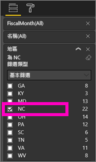

# 與同事共用 Power BI 報表
「共用」是讓一些人存取您儀表板和報表的一種好方法。 Power BI 提供[數種方式可進行共同作業以及散發您的報表](service-how-to-collaborate-distribute-dashboards-reports.md)，而共用只是其中的一種功能。

若要共用，您和您的收件者必須具有 [Power BI Pro 授權](service-free-vs-pro.md)，或內容必須位於[進階容量](service-premium.md)中。 有任何建議嗎？ Power BI 小組向來重視您的意見反應，請前往 [Power BI 社群網站](https://community.powerbi.com/)。

您可以從您自己的 [我的工作區] 或應用程式工作區，與相同電子郵件網域中的同事共用報表。 當您與他人共用報表時，他們可以檢視此報表並與之互動，但是無法編輯此報表。 除非套用[資料列層級安全性 (RLS)](service-admin-rls.md)，否則他們會看到您在報表中看到的相同資料。 

## 共用 Power BI 報表
1. 在 Power BI 服務中，[建立儀表板](service-dashboard-create.md)與至少一個連結至您想要共用之報表的磚。 
   
    即使您只想要共用報表，也需要先建立連結至該報表的儀表板才能共用。 

1. 在儀表板右上角，選取 [共用]。

     ![選取 [共用]](media/service-share-reports/power-bi-share-upper-right.png)
  
2. 將它傳給預定收件者。 如果您不想對他們傳送關於儀表板的郵件，請清除 [傳送電子郵件通知給收件者] 核取方塊。

     ![清除 [傳送電子郵件通知] 核取方塊](media/service-share-reports/power-bi-share-dont-send-mail.png)

4. 選取 [共用] 。

      您共用儀表板的人員現在有檢視基礎報表的權限。 

1. 在 Power BI 服務中開啟報表、複製報表頁面 URL，並將它傳送給您的同事。 
   
    當他們選取連結時，Power BI 會開啟報表的唯讀版本。

## 共用報表的篩選版本
如果要共用報表的篩選版本呢？ 可能是只顯示特定城市或特定銷售人員或特定年份等資料的報表。 您可以建立自訂 URL 來完成這項工作。

1. 在 [[編輯檢視]](service-reading-view-and-editing-view.md) 中開啟報告，套用篩選條件，然後儲存報告。
   
   在本例中，我們要篩選[零售分析範例](sample-tutorial-connect-to-the-samples.md)，只顯示 **Territory** 等於 **NC** 的值。
   
   
2. 在報表頁面 URL 的結尾處新增下列內容︰
   
   ?filter=<資料表名稱>/<檔案名稱> eq <值>
   
    欄位必須是**字串**類型，而且 <表格名稱> 或 <欄位名稱> 都不可以包含空格。
   
   在本例中，資料表的名稱是 **Store**、欄位名稱是 **Territory**，要篩選的值是 **NC**：
   
    ?filter=Store/Territory eq NC
   
   
   
   瀏覽器會新增特殊字元來代表斜線和空格，因此最後會是︰
   
   app.powerbi.com/groups/me/reports/010ae9ad-a9ab-4904-a7a1-10a61f70f2f5/ReportSection2?filter=Store%252FTerritory%20eq%20NC
3. 將此 URL 傳送給您的同事。 
   
   當他們選取連結時，Power BI 會開啟已篩選報表的唯讀版本。

## 後續步驟
* 有任何意見嗎？ 請移駕 [Power BI 社群網站](https://community.powerbi.com/)提供您的建議。
* [應該如何共同作業和共用儀表板和報表？](service-how-to-collaborate-distribute-dashboards-reports.md)
* [共用儀表板](service-share-dashboards.md)
* 有其他問題嗎？ [試試 Power BI 社群](http://community.powerbi.com/)。

