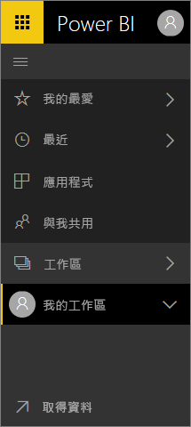
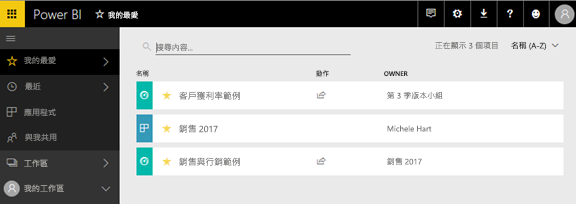
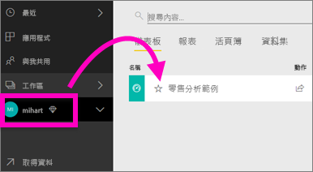
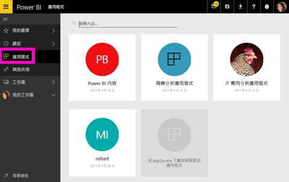
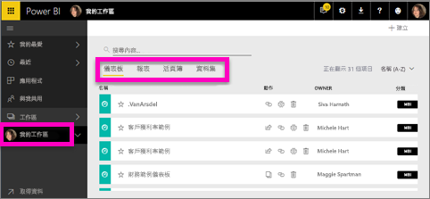
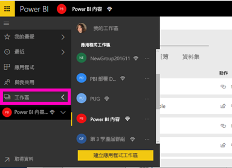
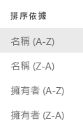

# 瀏覽 Power BI 服務
## 左側瀏覽窗格

**快速參考指南**

| 動作 | 新 (目前) 的路徑 |
| --- | --- | --- |
| 將儀表板或報表設為我的最愛 |[工作區] > [儀表板] 或 [工作區] > [報表] 並選取星形圖示將其變成黃色 |
| 將應用程式設為我的最愛 | 從左側瀏覽窗格選取 [應用程式] 並選取應用程式名稱旁的星星
| 檢視我的最愛清單 |從左側瀏覽窗格選取 [我的最愛] |
| 檢視最近瀏覽過的儀表板和報表清單 |從左側瀏覽窗格選取 [最近項目] |
| 檢視儀表板已與您共用的清單 |從左側瀏覽窗格選取 [與我共用] |
| 共用儀表板 |開啟儀表板，然後選取 [共用] 或建立並發佈應用程式。 |
| 刪除儀表板 |[我的工作區] > [儀表板] > 垃圾桶圖示 |
| 刪除報表 |[我的工作區] > [報表] > 垃圾桶圖示 |
| 刪除資料集 |[我的工作區] > [資料集] > […] > [刪除] |
| 開啟儀表板 |[工作區] > [儀表板] > 選取儀表板名稱 |
| 開啟報表 |[工作區] > [報表] > 選取報表名稱 |
| 開啟資料集 |[工作區] > [資料集] > 選取資料集名稱 |
| 建立儀表板 |從上方的導覽列中選取 [建立] > [儀表板] |
| 建立報表 |從上方的導覽列中選取 [建立] > [報表] |
| 建立資料集 |從上方的導覽列中選取 [建立] > [資料集] |
| 建立應用程式 |[工作區] > 建立應用程式工作區 |
| 檢視您擁有的所有儀表板、報表和資料集清單 |[工作區] > [我的工作區] |

## 一般工作

觀看影片，讓 Amanda 帶領您瀏覽 Power BI 服務的導覽體驗。  然後遵循以下影片中的逐步指示自行探索。

<iframe width="560" height="315" src="https://www.youtube.com/embed/G26dr2PsEpk" frameborder="0" allowfullscreen></iframe>

## 檢視內容 (儀表板、報表、活頁簿、資料集、工作區、應用程式)
讓我們開始查看如何組織基本內容 (儀表板、報表、資料集、活頁簿)。 在這之前，所有的內容都是列在左側功能窗格中。 現在，您還有該選項，但預設是依工作區內容中的內容類型顯示。 從左側瀏覽窗格 (左側瀏覽窗格) 選取工作區，相關內容 (儀表板、報表、活頁簿、資料集) 的索引標籤便會填入右側的 Power BI 畫布。

如果您有 Power BI (免費)，則只會看到一個工作區：[我的工作區]。

### 將儀表板、報表與應用程式設為我的最愛
[我的最愛] 可讓您快速存取對您而言最重要的內容。  

1. 在儀表板或報表開啟的狀態下，從右上角選取 [我的最愛]。
   
   
   
   [我的最愛] 會變成 [移除最愛]，且星狀圖示會變成黃色。
   
   

2. 若為應用程式，請從左側瀏覽窗格中選取 [應用程式]，停留在應用程式上，並選擇星星將其設為我的最愛。

2. 若要顯示您已新增為我的最愛之所有內容清單，請在左側瀏覽窗格中選取 [我的最愛] 右邊的箭號。 由於左側瀏覽窗格是 Power BI 服務的永久功能，因此您可以從 Power BI 服務的任何位置存取此清單。
   
    
   
    您可以在這裡選取儀表板、報表或應用程式並加以開啟。

3. 若要開啟 [我的最愛] 窗格，請在左側瀏覽窗格中選取 [我的最愛] 或選取我的最愛圖示 。
   
   
   
   您可以在這裡開啟、尋找內容、移除最愛，或與同事共用內容。

1. 另一種方式是從 [儀表板] 或 [報表] 工作區索引標籤將儀表板或報表標示為我的最愛。只要開啟工作區顯示內容檢視，並選取名稱左邊的星形圖示就可以了。
   
   

若要深入了解，請參閱[我的最愛](service-dashboard-favorite.md)

### 最近項目
瀏覽 [最近項目] 窗格，即可快速取得您最近存取過的內容。 這包括來自整個工作區的內容。

  

方法和 [我的最愛] 相似，您只要選取左側瀏覽窗格中 [最近項目] 旁的箭號，即可從 Power BI 服務的任何位置快速存取最近項目。

  

若要深入了解，請參閱 [Power BI 中的最近項目](service-recent.md)。

### 應用程式
應用程式是為了提供重要計量而建立的一組儀表板和報表，全都在同一位置。 您可以有組織內部的應用程式，以及[外部服務的應用程式](service-connect-to-services.md)，例如 Google Analytics 和 Microsoft Dynamics CRM。 

若要深入了解，請參閱下方的**應用程式工作區**和[什麼是 Power BI 應用程式](service-install-use-apps.md)。

### 與我共用
同事與您共用的所有內容都在 [與我共用] 中。  依儀表板擁有者進行篩選、使用搜尋欄位找到相關項目，然後依日期排序項目。  若是您經常瀏覽的共用內容，直接從 [與我共用] 檢視將其加入最愛會更加簡單。

若要深入了解，請參閱[與我共用](service-shared-with-me.md)。

### 運用工作區
接下來，在左側導覽中為「工作區」。 工作區可以視為 Power BI 內容的「容器」。 有兩種類型的工作區︰[我的工作區] 和 [應用程式工作區]。

如果您不是應用程式工作區的成員或管理員，則在左側導覽中可能看不到任何應用程式工作區。 此外，如果您是 Power BI 免費版的客戶，您將不會看到任何應用程式工作區。

#### 我的工作區
[我的工作區] 會儲存您所擁有的所有內容。 請將它視為您專屬內容的個人沙箱或工作區域。 您可以與同事共用 [我的工作區] 中的內容。 在 [我的工作區] 內，您的內容組織為 4 個索引標籤︰[儀表板]、[報表]、[活頁簿] 和 [資料集]。

#### 應用程式工作區
應用程式和應用程式工作區是 Power BI Pro 的功能。 如果您是撰寫儀表板和報表以供其他人使用的人員，將使用應用程式工作區來執行這項作業。 應用程式工作區是您將在其中建立應用程式的位置；因此，若要建立應用程式，您必須先建立應用程式工作區。 它們是群組工作區的演進 - 應用程式中內容的臨時區域和容器。  您和同事可以共同作業來處理儀表板、報表，以及其他想要散發給更多對象甚至整個組織的內容。

若要深入了解，請瀏覽[在 Power BI 中建立和散發應用程式](service-create-distribute-apps.md#app-workspaces)。

與 [我的工作區] 相同，您的內容組織為 4 個索引標籤︰[儀表板]、[報表]、[活頁簿] 和 [資料集]。

在左側瀏覽窗格中選取 [工作區]可切換工作區。

### 搜尋和排序內容
內容檢視可讓您更輕鬆地搜尋、篩選及排序您的內容。 若要搜尋儀表板、報表或活頁簿，請在搜尋區域中鍵入。 Power BI 只會篩選出名稱中包含搜尋字串的內容。

您也可以依名稱或擁有者排序內容。  

若要深入了解，請參閱 [Power BI 導覽：搜尋、排序、篩選](service-navigation-search-filter-sort.md)。

## 後續步驟
Power BI 服務[基本概念](service-basic-concepts.md)    

有疑問或意見反應嗎？ [請瀏覽 Power BI 社群論壇](http://community.powerbi.com/t5/Navigation-Preview-Forum/bd-p/NavigationPreview)

