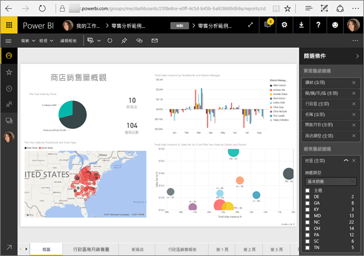
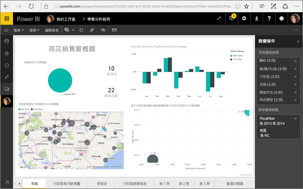

# <a name="filter-a-report-using-query-string-parameters-in-the-url"></a>使用 URL 中的查詢字串參數篩選報表
當您在 Power BI 服務中開啟報表時，每頁報表各有其唯一的 URL。 若要篩選該報表頁面，您可以使用報表畫布上的 [篩選] 窗格。  或者您也可以將查詢字串參數新增到 URL，以篩選報表。 您可能有想要向同事展示的報表，並想要預先為他們篩選。 其中一個執行方式是從報表的預設 URL 著手、將篩選參數新增到 URL，然後用電子郵件將整個 URL 寄送給他們。



<iframe width="640" height="360" src="https://www.youtube.com/embed/WQFtN8nvM4A?list=PLv2BtOtLblH3YE_Ycas5B1GtcoFfJXavO&amp;showinfo=0" frameborder="0" allowfullscreen></iframe>

## <a name="query-string-parameter-syntax-for-filtering"></a>用於篩選的查詢字串參數
語法相當簡單；只要從報表 URL 著手、新增問號，然後新增您的篩選語法即可。

URL?filter=***資料表***/***欄位*** eq '***值***'


* **資料表**和**欄位**名稱區分大小寫，**值**則無。
* 從報表檢視中隱藏的欄位仍可篩選。
* **值**的前後必須加上單引號。
* 欄位類型必須是數字或字串
* 資料表和欄位名稱不能有任何空格。

如果仍感到困惑，請繼續閱讀，我們會詳加解說。  

## <a name="filter-on-a-field"></a>篩選欄位
假設報表的 URL 如下所示。


而我們可以從地圖視覺效果 (上方) 看到，我們有門市位於北卡羅萊納州。

>[!NOTE]
>本範例以[零售分析範例](sample-datasets.md)為依據。
> 

若要篩選報表，使其只顯示 "NC" (北卡羅萊納州) 門市的資料，請將下列內容加到 URL 後；

?filter=Store/Territory eq 'NC'


>[!NOTE]
>NC 是儲存在 [Store] 資料表 [Territory] 欄位中的值。
> 
> 

我們的報表已篩選出北卡羅萊納州；報表頁面上的所有視覺效果都只會顯示北卡羅萊納州的資料。



## <a name="filter-on-multiple-fields"></a>篩選多個欄位
您也可以將額外參數新增至 URL，以篩選多個欄位。 讓我們回到原始的篩選參數。

```
?filter=Store/Territory eq 'NC'
```

若要篩選其他欄位，請新增 `and`，然後以上述相同格式新增另一個欄位。 範例如下。

```
?filter=Store/Territory eq 'NC' and Store/Chain eq 'Fashions Direct'
```

<iframe width="640" height="360" src="https://www.youtube.com/embed/0sDGKxOaC8w?showinfo=0" frameborder="0" allowfullscreen></iframe>


### <a name="using-dax-to-filter-on-multiple-values"></a>使用 DAX 篩選多個值
篩選多個欄位的另一種方法是建立計算結果欄，將兩個欄位串連成單一值。 接著您就可以篩選該值。

例如，我們有兩個欄位：Territory 和 Chain。 在 Power BI Desktop 中[建立新的計算結果欄](desktop-tutorial-create-calculated-columns.md) (欄位)，名稱為 TerritoryChain。 請記住，**欄位**名稱不能有任何空格。 以下是該資料行的 DAX 公式。

TerritoryChain = [Territory] & " - " & [Chain]

將報表發佈到 Power BI 服務，然後使用 URL 查詢字串篩選成只顯示 NC 的 Lindseys 門市資料。

    https://app.powerbi.com/groups/me/reports/8d6e300b-696f-498e-b611-41ae03366851/ReportSection3?filter=Store/TerritoryChain eq 'NC–Lindseys'

## <a name="pin-a-tile-from-a-filtered-report"></a>從篩選的報表釘選磚
在您使用查詢字串參數篩選報表後，可以將視覺效果從該報表釘選到儀表板。 儀表板上的磚會顯示經過篩選的資料，而選取該儀表板磚會開啟用來建立該磚的報表。  不過，您使用 URL 進行的篩選不會儲存在報表，而選取儀表板磚時，報表會以未篩選的狀態開啟。  這表示儀表板磚中顯示的資料與報表視覺效果中顯示的資料不相符。

在某些情況下，這在您想要查看不同結果時會很實用；在儀表板上已篩選，在報表則未篩選。

## <a name="considerations-and-troubleshooting"></a>考量與疑難排解
使用查詢字串參數時，有幾件點事項要注意。

* 在 Power BI 報表伺服器，[傳遞報表參數](https://docs.microsoft.com/sql/reporting-services/pass-a-report-parameter-within-a-url?view=sql-server-2017.md)的方法可以是將其包含在報表 URL 中。 這些 URL 參數不會有前置詞，因為會直接傳遞到報表處理引擎。 
* 查詢字串篩選不會處理[發行至網路](service-publish-to-web.md)或 Power BI Embedded。   
* 欄位類型必須是數字或字串。
* 資料表和欄位名稱不能有任何空格。

## <a name="next-steps"></a>後續步驟
[將視覺效果釘選至儀表板](service-dashboard-pin-tile-from-report.md)  
[請試用 - 完全免費！](https://powerbi.com/)

有其他問題嗎？ [嘗試在 Power BI 社群提問](http://community.powerbi.com/)

